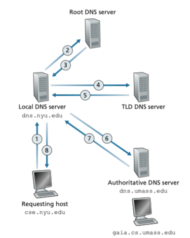

# Application Layer

- [Principles of Network Application](#principles-of-network-application)
- [Web and HTTP](#web-and-http)
- [DNS](#dns)

## Principles of Network Application
- __network application__: pairs of processes that send messages to each other over a network
    - for each pair of processes:
        - __client process__: the process that initiates the communication
        - __server process__: the process that waits to be contacted
    - an __application-layer protocol__ defines how an application's processes, running on different end systems, pass messages to each other
        - syntax and semantics and messages
        - when and how a process sends messages and responds to messages
- a process sends messages into, and receives messages from, the network through a software interface called __socket__
    - __socket__ is the interface between the application layer and the transport layer within a host
    - address of a socket is uniquely identified by (ip address, port number)

## Web and HTTP

- A __Web page (also called a document)__ consists of objects
    - an __object__ is a file identified by the server's domain name (hostname) and the object's path name, which are included in the __URL__
        - 
    - most pages consist of a __base HTML file__ and several referenced objects
- __HyperText Transfer Protocol (HTTP)__ is Web's application-layer protocol
    - it defines
        - how Web clients request Web pages from Web servers
            - The first line of an HTTP request message is called the __request line__; the subsequent lines are called the __header lines__. The request line has three fields: the method field, the URL field, and the HTTP version field
                ```
                GET /somedir/page.html HTTP/1.1
                Host: www.someschool.edu
                Connection: close
                User-agent: Mozilla/5.0
                Accept-language: fr
                ```
        - how servers transfer Web pages to client
            - HTTP response message has three sections:
                - a status line
                    - protocol version
                    - a status code
                    - corresponding status message
                - header lines
                - entity body: the requested object itself
                ```
                HTTP/1.1 200 OK
                Connection: close
                Date: Tue, 18 Aug 2015 15:44:04 GMT
                Server: Apache/2.2.3 (CentOS)
                Last-Modified: Tue, 18 Aug 2015 15:11:03 GMT Content-Length: 6821
                Content-Type: text/html

                (data data data data data ...)
                ```
    - it is a __stateless protocol__, HTTP server maintains no info about the clients
    - to enable server to identify client, __cookie__ can be used, it consists of 4 components:
        - a `set-cookie` header line in the HTTP response message
        - a `cookie` header line in the HTTP request message
        - a cookie file kept on the user’s end system and managed by the user’s browser
        - a back-end database at the Web site
- __Non-Persistent and Persistent Connection__: HTTP could either use non-persistent connection or persistent connection (default)
    - __non-persistent connection__: each reques/response pair is sent over a separate TCP connection
    - __persistent connection__: each request/response pair is sent over the same TCP connection
    - __round-trip time (RTT)__ is the time it takes for a small packet to travel from client to server, and then back to the client. When a client requests for a HTML file in a non-persistent connection, the total response time is 2 RTT plus the transmission time of the HTML file
        - the client sends `SYN` and the server replies `SYN` and `ACK`, which takes an __RTT__
        - the client sends `ACK` with the HTTP request and the server replies the HTML file, which takes an __RTT__ plus the transmission time of the HTML file
- a __Web cache__ (also called a proxy server) is a network entity that satisfies HTTP requests on the behalf of an origin Web server
    - it is both a client (wrt origin server) and a server (wrt user)
    - reduces response time and reduces Web traffic in the Internet as a whole
- __HTTP/2__: In HTTP/1.1, a web browser might open multiple TCP connections for a single webpage to avoid the head of line blocking problem. HTTP/2 gets rid of the parallel TCP connections, which reduces the number of socket descriptors opened at the server and allows TCP congestion control to operate as intended.
    - __Framing__: HTTP/2 breaks messages into smaller frames and interleave them on the same TCP connection, which allows for concurrent requests and responses to be sent and received. The server can break down multiple responses into frames and send each frame to the client. The client can then reassemble the frames into the original response.
    - __Response Prioritization__: When a client sends concurrent requests to a server, it can assign a weight and dependencies to each message.
    - __Server Pushing__: The server can send multiple responses for a single client request. The server can parse the HTML page, find the objects that are needed, and send them to the client without explicit requests.

## DNS

- __Domain Name System (DNS)__ is
    - a distributed database implemented in a hierarchy of DNS servers
        - __Root DNS servers__ provide the IP addresses of the TLD servers
        - __Top-level domain (TLD) servers__ provide the IP addresses for authoritative DNS servers
            - top-level domain: `com`, `edu`, `net`
            - can provide ip address of `dns.umich.edu`
        - __Authorirative DNS servers__: provide IP addresses of hostnames in an organization
    - an application protocol that allows hosts to query the database
        - like HTTP, the DNS protocol is an application-layer protocol since it
            - runs between the communicating end systems using the client-server paradigm
            - relies on an underlying end-to-end transport protocol to transfer DNS messages between communicating end systems
- __main task__: translates mnemonic hostnames to ip addresses
- other important services:
    - __host aliasing__: obtain the canonical hostname for a supplied alias hostname
    - __mail server aliasing__: same as host aliasing, and permits a company's mail server and Web server to have identical hostnames
    - __load distribution__: maps a hostname to multiple ip addresses and rotates the ordering of the addresses within each reply
- __local DNS server__ does not strictly belong to the hierarchy of servers but is central to the DNS architecture
    - it acts like __proxy server__
    - typically the query from the requesting host to the local DNS server is recursive and the remaining queries are iterative
    - 
