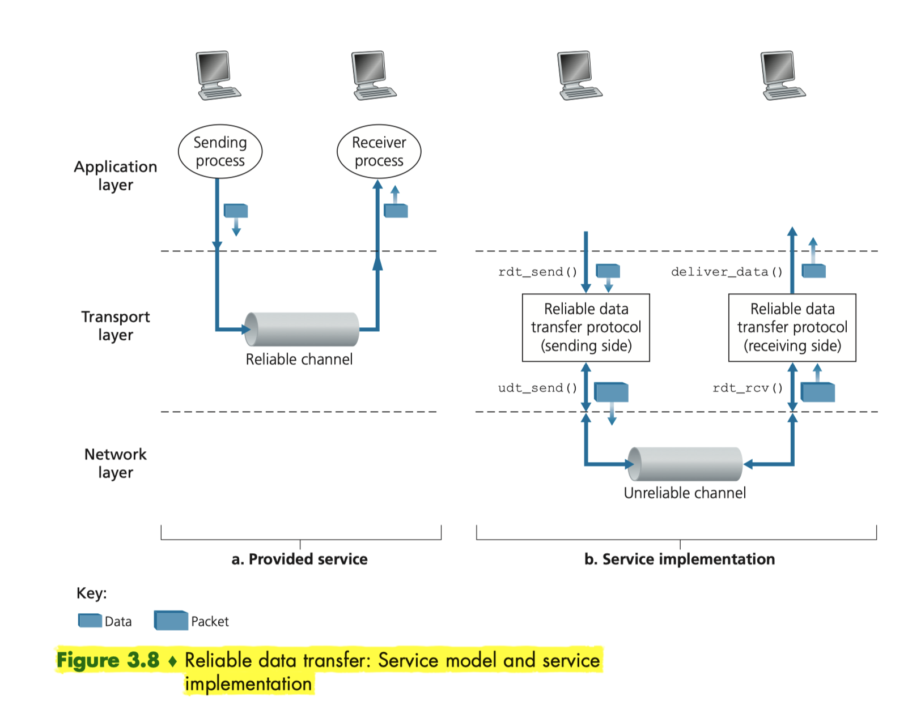

# Transport Layer

- [Intro](#intro)
- [Multiplexing and Demultiplexing](#multiplexing-and-demultiplexing)

## Intro

- a transport-layer protocol provides for __logical communication__ between application processes running on different hosts, a network-layer protocol provides __logical communication__ between hosts
    - __logical communication__: from application's perspective, processes are directly connected and free from the worry of details of physical infrastructure used to carry these messages

## Multiplexing and Demultiplexing

- the main functionality of transport layer: extending host-to-host delivery to process-to-process delivery
    - transport layer in the receiving host does not actually deliver data directly to a process, but instead to a socket which is held by the process, each socket has a unique identifier
        - UDP socket is identified by `(ip, port)`
        - TCP socket is identified by `(source ip, source port, dest ip, dest port)`
    - the job of gathering data chunks from different sockets, encapsulating each data chunk with header information (that will be used in demultiplexing) to create segments, and passing segments to the network layer is called __multiplexing__
    - the job of delivering the data in a transport-layer segment to the correct socket is called __demultiplexing__

## UDP

- besides __multiplexing and demultiplexing__, UDP also provides a simple error checking, which is done by using __checksum__
    - at the receiver, calculate the sum of all 16-bit words, including the checksum, and check whether the sum is 16 bits of 1
- reasons of choosing UDP over TCP
    - Finer application-level control over what data is sent, and when
        - application can use UDP to implement, as part of the application, any additional functionality that is needed beyond UDP's no-frills segment-delivery service
    - No connection establishment
        - less performance overhead
    - No connection state
        - can support more active clients
    - Small packet header overhead

## Principles of Reliable Data Transfer

- Stop-and-Wait
    - The sender sends a packet, sets retransmission timer, and waits for an acknowledgement from the receiver. Each packet has a sequence number of size 1 bit.
    - If the receiver receives a packet with bit error, it could either discard the packet or sends an acknowledgement with the sequence number of the last correct packet.

To utilize the bandwidth, the sender could buffer packets and send multiple packets at the same time.

Go-Back-N
In a Go-Back-N protocol, the sender is allowed to transmit multiple packets without waiting for an acknowledgement, but is constrained to have no more than a window size  of unacknowledged packets in the pipeline. The acknowledgement for a packet is a cumulative acknowledgement.

If a timeout occurs, the sender resends all packets that have been sent but that have not been acknowledged. If an ACK is received, the timer is restarted.

If the receiver receives an in-order packet, it sends an ACK for the packet and delivers the data to the application.

If the receiver receives an out-of-order packet, it discards the packet, because the sender will retransmit all unacknowledged packets.

Selective Repeat
In a selective repeat protocol, the receiver acknowledges each individual packet and buffers the out-of-order packets. The sender could retransmit the unacknowledged packets, but is constrained to have no more than a window size  of unacknowledged or out-of-order packets in the pipeline. The window size  should be less than or equal to half the sequence number.