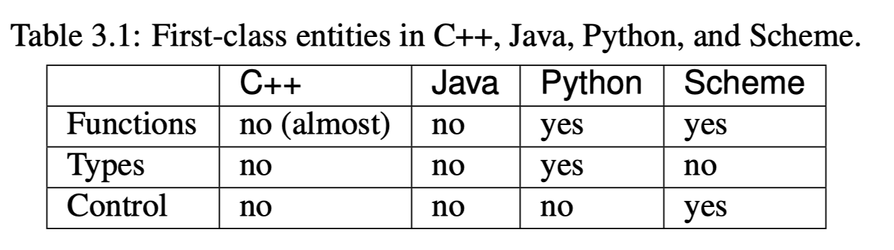

# Content

- [Foundations](#foundation)
    - [Basic Elements](#basic-elements)
    - [Names and Environments](#names-and-environments)
    - [Memory Management](#memory-management)

- Functional Programming
- Data Abstraction

# Foundation

- __imperative programming__: specifies how to do the computation step by step
    - __procedural programming__: computation is structured around procedures (functions)
    - __object-oriented programming__: computation organizeds around "objects" which are instances of "classes"
- __declarative programming__: specifies what result of the computation to get
    - __functional programming__: computation is treated as evaluation of matematical function and avoids changing state and mutable data
- modern languages like C++, Python are multi-paradigm

## Basic Elements

- __grammar__: what phrases are valid
    - __lexical structure__: what constitutes tokens in the language
    - __syntax__: what sequence of tokens constitute valid phrases
- __semantics__: meanings of a valid phrase
    - __expression__: syntatic construct that results in a value
    - __statement__: specifies some action to be carried out
        - an expression can also be a statement
    - __entity__: something that can be named
        - examples:
            - types, functions
            - data object: a location in memory that holds a value
                - variable: name paired with a data object
        - __first-class entity__
            - entities that can:
                - be passed as argument
                - be returned from function
                - assigned to a variable
                - created at runtime

        

- __pragmatics__: practical use of valid phrases
    - paradigms
- __implementation__: determines how the actions specified by a meaningful phrase are implemented
    - compiler vs interpreter
    - name resolution
    - memory management

## Names and Environments

- mappings of names to objects are restricted within a __scope__
    - global scope
        - organized by `namespace` in C++
    - local scope
        - introduced by a __block__
            - fundamemtal unit of program organization 
            - two kinds
                - body of a function
                - inline block
- __stack frame__ or __activation record__ is the data structure that keeps track of all the mappings within the function body block
    - __interpreted languages__ _typically_ use __dictionary-based__ implementation
    - __compiled languages__ _typically_ translates name in a frame to an __offset__ from the frame pointer
- name resolution within a __stack frame__
    1. start from inner most scope and proceed to the outer scope if the name is not found
    2. the process is recursively applied to the next outer scope
    3. continue this process until name is found or global scope is reached

## Memory Management

- languages with __value semantics__
    - data object introduced by variable declaration can have:
        - static storage: lifetime spans the entire program
        - automatic storage: lifetime tied to the local scope
        - thread-local storage: lifetime tied to a thread
    - dynamic storage
        - requires explicit operation for creation and destruction
        - __RAII__: uses a resource manager
            - resources lifetime tied to resource manager
                - resources are acquired on resource manager construction
                - released on resource manager destruction
            - resource manager typically has automatic storage duration
            - this way, lifetime of resources is tied to the local scope
- languages with __reference semantics__
    - variable acts as a pointer with automatic dereference
    - assignment to variable changes __which object it refers to__ instead of changing the __underlying object__
    - Python variable and Java variable of `Object` class
        - data objects are allocated on the heap
        - a pointer to the object is created on stack
    - uses __garbage collection__ for deallocation
        - reference counting
            - Python
            - like C++ smart pointers
        - tracing collectors
            - periodically traces out the set of objects in use and collects objects that are not reachable from program code
                - starts from a root set, objects that are not reachable from root set are reclaimed
            - triggered only free space is running slow
                - amortized cost is lower than reference counting
                - but leads to indeterminisitic performance
                