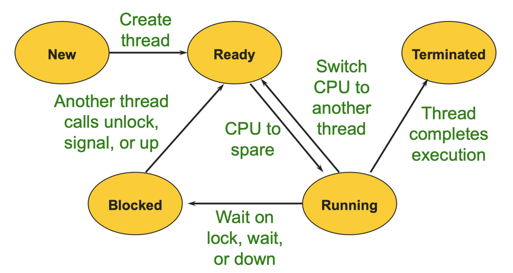
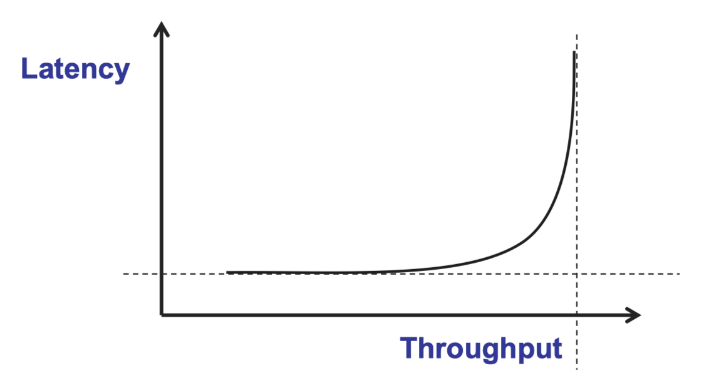
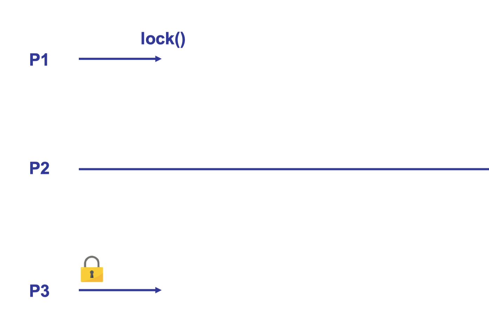
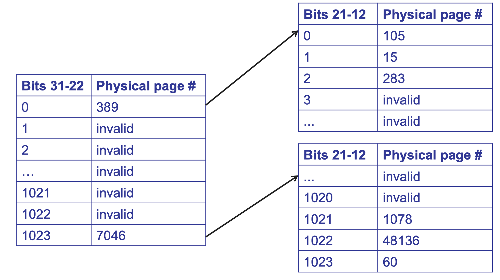
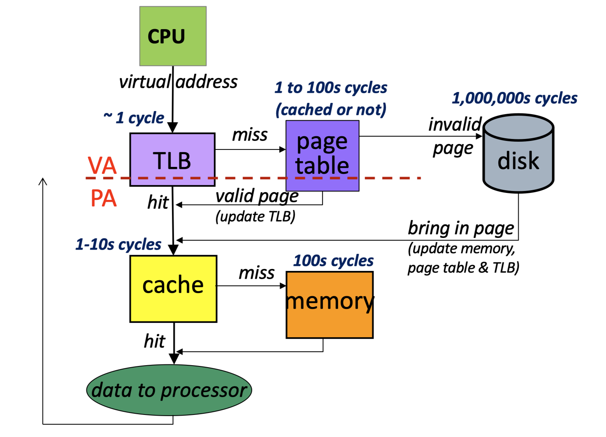
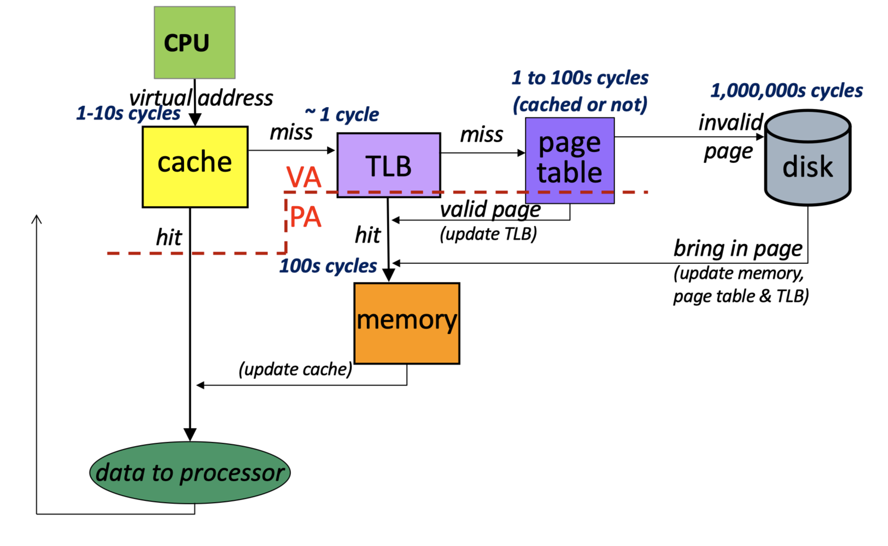

# Content

- [Overview](#overview)
- [Process and Thread](#process-and-thread)
    - [CPU Scheduling](#cpu-scheduling)
- [Virtual Memory](#virtual-memory)
    - [Implementation of Address Translation](#implementation-of-address-translation)
    - [Page Fault](#page-faults)
    - [Address Space Protection](#address-space-protection)
    - [Virtual Memory with Cache (EECS 370 Part)](#virtual-memory-with-cache-eecs-370-part)
- [Reference](#reference)


# Overview

- the operating system is the software layer between user applications and the hardware
- os creates abstractions to make hardware easier to use
    - CPU -> Process and Thread
    - Memory -> Virtual Memory
    - pesistent storage -> File system


# Process and Thread

- a process is an abstraction of a program in execution provided by the operating system
- a thread is a sequence of executing instructions from the program
    
    - when a thread is not in running state, its state is stored in a "thread control block" (TCB), which contains the values of registers:
        - program counter (PC)
        - stack base pointer and stack pointer
        - general-purpose registers
- a process can have multiple threads, each process has an individual __address space__ while each thread only has an individual __stack segment__
- analogy:
    - program: script of a play
    - process: a play being acted out
    - thread: a role
    - address space: all the objects on the stage
- shell implementation
    - `fork()`: creates a new process (copy of current process), returns 0 in child process and returns pid of child process in paretn process
    - `exec()`: run a program that is different from the calling program
    - `wait()`: wait for a process to terminate
    ```
    while (1) {
        print prompt
        ask user for input (cin)
        parse input // split into command anad args

        if (fork() == 0) {
            call exec(command) and redirect output to a file/pipe if requested
        }
        else {
            wait for child to finish, or
            run child in the background and continue
        }
    }
    ```
 
## Concurrency

- a monitor = a lock + conditional variables associated with that lock
- to program with monitor:
    - __lock/mutex__ for mutual exclusion
        - allowing critical sections to be executed atomically
    - __condition variable__ for ordering constraints
        - associated with one __mutex__
        - used when thread execution involve __before-after conditions__
            - can't proceed because condition of shared state isn't satisfactory
            - some other thread must do something
            - assign a condition variable for each situation
    ```
    lock
    while (!condition) {
        wait
    }

    do stuff

    signal/broadcast about the stuff you did
    unlock
    ```
 
## CPU Scheduling

### goals

- maximize performance
    - minimize _average_ __latency__ (response time/elapsed time to do each job)
    - maximize __throughput__ (rate at which job complete in the system)
    
- fairness
    - conflicts with response time
    - starvation = extremely unfair
        - outcome of synchronization (readers can starve writers)
        - outcome of scheduling (low priority starves)

### policies

- __FCFS (first-come, first-served)__
    - pros: simple to implement
    - cons: short jobs can be stuck behind long ones
- __round robin__: add preemptions via timer interrupts
    - pros: still simple and improve latency for short jobs
    - cons: more context-switching overhead
- __STCF (shortest time to completion first)__
    - pros: optimal average response time
    - cons:
        - potential starvation for long jobs
        - needs knowledge of future
- __Priority__
    - assign external priority to each job
    - run high-priority jobs before low-priority ones
    - use, e.g., round-robin for jobs of equal priority
    - prone to starvation
        - low priority job starves
        - priority inversion
            
- __proportional share__: used for audio, video player, etc.
- __EDF (earliest-deadline first)__: used for vehicle control, etc.
    - always succeeds if schedule is feasible, may be very poor if schedule is infeasible
- OS schedulers mix all of these
    - many heuristics and complex tuning
    - no perfect solution


# Virtual Memory

- An OS functionality that provides an abstraction over RAM to application processes.
- it enables multiple processes to share the physical memory by providing following capabilities:
    - __capacity__: it creates a illusion to the process that its address space is of `2^64` bytes, which is much larger than the underlying physical main memory
    - __address independence__: same numeric address can be used in different address spaces, yet remain logically distinct
    - __protection__: one process can't refer to another process's address space

## Implementation of Address Translation

- during execution, __MMU (memory management unit)__ translates virtual address into physical address
- __paging__ is used for implementing this address translation functionality
    - divides memory (virtual/physical) into fixed-size blocks called pages
        - virtual address is split into
            - virtual page # (high bits of address)
            - offset (low bits of address)
    - uses a page table to map a virtual page # to a physical page #
    - MMU access a page table of running process by __page table base register (PTBR)__
    - OS kernel is responsible to manage page tables
- __paging__ pros:
    - no external fragmentation
    - flexible for memory allocation and growing address space
        - request for a new physical page when needed
        - if no available physical page, evict a page to disk
    - flexible sharing
- __paging__ cons: large page tables
    - page table is allocated at the beginning of a process
        - though most of PTE will be invalid throughout the execution of process
    - __solution__: use multi-level paging to generalize this into a tree and defer allocation of page table entries
        - only allocated level 1 page table at the beginning
        - allocate level 2 page table on first access
        <p align="center">
            [1]
        </p>
- with n-level page table, n memory accesses are needed for address translation, which is slow
    - __solution__: translation look-aside buffer (TLB)
        - a special cache for page tables
        - stores a small subset of valid page table entries

## Page Faults

- a type of exception raised by MMU when accessing the physical page stored in a PTE is not allowed
    - transfer control to kernel fault handler
    - if kernel cannot handle
        - send error signal to offending process (like SIGSEGV)
    - else
        - return control to the process and let it retry the instruction
- segmentation fault is one kind of page fault
    - accessing an invalid virtual page
    - write to a read-only page
    - kernel fault handler sends a SIGSEGV signal to offending process

## Address Space Protection
1. seperation of address spaces ->
2. seperation of translation data ->
3. can update translation data only if kernel mode bit is set ->
4. mode bit is only set on trap to kernel, i.e., jumping to specific handler in kernel ->
5. locations of handlers are defined in interrupt vector table ->
6. interrupt vector table is only set up when system boots up and cannot be modified

## Virtual Memory with Cache (EECS 370 part)

- physically addressed cache
    - pros: simple
    - cons: slow, need address translation first
    <p align="center">
        [2]
    </p>
- virtually addressed cache
    - pros: fast, no address translation needed if hit
    - cons: complex, invalidate cache on a context switch or store `pid` as part of metadata of a cache line
    <p align="center">
        [3]
    </p>
- refer to [Virtually Indexed Physically Tagged (VIPT) Cache](https://www.geeksforgeeks.org/virtually-indexed-physically-tagged-vipt-cache/) for more info


# Reference
[1] from Winter 2023 EECS 482 - Lecture 13, by _Manos Kapritsos_

[2,3] from Winter 2022 EECS 370 - L24- Virtual Memory: TLB and Caches, _Austin, Biernacki, Das, Sample, Tang_
