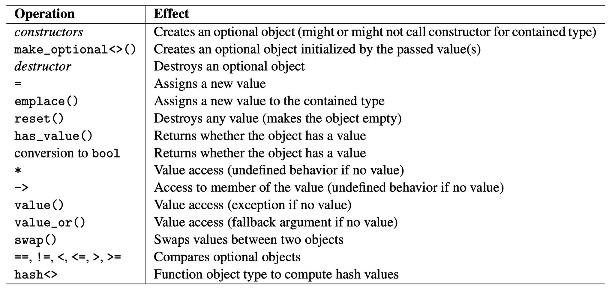

# Content

- [Part I: Basic Language Features](#part-i-basic-language-features)
    - [Chapter 1: Structured Bindings](#chapter-1-structured-bindings)
    - [Chapter 2: `if` and `switch` with Initialization](#chapter-2-if-and-switch-with-initialization)
    - [Chapter 3: Inline Variables](#chapter-3-inline-variables)
    - [Chapter 4: Aggregate Initialization Extension](#chapter-4-aggregate-initialization-extension)
    - [Chapter 5: Mandatory Copy Elision](#chapter-5-mandatory-copy-elision)
    - [Chapter 6: Lambda Extensions](#chapter-6-lambda-extensions)
    - [Chapter 7: New Attributes](#chapter-7-new-attributes)
- [Part II: Template Features](#part-ii-template-features)
    - [Chapter 9: Class Template Argument Deduction](#chapter-9-class-template-argument-deduction)
    - [Chapter 10: Compile-Time `if`](#chapter-10-compile-time-if)
    - [Chapter 11: Fold Expression](#chapter-11-fold-expression)
    - [Chapter 12: Dealing with String Literals as Template Parameters](#chapter-12-dealing-with-string-literals-as-template-parameters)
    - [Chapter 13: Placeholder Types (`auto` and `decltype(auto)`) as template parameters](#chapter-13-placeholder-types-auto-and-decltypeauto-as-template-parameters)
    - [Chapter 14: Variadic Using Declarations](#chapter-14-variadic-using-declarations)
- [Part III: New Library Components](#part-iii-new-library-components)
    - [Chapter 15: `std::optional<>`](#chapter-15-stdoptional)


# Part I: Basic Language Features

## Chapter 1: Structured Bindings

### understand structured bindings
- Structured bindings allow you to decompose an object who has multiple members and use these members to initialize multiple entities respectively.
- __main benefit is code readability__: it allows you bind multiple values to seperate variables whose names that better describe their semantic meaning
- how it works: there is a hidden anonymous variable involved
    ```cpp
    struct A {
        int i = 0;
        std::string s;
    };
    A a;
    auto [x, y] = a;
    /*
    auto e = a;
    aliasname x = a.i;
    aliasname y = a.s;
    */
    // note: aliasname, not reference!
    ```

### usage of structured bindings
- classes with no non-static private member variables
    - if inheritance is involved, all public non-static member variables must be in the same class
- raw array (non-decay)
- classes with tuple-like API
    - `std::tuple`, `std::pair` (can also use `std::tie` to unpack)
    - `std::array`
    - user-defined
        - `std::tuple_size<type>::value`: number of elements
        - `std::tuple_element<i, type>::type`: type of ith element
        - `get<i>(tuple)`: yield value of ith element of object __tuple__

## Chapter 2: `if` and `switch` with Initialization

- `if` and `switch` control structures now allow us to specify an initialization clause before the usual condition clause.
- The initialized variable will be valid for the whole `if` statement
```cpp
if (std::lock_guard lg{mut}; false) {
    // i is not valid in this scope
}
else if (int i = 1; i) {
    // lg is still valid in this scope
}
else {
    // i and lg are both valid in this scope
}
```

## Chapter 3: Inline Variables

- review [static member variables rules](../README.md#rules-of-static-member-variables)
- since C++17, you can define an object/static member variable as `inline` in the header file to bypass __one definition rule__:
    - before C++17
        ```cpp
        class A {
            static const std::string msg;
        }
        const std::string A::msg = "ERROR";    // Link ERROR if included by multiple CPP files
        A a_obj;    // Link ERROR if included by multiple CPP files
        ```
    - since C++17:
        ```cpp
        class A {
            // OK to be included by multiple CPP files
            inline static const std::string msg = "OK";
        }
        // OK to be included by multiple CPP files
        inline A a_obj;
        ```
- __main benefit__: allows a single globally available object by defining it only in a header file
- __downside__: [magic statics](../README.md#magic-statics-since-c11)


## Chapter 4: Aggregate Initialization Extension

C++17's extended aggregate initialization to allow passing values for member variables of Base class when initialize an aggregate.
```cpp
struct Base {
    int i;
    double d;
};

Base b1 = {1, 2.3}; // since C
Base b2{1, 2.3};    // since C++11

struct Derive : Base {
    bool k;
}
// since C++17
if (std::is_aggregate_v<Derive>) {  // new type_trait in C++17
    Derive d1{{1, 2.3}, false};
    Derive d2{1, 2.3, false};
}
```

## Chapter 5: Mandatory Copy Elision

refer to [Value Categories Evolution](../cppcon/value-categories/README.md)

## Chapter 6: Lambda Extensions

### `constexpr` Lambdas

Lambdas are implicitly `constexpr` if possible
```cpp
// compile-time init is not necessary but recommended
constexpr auto squared = [](auto val) { return val*val; };
// same as
class CompilerSpecificName {
public:
    template <typename T>
    constexpr auto operator() (T val) const {
        return val*val;
    }
}

// use constexpr to check if can be used at compile-time
auto squared2 = [](auto val) constexpr {    // ERROR
    // static variable cannot be used in compile-time
    static int calls = 0;   
    calls++;
    return val*val;
}
```

### Passing Copies of `this` to Lambda
```cpp
void S::member_func() const {
    // before C++17
    auto f0 = [thisCopy = *this] {
        std::cout << thisCopy.name << '\n';
    };
    // since C++17
    auto f = [*this] { std::cout << name << '\n'; };
}
```

## Chapter 7: New Attributes

### `[[nodiscard]]`
Generate warning if a returned object is discarded.

```cpp
struct [[nodiscard]] error_info { /*...*/ };
[[nodiscard]] auto* factory { /*...*/ };
```

### `[[maybe_unused]]`
Disable warning for unused variable.
```cpp
void foo(int val, [[maybe_unused]] int state) {
    assert(state == 0); // not executed if compiled with -DNDEBUG
}
```

### `[[fallthrough]]`
Disable warning when lacking a `break` statement in `switch` statement.
```cpp
switch (place) {
case 1:
    std::cout << "very ";
    [[fallthrough]];
case 2:
    std::cout << "well\n";
    break;
default:
    std::cout << "OK\n";
}
```

# Part II: Template Features

## Chapter 9: Class Template Argument Deduction

By using __class template argument deduction (CTAD)__, you can omit explicit definition of the template arguments if the __constructor__ can deduce __all__ the template parameters.
```cpp
std::pair p = {3, 4.5};
std::vector v1{42}; // vector<int> with one element
std::vector v2{v1}; // copy by default, still vector<int>
std::vector v3{v1, v2}; // vector<vector<int>>
// NOTE: for containers with complicated ctors, better not use CTAD
std::pair<int> p1 = {3, 4.5};   // ERROR: partial specification 
```

### deduction guides

- deduction guides allows us to fix the deduction rules for the constructors, like forcing the decay of raw array, since raw array does not decay to a pointer when pass-by-reference
    ```cpp
    template <typename T1, typename T2>
    struct Pair {
        T1 first;
        T2 second;
        Pair(const T1& t1, const T2& t2) : first{t1}, second{t2} {}
    };

    // use pass-by-value type deduction rule
    template <typename T1, typename T2>
    Pair(T1, T2) -> Pair<T1, T2>;

    Pair p{3, "abc"};   // Pair<int, const char *>
    ```
- for CTAD, there is an overload resolution to find the best match for type deduction given the arguments of the constructor call:
    - first the best-matched constructor is found
    - then it is compared against all the deduction guides
    - if a constructor and a deduction guide match equally well, the deduction guide is preferred
    - no preference between call-by-value and call-by-reference
- no CTAD or deduction guides for smart pointers, allows for
    ```cpp
    std::shared_ptr<Base> sp{new Derived(...)};
    ```

## Chapter 10: Compile-Time `if`

Compile-Time `if` can be used to decide whether to use _then_ part or the _else_ part at compile-time given a compile-time expression that is convertible to `bool`.

```cpp
template <typename T>
std::string asString(T x) {
    if constexpr (std::is_same_v<T, std::string>) {
        return x;
    }
    else if constexpr (std::is_arithmetic_v<T>) {
        return std::to_string(x);
    }
    else {
        return std::string(x);
    }
}

// asString<std::string> instantiated as
std::string asString(std::string x) { return x; }
```
- for the above example, if using run-time `if`, the whole `if` statement is instantiated as a whole and compilation will fail
- during compile-time, only the selected part is maintained and other parts are discarded, can be used to reduce executable size
- even if discarded, it is not ignored and can lead to compile-time error:
    - invalid syntax
    - call to undeclared function
    - `static_assert`
- compile-time conditions do not short-circuit, they are instantiated and must be valid as a whole
    ```cpp
    // ERROR if instantiated T is not integral
    if constexpr (std::is_integral_v<T> && T{} < 10) {
        return val * 2;
    }
    ```

## Chapter 11: Fold Expression

Fold expression allows us to apply binary operators over all the arguments of a parameter pack.

- unary left fold (most intuitive)
    - `(... op args)`
    - expands to `arg1 op arg2 op arg3 ...`
- binary left fold (with initial value)
    - `(val op ... op args)`
    - expands to `val op arg1 op arg2 ...`
- right folds are exactly the reverse
```cpp
template <typename First, typename... Args>
void print(const First& firstarg, const Args&... args) {
    std::cout << firstarg;
    auto outWithSpace = [](const auto& arg) {
        std::cout << ' ' << arg;
    };
    (..., outWithSpace(args));
    std::cout << '\n';
}
```

## Chapter 12: Dealing with String Literals as Template Parameters

- Non-type template parameters:
    - integral values
    - pointers to objects/functions/members
    - lvalue references
    - `std::nullptr_t`
- Since C++17, pointers with "no linkage" is allowed (but still require `static` storage duration):
    ```cpp
    template <const char* str>
    class Message { ... };

    extern const char hello[] = "Hello World!"; // external linkage
    const char hello11[] = "Hello World!";      // internal linkage

    void foo() {
        Message<hello> msg; // OK for all C++ versions
        Message<hello11> msg11; // OK since C++11

        static const char hello17[] = "Hello World!";   // no linkage
        Message<hello17> msg17; // OK since C++17
        Message<"hi"> msgError; // ERROR
    }
    ```

## Chapter 13: Placeholder Types (`auto` and `decltype(auto)`) as template parameters

Sicne C++17, you can use `auto` to declare a __non-type__ template parameter.

```cpp
template <const auto* P>
struct S {};

template <auto... VS>
class HeteroValueList {};

template <auto V1, decltype(V1)... VS>
class HomoValueList {};

template <auto N>
constexpr auto val = N;
```

## Chapter 14: Variadic Using Declarations
```cpp
template <typename ... B>
struct Merged : B... {   // inherit variadic callables
    template <typename ... T>
    Merged(T && ... t) : B(std::forward<T>(t))... {}

    using B::operator()...;
};

template <typename ... T>
Merged(T...) -> Merged<std::decay_t<T>...>;
```

# Part III: New Library Components

## Chapter 15: `std::optional<>`

Wraps a type and add a new boolean flag to check if it has value.

better refer to [cppreference](https://en.cppreference.com/w/cpp/utility/optional)


- comparison
    - both have values: compare values
    - only one has value: greater than w/o value
    - neither have values: equal
- call ctor of wrapping type
    ```cpp
    std::optional<std::complex> c{std::in_place, 3.0, 4.5};
    ```