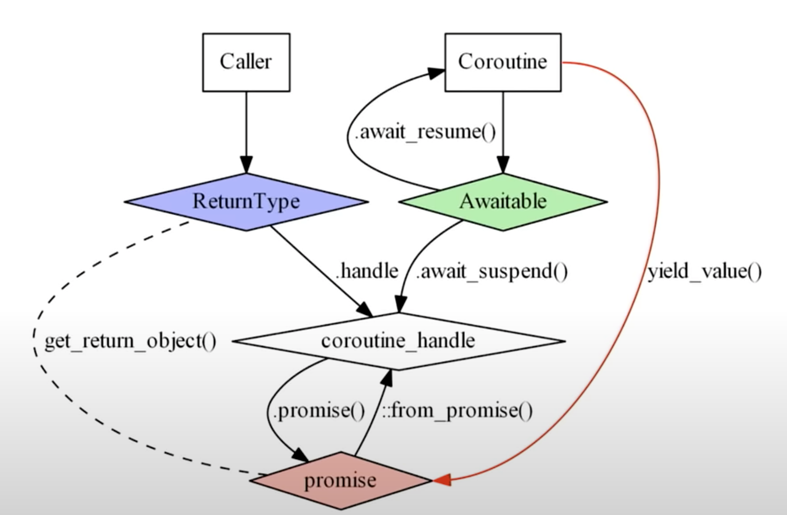

## [Index](./coroutines.md)

# C++20 Coroutine Components

- [keywords](#keywords)
- [Coroutine Interface](#coroutine-interface)
- [Promise](#promise)
- [`std::coroutine_handle`](#stdcoroutine_handle)
- [Awaitable and Awaiter](#awaitable-and-awaiter)

<!-- <p align="center">
    
</p> -->

When it is said that C++ coroutines are not tied to any particular runtime, it means that the C++ standard specifies the syntax and semantics of coroutines but does not prescribe how they should be scheduled, executed, or integrated with the rest of the system. This is unlike languages such as JavaScript (with its event loop model) or C# and Python (which have built-in support for async/await patterns tightly integrated with their runtime environments).

In C++, the coroutine support is designed to be low-level and flexible, allowing library authors and application developers to build their abstractions on top of it. This design choice gives C++ programmers the freedom to implement coroutines in a way that best fits their application's architecture, performance requirements, and existing libraries/frameworks.


## Keywords

- a function is coroutine if it contains any coroutine keywords: `co_await`, `co_yield`, `co_return`
- `co_await`: used to suspend current coroutine execution
- `co_yield`
    - `co_yield val` equivalent to `co_await promise.yield_value(val)`
- `co_return`: [Return operation](./coroutine_theory.md#return-operation-subroutine--coroutine) for coroutine

## Coroutine Interface

- with type member `promise_type`
- a wrapper around `std::coroutine_handle<promise_type>`
- typically the return type of the declared coroutine
    - it allows the compiler to determine the promise to construct in coroutine state through metafunction `std::coroutine_traits`
    - if not declared as the return type (i.e., using interface created some where else and passed as reference), then need to implement overload of the metafunction `std::coroutine_traits`

## Promise

- customization point for coroutine behaviors
    - mandatory
        - `get_return_object()`: init and return the coroutine interface
        - `initial_suspend()` and `final_suspend()`: customize whether to suspend at the beginning/end
            - if `final_suspend()` chooses to suspend, it will not set the resumption-point, calling `resume()` will be UB
            - else, it will destroy the coroutine state, if the __RAII Coroutine Interface__ also calls `destroy()`, we have double `delete`
        - `unhandled_exception()`: deal with exception
    - optional
        - can define data members as needed, typical use cases include storing the returned and yield value to be accessed through coroutine interface
        - constructor that takes the same parameters (by reference) as the coroutine will be preferred, if not defined, default ctor is called
        - `return_void()` and `return_value(T val)`: called when `co_return;` or `co_return val;`, can be overloaded
        - `yield_value(T val)`: called when `co_yield val`
        - `operator new` and `operator delete`: customize memory allocation for coroutine state
            - only called when the compiler cannot prove that the lifetime of coroutine state is nested inside the caller
        - `await_transform()`: define [awaitable](#awaitable)

## `std::coroutine_handle`

- contains a pointer to the coroutine state
    - `sizeof(std::coroutine_handle) == 8`
    - get with `hdl.address()`
- `hdl.resume()`: resume the coroutine
- `hdl.done()`: returns whether the suspended coroutine is suspended at final suspend point (undefined behavior if hdl does not refer to a suspended coroutine)
- `hdl.destory()`: destory the suspended coroutine (undefined behavior if hdl does not refer to a suspended coroutine)
- https://en.cppreference.com/w/cpp/coroutine/coroutine_handle

## Awaitable and Awaiter

- __Awaiter__ controls the behavior of `co_await`
- __Awaitable__ type is type that supports `co_await` operator
    - it is convertible to __awaiter__ or __awaiter__ itself
- operand of `co_await` must be convertible to awaitable or be an awaitable itself
    ```cpp
    template<typename Promise, typename T>
    decltype(auto) get_awaitable([[maybe_unused]] Promise& p, T&& expr)
    {
    if constexpr (has_any_await_transform_member_v<Promise>)
        return p.await_transform(std::forward<T>(expr));
    else
        return std::forward<T>(expr);
    }

    template<typename Awaitable>
    decltype(auto) get_awaiter(Awaitable&& awaitable)
    {
    if constexpr (has_member_operator_co_await_v<Awaitable>)
        return std::forward<Awaitable>(awaitable).operator co_await();
    else if constexpr (has_non_member_operator_co_await_v<Awaitable&&>)
        return operator co_await(std::forward<Awaitable>(awaitable));
    else
        return std::forward<Awaitable>(awaitable);
    }

    co_await expr;
    // equivalent to:
    co_await get_awaiter(get_awaitable(promise, expr));
    ```
- __Awaiter__ contains three member functions that control the behavior of `co_await` expression
    - `bool await_ready()`
        - return whether the it is ready for the `co_await` operation to finish immediately and determine whether the coroutine should suspend
        - `true`->not suspend, `false`->suspend
    - `Ret await_suspend(std::coroutine_handle<promise_type> hdl)`
        - executed immediately after suspension
        - `hdl` refers to the coroutine just suspended
        - if `same_as<Ret,void>`, nothing special
        - if `same_as<Ret,bool>`, returns whether it should maintain this suspended state
            - `true`->maintain, `false`->resume
        - if `same_as<Ret, std::coroutine_handle<>>`,
            - if returns `std::noop_coroutine_handle`, nothing special
            - else resume the coroutine referred by the returned `std::coroutine_handle` immediately
                - symmetric transfer
                ```cpp
                void CoroHdl::resume() {
                    ...
                    if (!awaiter.await_ready()) {
                        auto h = awaiter.await_suspend(*this);
                        h.resume(); // noop_coroutine_handle does noop
                        return;
                        // return immdiately after h.resume()
                        // h.resume() is a tail-call, it reuses
                        // stack frame of CoroHdl::resume()
                    }
                    ...
                }
                ```
    - `Ret await_resume()`
        - executed as the last step of `co_await` operation
            - if `co_await` suspend the coroutine, then it is executed immediately after `resume`
            - if `co_await` does not suspend, it is called after `await_ready()`
        - return value is the value of expression `co_await expr`