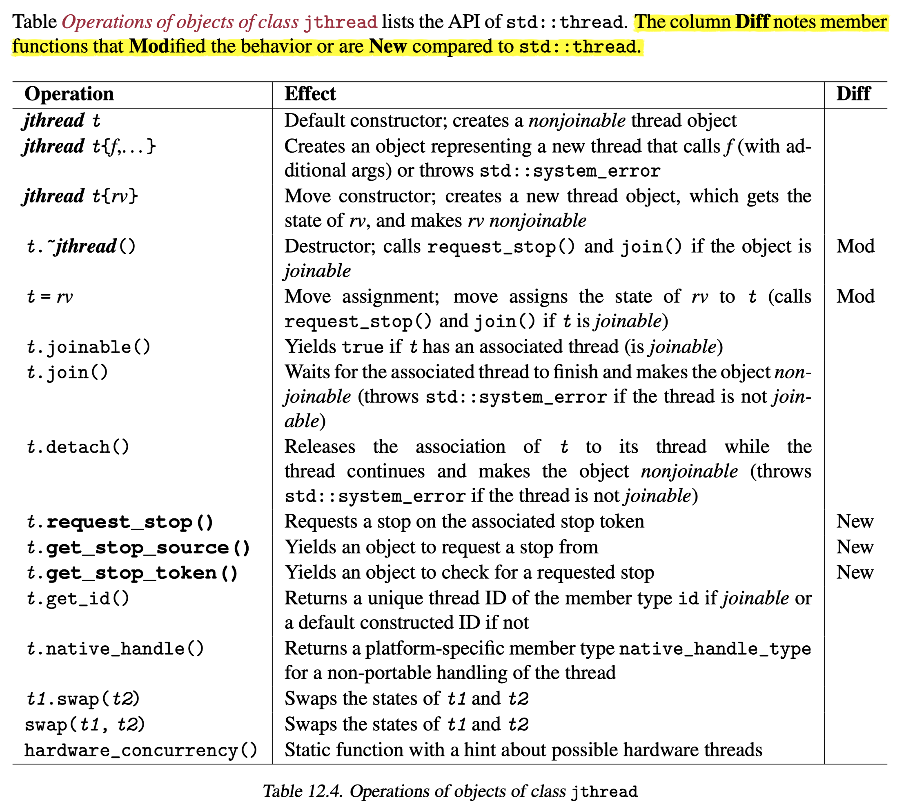
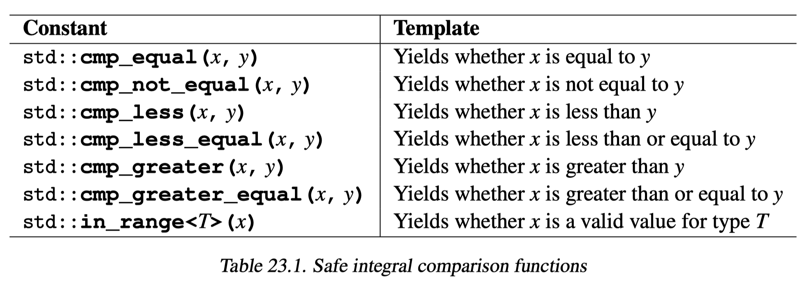
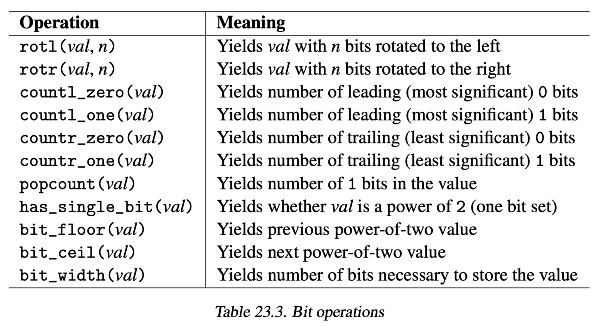

# Content

- [Chapter 1: Comparisons and Operator `<=>`](#chapter-1-comparisons-and-operator)
- [Chapter 2: Placeholder Types for Function Parameters](#chapter-2-placeholder-types-for-function-parameters)
- [Chapter 3~5: Concepts, Requirements and Constraints](#chapter-35-concepts-requirements-and-constraints)
- [Chapter 6~9: Ranges and Views](./ranges/ranges.md)
- [Chapter 10: Formatted Output](#chapter-10-formatted-output)
- [Chapter 12: `std::jthread` and Stop Tokens](#chapter-12-stdjthread-and-stop-tokens)
- [Chapter 13: Cocurrency Features](#chapter-13-concurrency-features)
- [Chapter 14~15: Coroutines](./coroutines/coroutines.md)
- [Chapter 16: Modules](#chapter-16-modules)
- [Chapter 17: Lambda Extensions]
- [Chapter 18: Compile-Time Computing](#chapter-18-compile-time-computing)
- [Chapter 19: Non-Type Template Parameter (NTTP) Extensions](../cppcon/template/template.md#template-parameters)
- [Chapter 20: Small Improvements for the Core Language](#chapter-20-small-improvements-for-the-core-language)
- [Chapter 21: Small Improvements for Generic Programming](#chapter-22-small-improvements-for-generic-programming)
- [Chapter 22: Small Improvements for the C++ Standard Library](#chapter-23-small-improvements-for-the-c-standard-library)

# Chapter 1: Comparisons and Operator `<=>`

- defining `operator==` enables use for all equality operators
    - compiler rewirtes `a != b` to `!(a == b)`
    - change the order when implicit conversion applies
- defining `operator<=>` enables uses for all relational operators
    - called "three-way comparison operator", "spaceship operator"
    - compiler rewrites `a < b` to `a <=> b < 0`
    - change the order when implicit conversion applies
    - defined as `default` to perform member-wise comparison
        - also implicitly generated `default` version of `operator==`
      ```cpp
      struct S {
        // enable use of all comparison operaotors
        [[nodiscard]] auto operator<=> (const S& rhs) const = default;
      };
      ```
- for `default` versions
    - `noexcept` if comparing the members `noexcept`
    - `constexpr` if possible

## Return Types of `operator<=>`

- returns __comparison category types__ instead of `bool`
- `std::strong_ordering` for the types that one of (`==`, `<`, `>`) must applies for any two values
    - contains static member constants `less`, `equal`/`equivalent`, `greater`
- `std::weak_ordering` for the types that __equivalent__ values might not be __equal__ (eg. case-insensitive strings)
    - contains static member constants `less`, `equivalent`, `greater`
- `std::partial_ordering` for the types that contains comparable value (e.g. `NaN` in floating-point type, any comparison yields `false`)
    - contains static member constants `less`, `equivalent`, `greater`, `unordered`
- notes
    - static member constants have the same type as the class
        - e.g., `std::strong_ordering::less` is of type `std::strong_ordering`
    - comparison category types are not integers, they contain an integral type (`signed char` in [gcc](https://github.com/gcc-mirror/gcc/blob/master/libstdc%2B%2B-v3/libsupc%2B%2B/compare)) data member
        - can only be compared with `0` (or `nullptr`/`NULL`)
    - stronger ordering types can be implicitly converted to weaker ordering types
        ```cpp
        using namespace std;
        static_assert(
            is_same_v<
                common_comparison_category_t<strong_ordering,
                                             weak_ordering>,
                weak_ordering
            >);
        ```

# Chapter 2: Placeholder Types for Function Parameters

- function template syntax can be abbreviated
    ```cpp
    void foo(auto t);
    ```
- in the following code, `foo1` is equivalent to `foo2`
    ```cpp
    template <class T>
    void foo1(auto t1, T t2);

    template <class T2, class T1>
    void foo2(T1 t1, T2 t2);
    ```

# Chapter 3~5: Concepts, Requirements and Constraints

refer to [template note](../cppcon/template/template.md)

# Chapter 6~9: Ranges and Views
refer to [ranges note](./ranges/ranges.md)

# Chapter 10: Formatted Output

## format of format strings
- replacement fields specified `{}`
    - use `{{` to print `{`, use `}}` to print `}`
- in replacement fields: `{n:fmt}`
    - `n`: argument index
    - `fmt`: format specifier
    - both are optional and seperated by colon `:`
- format specifiers: `fill align sign # 0 width .prec L type`
    - all are optional, bulit-in types have default format specifiers
    - `align`
        - `<`(left-aligned), `>`(right-aligned), `^`(centered)
        - `fill`
            - must be used with `align`
            - the character to fill the field up to `width`
            - default: space
    - `width` specifies minimum field width
    - `.prec`
        - for floating-point types, specifies number of digits after dot(`.`)
        - for strings, specifies maximum number of characters

## usage

```cpp
constexpr const char* fmt = "key: {1:06.3}, val: {0:.3}";
std::format(fmt, "abcdefg", 3.4);
// "key: 0003.4, val: abc"
```
- format string must be a compile-time value
    - allows error checking in compile time, better performance
    - if not, use `std::vformat()`
- since C++23, `std::print()` equivalent to `std::cout << std::format()`

# Chapter 12: `std::jthread` and Stop Tokens

## Stop Sources and Stop Tokens

- code example [stop.cpp](./stop.cpp)
- a general-purpose mechanism to asynchronously request a stop
    - the asynchronous task that is requested to stop can have multiple ways to react to it
- `std::stop_source` is used to request a stop and `std::stop_token` is used to react to a stop request
- each `std::stop_source` and `std::stop_token` is associated with a shared stop state
    - stop state is created when default constructing `std::stop_source`
    - a stop state can only be requested stop once
    - stop state is destroyed only when the last of `std::stop_source`, `std::stop_token` and `std::stop_callback` is destroyed
- `std::stop_callback` can be used to register a callable when a stop is requested
    - it is constructed using a `std::stop_token` and a callable
    ```cpp
    void task(std::stop_token st) {
        // register temporary callback:
        std::stop_callback cb{st, []{
            std::cout << "stop requested\n";
        }};
    }   // unregisters callback
    ```
    - the callable cannot throw, otherwise `std::terminate` is called
    - register and unregister process are carefully synchronized that only one of __three__ cases can happen:
        - stop request before construction of `std::stop_callback`, then __callable__ will be called immediately where the callback is initialized
        - stop request after construction and before destruction of `std::stop_callback`, then __callable__ will be called immediately where `request_stop()` was called
            - `request_stop()` blocks until all registered callables have been called
            - order of calls not defined
        - stop request after destruction of `std::stop_callback`, then __callable__ will never be called


## `std::jthread`

- an enhanced version of `std::thread`
    - `RAII`: `join` is called in destructor (if `joinable`)
    - provides a _cooperative_ mechanism to signal that a thread should no longer run
        - it is _cooperative_ since the stop request does not kill the thread, which will leave the program in a corrupt state
        - uses [stop tokens](#stop-sources-and-stop-tokens)
        - the ctor that starts a thread creates a `std::stop_source` and stores it as a member of the thread object
        - if the called function's first parameter is `std::stop_token` and ctor does not receive a argument for it, then ctor will generate a `std::stop_token` to pass to the function

<p align="center">
    
</p>

```cpp
{
    std::vector<std::jthread> threads;
    auto task = [](std::stop_token st) {
        while (!st.stop_requested()) {
            std::cout << "do something\n";
        }
    };
    for (int i = 0; i < numThreads; i++) {
        threads.push_back(std::jthread{task});
    }
    // request stops for all threads before we start to join
    for (auto& t : threads) t.request_stop();
}   // dtor joins all threads
```

# Chapter 13: Concurrency Features

## New Synchronization Primitives

- latch, barrier
- semaphore

## New Atomics

- `std::atomic_ref`: provide a temporary atomic API for trivially copyable type
- floating-point type
- atomic shared pointers

## Synchronized Output Stream

```cpp
std::osyncstream(std::cout) << "Hello, " << "World!" << '\n';
```

# Chapter 14~15: Coroutines

refer to [Coroutines note](./coroutines/coroutines.md)


# Chapter 16: Modules

- modules allow programmers to define a clear API for a __large__ logical entity
    - the logical entity might have a significant size of code distributed over multiple files

## Components of a Module

- a module consist of one or more __module units__, which are translation units that belong to a module
- the kind of module unit is identified by the `module` declaration within the C++ source file
    - [__primary interface__](#primary-interface): `export module name;`
    - [__interface partition__](#interface-partition): `export module name:partname`;`
    - [__implementation unit__](#implementation-unit): `module name;`
    - [__internal partition__](#internal-partition): `module name:partname`;`
- recommended file suffix
    - interfaces files (__primary interface__ and __interface partition__): `.cppm`
    - __implementation unit__: `.cpp`
    - __internal partition__: `cppp`
- example code:
    - __primary interface__: [m1.cppm](./modules/m1.cppm)
    - __interface partition__: [m1p1.cppm](./modules/m1p1.cppm)
    - __implementation unit__: [foobar.cpp](./modules/foobar.cpp)
    - __internal partition__: [m1p2.cppp](./modules/m1p2.cppp)
    - __user__: [m1test.cpp](./modules/m1test.cpp)
    - note: `g++` just partially supports modules by now (2023.7), hard to experiment

### __Primary Interface__

- each module have and only have one __primary interface__
    - all other module units are optional
- uses `export` keyword to speicify all the entities that can be used (visible) by the program that `import` this module
- `export`ed entities will not violate ODR when imported by multiple translation units

### __Interface Partition__

- allows projects to maintain `export`ed interfaces in different files
- for __primary interface__ to `export` interfaces that is declared with `export` in __interface partition__: `export import :`_partname_`;`

### __Implementation Unit__

- allows projects to split definitions into multiple files 
    - can be maintained seperately
    - if local things change we don't need to recompile the whole module

### __Internal Partition__

- allows projects to move __module-local__ declarations and definitions outside the primary interface


# Chapter 17: Lambda Extensions

## Generic Lambda with Template Parameters

```cpp
auto f = []<class T>(const T& t) { T tmp{}; /*...*/ };
// call: must writes out `operator()`
f.operator()<int>(2);
```

## Calling the Default Constructor of Lambda

- lambda with no captures have a default ctor and assignment op
```cpp
auto cmp1 = []{};
decltype(cmp1) cmp2;    // default ctor provided
cmp1 = cmp2;            // assignment operator provided
```

## As NTTP

- side effect of extension of NTTP in C++20
- lambda with no captures is [structural type](../cppcon/type-categories.md#structural-type)

## `consteval` Lambdas

```cpp
// can only be called in compile time
auto hashed = [](const char* str) consteval { /*...*/ };
```

## Lambdas as Coroutines

- lambdas with no captures can be coroutines

# Chapter 18: Compile-Time Computing

- `constinit`
    - used to force and ensure that a _mutable_ static or global variable is initialized at compile time
    - `constinit = constexpr - const`
    - intialization value can only be a __constant__ value at compile time
        - `constinit` variable is not __constant__ so cannot be used to initialize another `constinit` variable
- `consteval`
    - forces a function to only be called in compile-time
- `std::is_constant_evaluated()`
    - generally speaking, yields true if
        - called in compile-time
        - in a constant expression, both the followings yield `true`:
            - `const bool i = std::is_constant_evaluated()`
            - `static bool i = std::is_constant_evaluated()`

## Contraints and Extensions for `constexpr` Functions

- can use __heap memory__ at compile time
    - enables the use of `std::vector` and `std::string` in `constexpr` function
    - need to ensure that memory allocated in one constant expression context be deallocated in the same context
        - [Why `constexpr` specifier is not allowed for non-empty `std::vector` in `consteval` function?](https://stackoverflow.com/questions/76774877/why-constexpr-specifier-is-not-allowed-for-non-empty-stdvector)
        - [What are the conditions that `constexpr` will start a new constant expression context?](https://stackoverflow.com/questions/76775335/what-are-the-conditions-that-constexpr-will-start-a-new-constant-expression-co)
- only literal types in declaration and body
    - literal type: type that can be declared as `constexpr`
    - variables cannot be `static` or `thread_local`
- runtime polymorphism
    - can use `virtual` function and `dynamic_cast`
- ctor and dtor can be `constexpr` only if the class has no virtual base class
- implicitly `inline`


# Chapter 19: Non-Type Template Parameter (NTTP) Extensions

refer to [template note](../cppcon/template/template.md#template-parameters)


# Chapter 20: Small Improvements for the Core Language

- range-based `for` loop with initialization
    ```cpp
    for (auto&& coll = getValues(); int i : coll) {}
    ```
- `using` for enum class
    ```cpp
    enum class Status {open, close};
    Status s1 = open;   // ERROR
    using enum Status;
    auto s2 = open;     // OK
    ```
- attributes
    - `[[likely]]` and `[[unlikely]]` to give compiler hints for branch optimizations
        ```cpp
        if (n > 0) [[likely]] n++;
        else n--;
        ```
        - excessive use might be counter-productive
    - `[[no_unique_address]]`: used to make state-less members not occupying memory storage
        - state-less members examples
            - hash function of an unordered container
            - deleter of `std::unique_ptr`
            - standard allocator of containers or strings
        ```cpp
        struct Empty {};
        // before C++20: empty base calss optimization
        struct S1 : Empty {
            int i;
        };  // sizeof(S1) == 4

        // since C++20
        struct S2 {
            [[no_unique_address]] Empty e;
            int i;
        };  // sizeof(S2) == 4
        ```
    - `[[nodiscard]]` can have parameters for warning message
        - used to indicate which of the followings:
            - memory leaks
            - non-intuitive behavior 
                - ignore return result of `empty()`
            - unnecessary overhead
                - ignore result of a pure function
        ```cpp
        [[nodiscard("Did you mean clear()?")]]
        bool empty() const;
        ```

# Chapter 22: Small Improvements for Generic Programming

- conditional `explicit`
    - usage example: delegate type conversion support to a wrapper type
        ```cpp
        #include <type_traits> // for std::is_convertible_v<>

        template <class T>
        class Wrapper {
            T value;
          public:
            template <class U>
            explicit(!std::is_convertible_v<U, T>)
            Wrapper(const U& val) : value{val} {}
        };
        ```

# Chapter 23: Small Improvements for the C++ Standard Library

- `std::source_location`
    ```cpp
    #include <source_location>
    #include <iostream>
    #include <format>

    void bar(std::source_location sl = std::source_location::current()) {
        std::cout << std::format("file:\t\t{}\n", sl.file_name());
        std::cout << std::format("function:\t\t{}\n", sl.function_name());
        std::cout << std::format("line:\t\t{}\n", sl.line());
    }
    ```
- safe comparisons of integral values

    

    ```cpp
    int x = -7;
    unsigned y = 42;
    bool b1 = x < y;            // false
    bool b2 = comp_less(x, y);  // true
    ```

    - `std::ssize` can be used to get signed value of the size fo a range
        ```cpp
        for (int i = 0; i < ssize(coll) /* use ADL here */; ++i) {
        }
        ```
- utilities for dealing with bits
    - bit operations

        
    
        - _val_ must be __unsigned integral__
    - `std::bit_cast<>()`: cast between integral types with the same number of bits
