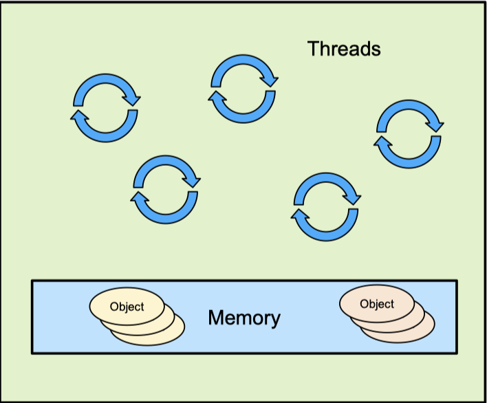

# C++ Abstract Machine

> __When we write C++ code, we are writing to the C++ abstract machine__

- [Definition](#definition)
- [Characteristics](#characteristics)
- [Structure](#structure)
    - [Memory Model](#memory-model)
    - [Objects](#objects)
    - [Threads](#threads)

## Reference
[Back to Basics: The Abstract Machine - Bob Steagall - CppCon 2020](https://www.youtube.com/watch?v=ZAji7PkXaKY)

## Definition

> “___The C++ abstract machine is a portable abstraction of your operating system, kernel and hardware. The abstract machine is the intermediary between your C++ program and the system that it is run on.___”   - Bryce Adelstein Lelbach, Core C++ 2019   The C++ Execution Model

> ___“Programming language specifications (not just C and C++, all high-level programming language specifications), define the languages in terms of an abstract machine, which, in this usage, is the simplest imaginary computer capable of executing a program in the source language (or a family of languages, as in the case of the JVM).”___
  - Sergey Zubkow, www.quora.com (2015)

The C++ abstract machine is a theoretical model defined by the C++ standard that describes the behavior of C++ programs. It specifies how C++ constructs should behave, but it doesn't dictate how they must be implemented by compilers or run on actual hardware. This model allows for portability, enabling C++ code to run on various platforms and architectures as long as the compiler and runtime environment adhere to the standard's specifications.

### Design of the C++ Abstract Machines

- two C++ language goals:
    - support performance-critical software
        - give the programmer control over every aspect of performance
        - code should perform predictably
        - leave no room for a lower-level language
    - support current hardware architecture, OS platforms and environments as they evolve
- to meet these two goals:
    - C++ has no layers of abstraction or execution between it and hardware
        - no interpreters or virtual machines
        - allow high-quality code generation by compiler
        - there is no room for another language between C++ and the hardware
    - C++ maps types and operations directly onto hardware
        - fundamental C++ types (e.g., char, int, double) map directly into memory entities
        - C++ pointers, references, arrays map directly to hardware addressing capabilities
- driven by these goals, C++ abstract machine is deliberately defined to be “close to the hardware” 

## Characteristics

- __flexibility of implementation: "as-if" rule__
    - an implementation is free to disregard requirement of C++ standard document as long as the result is ___as if___ the requirement had been obeyed
        - __implementation__: tool to verify a program on the abstract machine and generate executable image (compiler, linker)
    - implementations must emulate the __observable behavior__ of the abstract machine
        - __observable behavior__: execution state information exchanged over time with outside entities
    - expressions with non-observable side effects may be ignored
        - __expressions__: a sequence of operators and operands that specify a computation
        - __side effects__: changes in the program's execution state
- __parametrized__: some behaviors of the abstract machine are __implementation-defined__, they depend on implementation and document
    - examples:
        - `sizeof(void*)`: depends on the hardware
        - `CHAR_BIT`: the number of bits in a byte
        - the text returned by `std::bad_alloc_what()`
- __non-deterministic__: some behaviors of the abstract machine are __unspecified__, they depend on implementation
    - each unspecified behavior yields one result from the set of all possible valid result
    - examples:
        - order of evaluation of arguments in a function call
        - whether identical string literals are stored at the same address
        - initial value of storage returned dynamic allocation requests
        - thread schedules
- behaviors can be __undefined__ -- no requirements, anything can happen
    - examples:
        - dereferencing a null pointer
        - accessing an object through a pointer of different type

## Structure

### Memory Model

- memory is a single flat space, no hierarchy
- all parts of memory are equally reachable by the abstract machine
- memory is composed of bytes and every byte has a unique location in memory - its __address__, which are represented by __pointers__
- since C++11, it is __multithreading-aware__ and defines that memory accesses are sequentially consistent for data-race free program (SC-DRF)

### Objects

- operations in a program create, destroy, refer to, access and manipulate __objects__, which have
    - size (`sizeof`)
    - alighment (`alignof`)
    - storage duration
        - automatic
        - static
        - dynamic
        - thread_local
    - [lifetime](../object_lifetime/object_lifetime.md)
    - type
        - specify size and alignment and allowable operations on it
    - value
    - name (optional)

### Threads

- A thread of execution (also known as a thread) is a single flow of control within a program
    - This includes the initial invocation of a specific top-level function, and
    - Recursively includes every function invocation subsequently executed by the thread
    - A C++ program can have more than one thread running concurrently
    - Every thread in a program can potentially access every object and function in that program
- When one thread creates another, the initial call to the top-level function of the new thread is executed by the new thread, not by the creating thread