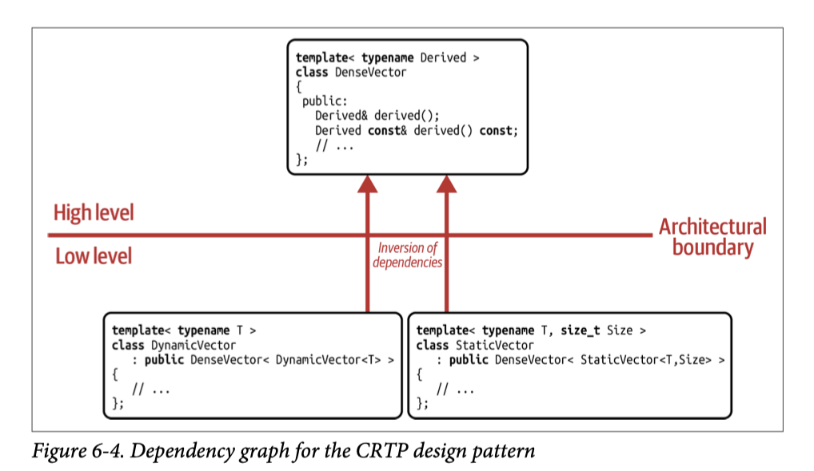

## [Index](../c++_software_design.md)

# CRTP

```cpp
template <class Derived> class Base { /*...*/ };
class D : Base<D> { /*...*/ };
```

- __Why CRTP is valid__: instantiating a template does not need complete type
    - unless the class template contains something like
        - a field of the incomplete type, which makes it unable to determine `sizeof`
        - type aliasing to member types of the template parameter

## Use CRTP to Introduce Static Type Categories (as Design Pattern)

- The CRTP __design pattern__ builds on the common idea of creating an abstraction using a base class. But instead of establishing a runtime relationship between base and derived classes via virtual functions, it creates a compile-time relationship.
- Intent: “Define a compile-time abstraction for a family of related types.”
- With the template parameter, the base class is now aware of the actual type of the derived type and can use a `static_cast` to convert itself into a reference to the derived class and calls methods of derived class

```cpp
template <typename Derived>
struct DenseVector {
    // ...
    decltype(auto) operator[](size_t index) { return derived()[index]; }
    decltype(auto) operator[](size_t index) const { return derived()[index]; }

    decltype(auto) begin() { return derived().begin(); }
    decltype(auto) begin() const { return derived().begin(); }
    // ...
};
```
- __Strengths__:
    - better performance if you don't need runtime polymorphism for the base class abstraction
- __Shortcomings__:
    - lack of common base class (no runtime polymorphism) and everything that comes in touch with a CRTP base class becomes a template itself
        ```cpp
        template <typename Derived>
        auto l2norm(DenseVector<Derived> const& vector);
        ```
        - note that C++23 deducing this allows only one common base class, but it is not polymorphic base class, in this way, you can no longer have function template that takes this base class anymore since you don't know which derived class to cast to and there is nothing you can do with it
    - cannot access derived class type members
    - intrusive design pattern
- __Obsolete since C++20 concept__:
    - C++20 concept is an easier, more powerful and nonintrusive alternative to define a compile-time abstraction for a family of types
        ```cpp
        template <typename T>
        concept DenseVector = requires(T t, size_t index) {
            t[index];
            { t.begin() } -> std::same_as<typename T::iterator>;
        } &&
        requires (T const t, size_t index) {
            t[index];
            { t.begin() } -> std::same_as<typename T::const_iterator>;
        };

        template <DenseVector VectorT>
        auto l2norm(VectorT const& vector);
        ```
    - note it does not completely restrict the function template to our set of dense vector types (like `std::string` also supports the same operation), to be more specific, we can introduce a compile-time boolean variable template:
        ```cpp
        template <class T>
        constexpr bool enable_DenseVector = false;

        template <typename T>
        concept DenseVector = /* ... */ && enable_DenseVector<T>;

        template <>
        constexpr bool enable_DenseVector<DynamicVector> = true;
        ```
        - this is how C++20 defines the concept `std::ranges::borrowed_range`

## Use CRTP for Static Mixin Classes (as Implementation Pattern)

- mixin class in C++ is base class that "inject" the desired operations, it serves as implementation details instead of abstraction
    - Standard library examples: `std::ranges::view_interface`, `std::enable_share_from_this`
- pre C++23, CRTP is the way to define mixin class
    ```cpp
    template <typename Derived>
    struct Swappable
    {
        friend void swap(Derived& lhs, Derived& rhs) {
            std::ranges::swap(lhs.get(), rhs.get());
        }
    };

    template <typename T>
    using Meter = StrongType<T, struct MeterTag, Addable,Swappable>;
    ```
- __Might be Obsolete since C++23 deducing this__
    - since C++23, we have deducing this, and the template parameter of mixin class is not needed anymore in many cases
    ```cpp
    struct Swappable {
        template <typename Self>
        void swap(this Self&&, Self& rhs) {
            std::ranges::swap(get(), rhs.get());
        }
    };
    ```
    - cases that still needs CRTP
        - injecting hidden friend
        - needs the derive class info to declare data members
            - like `enable_share_from_this<T>` needs to declare `weak_ptr<T>`
            - it might be possible without template parameter but might not be as simple as using the template parameter