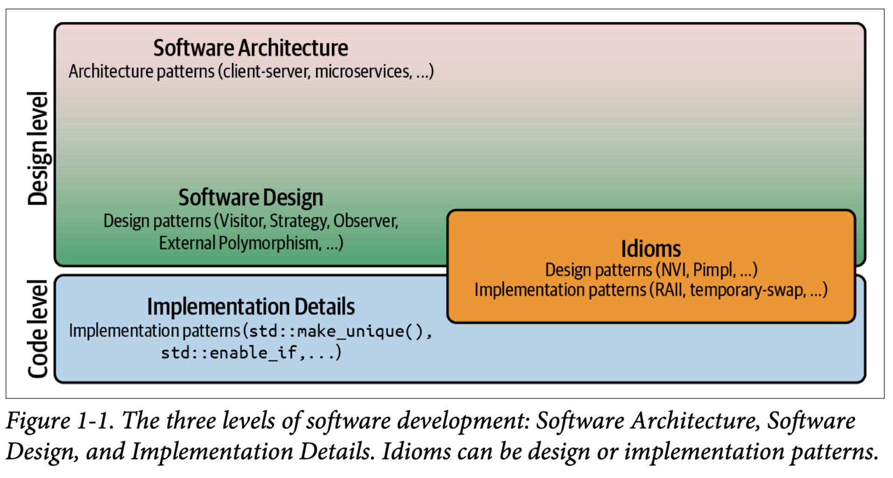
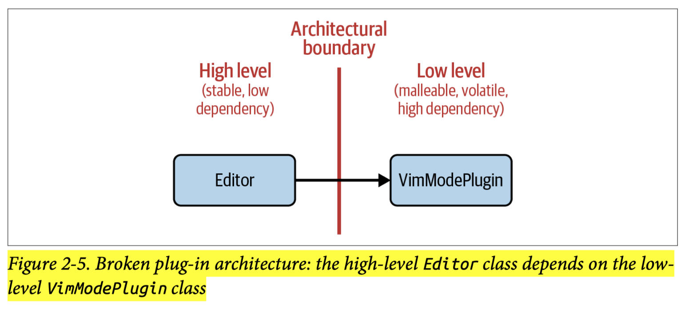
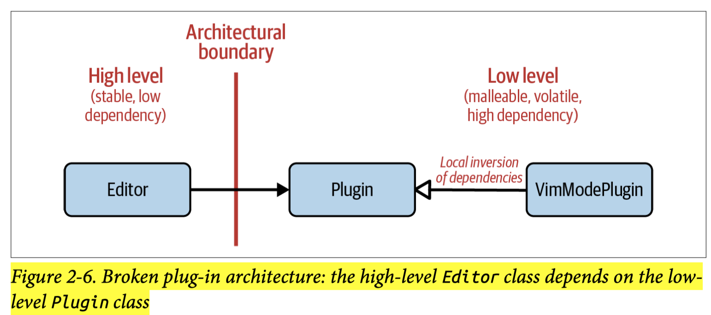
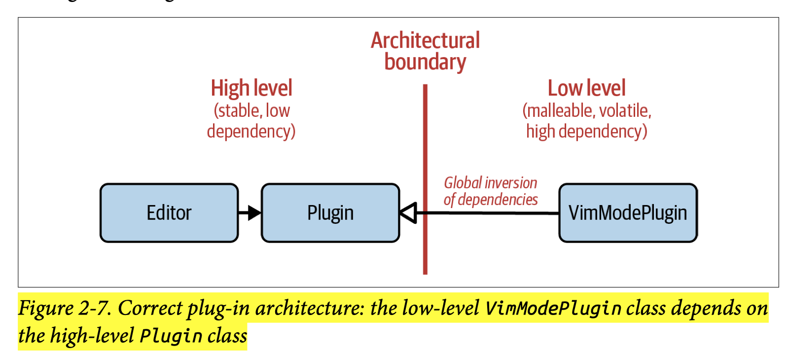
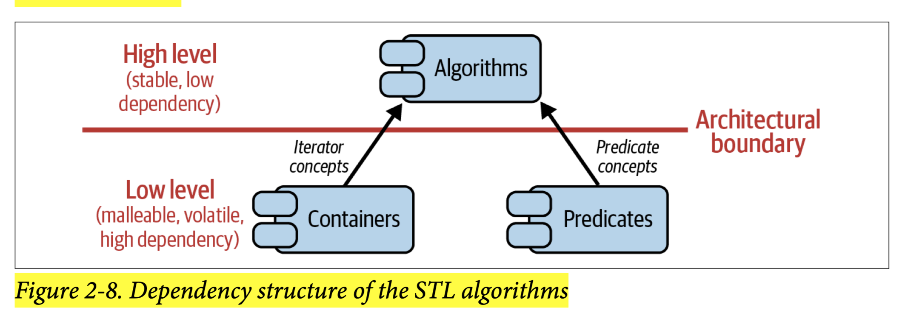

## [Index](../c++_software_design.md)

- [The Art of Software Design](#the-art-of-software-design)
    - [Three Levels of Software Development](#three-levels-of-software-development)
    - [Design for Change](#design-for-change)
    - [Design for Testability](#design-for-testability)
- [The Art of Building Abstractions](#the-art-of-building-abstractions)
    - [Liskov Substitution Principle (LSP)](#liskov-substitution-principle-lsp)
    - [Abstractions in Static Polymorphism](#abstractions-in-static-polymorphism)
    - [Dependency Inversion Principle (DIP)](#dependency-inversion-principle-dip)

# The Art of Software Design

- __Features vs Design__: The overall structure is the design of a project. The design plays a much more central role in the success of a project than any feature could ever do. Features cannot save bad design while good design can lead to success even with an older C++ standard
- __Managing Dependencies__: Software design is the art of managing interdependencies between software components. It aims at minimizing _artificial dependencies_ (which is in contrast to _intrinsic dependencies_) and introduces the necessary abstractions and compromises.
- __Art instead of Science__: Software design is an art. It’s not a science, and it doesn’t come with a set of easy and clear answers.
- __Avoid Premature Application of SOLID__: SOLID are your tools for achieving better maintainability and simplifying change. They are not your goals. If you don’t know what kind of change to expect, then don’t guess—just wait. Wait until you have a clear idea about what kind of change to expect and then refactor to make the change as easy as possible.
- __Consider Creating an Aritectural Document__:
    - one common document that unifies the ideas, visions, and essential decisions in one place; helps maintain and communicate the state of the architecture; and helps avoid any misunderstandings.
    - An architectural document shouldn’t go out of date quickly because it should primarily reflect the big picture of your codebase. It shouldn’t contain the little details that indeed can change very often; instead, it should contain the overall structure, the connections between key players, and the major technological decisions.
    - The architectural document should be considered an essential part of any project and an integral part of the maintenance and communication efforts. It should be considered equally important as a CI environment or automated tests.

## Three Levels of Software Development

<p align="center">
    
</p>

- __Software Architecture vs Software Design__:
    - Architecture usually entails the big decisions, the aspects of your software that are among the hardest things to change in the future.
    - Similar to Software design patterns, they define and address the structure and interdependencies among software entities. In contrast to design patterns, though, they usually deal with the key players, the big entities of your software (e.g., modules and components instead of classes and functions).
    - no clear line between small and big entities, so the boundary between architecture and design appears to be fluid and is not clearly separated.
- __Idiom__: An idiom is a commonly used but language-specific solution for a recurring problem. As such, an idiom also represents a pattern, but it could be either an implementation pattern or a design pattern.
    - In C++, most idioms fall into the category of implementation details
        - __copy-and-swap idiom__
        - __RAII idiom__: RAII separates resource management and business logic. However, it doesn’t achieve this by means of decoupling, i.e., abstraction, but by means of encapsulation. Both abstraction and encapsulation help you make complex systems easier to understand and change, but while abstraction solves the problems and issues that arise at the Software Design level, encapsulation solves the problems and issues that arise at the Implementation Details level
    - there are also idioms that fall into the category of Software Design.
        - __Non-Virtual Interface (NVI)__: based on _Template Method_ design pattern
        - __Pimpl idiom__: based on _Bridge_ design pattern

## Design for Change

- __Software Expects Change__: the ability to change easily is one of the essential expectations for good software. This expectation is even part of the word _software_. _Software_, in contrast to _hardware_, is expected to be able to adapt easily to changing requirements.
- __Single-Responsibility Principle (SRP)__: One of the best and proven solutions to reduce artificial dependencies and simplify change is to __separate concerns__. Group only those things that truly belong together, and separate everything that does not strictly belong. Or in other words: separate those things that change for different reasons into __variation points__.
- __Don't Repeat Yourself (DRY)__: As much as everything should have a single responsibility (a single reason to change), every responsibility should exist only once in the system.
- __Interface Segregation Principle (ISP)__: Clients should not be forced to depend on methods that they do not use. The ISP advises separating concerns by segregating (decoupling) interfaces.
    - ISP is a special case of the SRP because of the focus of the ISP on interfaces. However, it’s an important special case. Unfortunately, it is often very tempting to aggregate unrelated, orthogonal aspects into an interface.
    - example:
        ```cpp
        class Document {
        public:
            // ...
            virtual void exportToJSON( /*...*/ ) const = 0;
            virtual void serialize(ByteStream& bs, /*...*/ ) const = 0;
            // ...
        };

        void exportDocument(Document const& doc) {
            // ...
            doc.exportToJSON( /* ... */ );
            // ...
        }
        ```
        - The `exportDocument()` function is solely interested in exporting a given document to JSON. In other words, the `exportDocument()` function is not concerned with serializing a document or with any other aspect that `Document` has to offer. Still, as a result of the definition of the `Document` interface, due to coupling many orthogonal aspects together, the `exportDocument()` function depends on much more than just the JSON export.
        - In our case, there should be two separate interfaces representing the two orthogonal aspects of JSON export and serialization:
            ```cpp
            class JSONExportable {
            public:
                // ...
                virtual void exportToJSON( /*...*/ ) const = 0;
                // ... 
            };
            
            class Document : public JSONExportable, public Serializable {
                // ...
            };

            void exportDocument(JSONExportable const& exportable) {
                // ...
                exportable.exportToJSON( /*...*/ );
                // ...
            }
            ```
- __Open-Closed Principle (OCP)__: Software artifacts (classes, modules, functions, etc.) should be open for extension, but closed for modification. In other words, the extension should not require modifying/recompiling existing code.
    - SRP very often leads to OCP, but we will often have to make explicit decisions about what we want to extend and how we want to extend it. That decision can significantly influence how we apply the SRP and the way we design our software. Therefore, the OCP seems to be more about the awareness of extensions and conscious decisions about extensions than the SRP.
    - the same considerations and the same arguments also apply to __compile-time problems__. Almost the entire Standard Library is designed for extension and customization. It isn’t using base classes for that purpose, but primarily builds on function overloading, templates, and (class) template specialization. 
        - __function overloading__: `std::ranges::swap`
        - __templates__: allocator
        - __(class) template specialization__: `std::hash`

## Design for Testability

- how to test `private` member function
    -
    - __white box test__: A white box test knows about the internal implementation details of some function and tests based on that knowledge.
        - white box test suggests testing `private` member function directly, however, this introduces a dependency of the test code on the implementation details of your production code.
        - worse, to get access to `private` member function, we need to:
            - __declare test class as `friend`__: this introduces an artificial dependency again. While test code should know about production code, the production code should not know about the test code. This introduces a cyclic dependency, which is an unfortunate and artificial dependency.
            - __use inheritance__: it works, but it feels like abusing inheritance for the sole reason of gaining access to nonpublic member functions
    - __black box test__: A black box test does not make any assumptions about internal implementation details, but tests only for expected behavior.
        - black box test suggests only testing `public` member function
- consier `private` member functions that need testing to be misplaced
    - 
    - __Separate concerns__ is the true solution here, we need to extract the `private` member function from the class and make it a separate entity in our codebase.
        - if there is attached states, extract it in the form of another class, otherwise in the form of free function
    - __Reasoning__
        - Since testing plays a vital role in the presence of change, testing represents just another way to help decide which things belong together. If the `private` member function is important enough that we want to test it in isolation, then apparently it and the class do not belong together. Based on the SRP, it should be extracted from the class.
        - It is not against the idea of __encapsulation__, instead, extracting functions from a class is a step toward increasing encapsulation. Now fewer functions can access the `private` members of the class, the class is considered more encapsulated


# The Art of Building Abstractions

- The term __abstraction__ is used in different contexts.
    - It’s used for the organization of functionality and data items into data types and functions (__alias of encapsulation__).
    - In the context of software design, it’s used to describe ___the modeling of common behavior and the representation of a set of requirements and expectations.___
- __Communicate the expectations of a abstraction__: A vital part is the clear and unambiguous communication of the expectations of an abstraction. In the best case, this happens by means of software itself (self-documenting code), but it also entails a proper documentation of abstractions. A good example is the [iterator concepts documentation](https://en.cppreference.com/w/cpp/iterator) in the C++ standard.


## Liskov Substitution Principle (LSP)

- LSP describes the behavioral requirement for a subtype and formulates what we commonly call an ___IS-A___ relationship
    - generally, subtype cannot require more or promise less than super type
        - require: precondition, parameters (contravariant)
        - promise: invariant, postcondition, return type (covariant)
    - Example of `Rectangle` and `Square` can demonstrate that the mathematical IS-A relationship is indeed different from the LSP IS-A relationship:
        - expectation of `Rectangle`: the result of `getWidth()` does not change after `setHeight()` is called.
        - `Square` does not adhere to thie expection
- __Generalization__:  __implementation__ should adhere to the expected behavior of __abstractions__, i.e., __implementation__ should not require more or promise less than the __abstraction__ expects
    - super type -> abstraction
    - subtype -> implementation
    - Any kind of abstraction (dynamic and static) represents a set of requirements with that expected behavior. These expectations need to be fulfilled by concrete implementations. Thus, the LSP clearly represents essential guidance for all kinds of IS-A relationships.

## Abstractions in Static Polymorphism

- __concepts (both the C++20 feature and pre-C++20 named template arguments)__: Both the base class and the concept represent a set of requirements (syntactic requirements, but also semantic requirements).
    - concepts can be considered the equivalent, the static counterpart, of base classes. And from this point of view, it makes perfect sense to also consider the LSP for template code.
- __free function overloading__: a powerful compile-time abstraction mechanism
    - __Advantages__:
        - __SRP & ISP__: seperating concerns by implementing an operation outside a class
        - __OCP__: you can easily add a free function non-intrusively
        - __DRY__: free functions don’t have an implicit first argument, the `this` pointer. At the same time, this promotes the function to become a separate, isolated service, which can be used by many other classes as well.
    - STL is a great example for demonstrating power of free function abstraction
    - __Caveats__: If you buy into an overload set, you’re subject to fulfill the expected behavior of the overload set. In other words, you have to adhere to the LSP. The problem is that it might not always be entirely clear what the expected behavior is.
        - to adhere to the expected behavior, every C++ developer is well advised to be aware of existing overload sets (std::swap(), std::begin(), std::cbegin(), std::end(), std::cend(), std::data(), std::size(), etc.) and to know about common naming conventions.
            - of course, the names `begin()` and `end()` should always fulfill the expectation to return a pair of iterators that can be used to traverse a range. They should not start or end some kind of process. This task would be better performed by a `start()` and a `stop()` function.

## Dependency Inversion Principle (DIP)

- DIP states that
    - the high-level modules, i.e., the stable part(s) of our software, should not depend on the low-level modules, i.e., the implementation details that changes more often. That dependency should be inverted, meaning that the low level should depend on the high level.
    - to achieve this, we need to
        - introduce abstractions so that both high-level modules and low-level modules depend on abstractions instead of details
        - assign abstraction ownership to high-level
            - This may result in moving the dependent header files for the from one module to another and also completely rearranging the dependent include statements. It’s not just a mental shift—it is a reassignment of ownership.
- Examples
    -
    - Text editor that allows plug-ins
        -
        - no abstractions:
            
        - introduce abstractions but wrong ownership
            
            ```cpp
            // ---- <thirdparty/Plugin.h> ----------------
            class Plugin { /*...*/ };   // defines requirements for plugins

            // ---- <thirdparty/VimModePlugin.h> ----------------
            #include <thirdparty/Plugin.h>
            class VimModePlugin : public Plugin { /*...*/ };

            // ---- <yourcode/Editor.h> ----------------
            #include <thirdparty/Plugin.h> // Wrong direction of dependencies!
            class Editor { /*...*/ };
            ```
        - correctly assign abstraction ownership to high-level module
            
            ```cpp
            // ---- <yourcode/Plugin.h> ----------------
            class Plugin { /*...*/ };   // defines requirements for plugins

            // ---- <yourcode/Editor.h> ----------------
            #include <yourcode/Plugin.h>
            class Editor { /*...*/ };

            // ---- <thirdparty/VimModePlugin.h> ----------------
            #include <yourcode/Plugin.h> // correct direction of dependencies
            class VimModePlugin : public Plugin { /*...*/ };
            ```
    - `std::copy_if`
        -
        ```cpp
        template <typename InputIt, typename OutputIt, typeName UnaryPredicate>
        OutputIt copy_if( InputIt first, InputIt last, OutputIt d_first,
                          UnaryPredicate pred );
        ```
        - abstractions: concepts `InputIt`, `OutputIt`, `UnaryPredicate`
        - question of ownership of is resolved automatically with template
            
    - `std::swap`
        -
        - abstraction: name `swap`, which represents a set of requirements and expectations
        - high-level `std::swap` specifies such expectations and take ownership
        - low-level user-defined `swap` depends on high level `swap`

