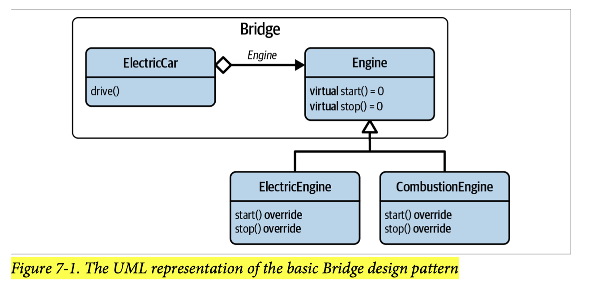
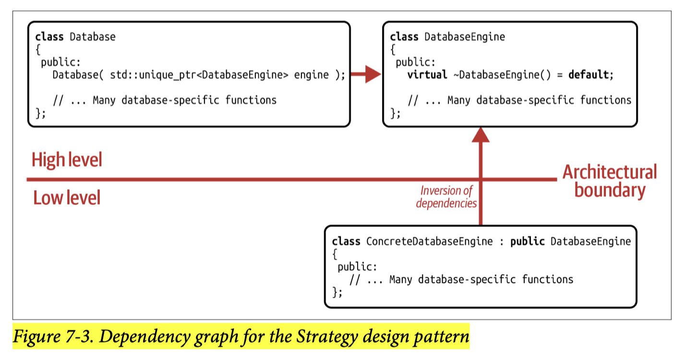
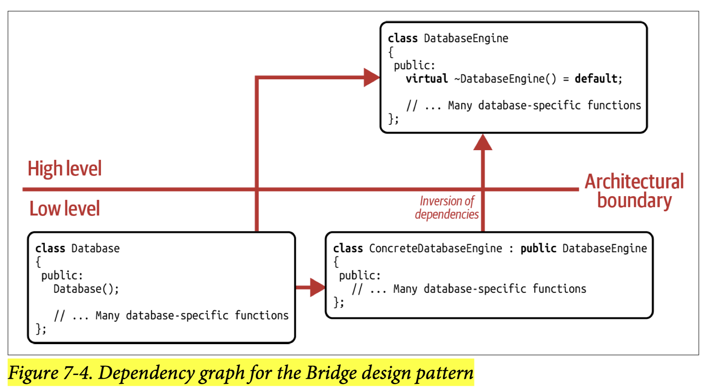

## [Index](../c++_software_design.md)

# Bridge


- The purpose of a Bridge is to minimize physical dependencies by encapsulating some implementation details behind an abstraction. In C++, it acts as a compilation firewall, which enables easy change.

- __Strengths__
    - __SRP and OCP__: by isolating `ElectricCar` and its implementation details `ElectricEngine` in the form of the `Engine` abstraction, fulfilling the SRP and you gain the flexibility to change, tune or upgrade the engine engine any way you want without recompiling the source file of `ElectricCar` or any files including `ElectricCar`
    - __ABI stability__: with storing a pointer to implementation details, we maintain a stable instance size and hence gain ABI stability
- __Shortcomings__
    - __performance cost__
        - __additional indirection__: the `pimpl` pointer making all access to the implementation details more expensive
            - this cost can be mitigated using __Partial Bridge__, which stores data members that are frequently accessed directly in class and those that are infrequently accessed in the Impl Class
        - __additional dynamic memory allocation__
        - __runtime polymorphism__: if using virtual base class for implementation (like the above `Engine`), also need to pay for virtual function call overhead
    - __increased code complexity__: though it only affects the internals of a class, not user code, it might be still confusing for less-experienced developers (like the need to define the destructor in the source file in pimpl idiom)
- __Comparison with Strategy__
    - they are structurally similar (both using composition)
    - If a class __does not want to know about some implementation detail__, and if for that reason it provides the opportunity to configure the behavior by passing in details from the ___outside___ (for instance, via a constructor or via a setter function), then you are most likely dealing with the Strategy design pattern. Because the flexible configuration of behavior, i.e., the reduction of ___logical dependencies___, is its primary focus, Strategy falls into the category of a ___behavioral design pattern___.
        
    - If, however, ___a class knows about the implementation details but primarily wants to reduce the physical dependencies on these details___, then you’re most likely dealing with the Bridge design pattern. In that case, the class does not provide any opportunity to set the pointer from outside, i.e., the pointer is an implementation detail and ___set internally___. Since the Bridge design pattern primarily focuses on the physical dependencies of the implementation details, not the logical dependencies, Bridge falls into the category of ___structural design patterns___.
        
        - note that in this case, `Database` is logically coupled to a specific implementation `ConcreteDatabaseEngine` but only physically decoupled via the `DatabaseEngine` abstraction

## Pimpl idiom

- the local (`Impl` class is just a nested class), nonpolymorphic (`Impl` does not have virtual methods) form of Bridge is called the __Pimpl idiom__ and it is Bridge design pattern in its simplest form
```cpp
// ---- <Person.h> -----------------------------
#include <memory>
class Person {
public:
    // ...
    Person();
    ~Person();

    Person(Person const& other);
    Person& operator=(Person const& other);
    
    Person(Person&& other);
    Person& operator=(Person&& other);

    int year_of_birth() const;
    // ... Many more access functions
private:
    struct Impl;
    std::unique<Impl> const pimpl_;
};

// ---- <Person.cpp> -----------------------------

#include <Person.h>
#include <string>

struct Person::Impl {
    // ...
};

Person::Person() : pimpl_{ std::make_unique<Impl>() } {}

Person::~Person() = default;

Person::Person(Person const& other)
    : pimpl_{ std::make_unique<Impl>(*other.pimpl_) } {}

Person& Person::operator=(Person const& other) {
    *pimpl_ = *other.pimpl_;
    return *this;
}

Person::Person(Person&& other)
    : pimpl_{ std::make_unique<Impl>(std::move(*other.pimpl_)) } {}

Person& Person::operator=(Person&& other) {
    *pimpl = std::move(*other.pimpl_);
    return *this;
}

int Person::year_of_birth() const {
    return pimpl_->year_of_birth;
}
```
- destructor has to be defined in the source file even if it is as trivial as `= default`
    - otherwise the compiler will generate destructor for you in the header file,
    - which will trigger the instantiation of the destructor of the `std::unique_ptr` data member,
    - which in turn would require the definition of the destructor of the `Impl` class,
    - which is not available in the header file
- the sematics of `pimpl` makes it reasonable to never be `nullptr`, so:
    - once it is initialized it will never change and we define it as `const` data member
        - `const` data member prevents move operator of this member and thus might make move operation of the class throwing and should be prevented in most cases
    - operations do not check if `pimpl` is `nullptr` when dereferencing `pimpl`
    - move constructor cannot just move the `std::unique_ptr`, instead it will allocate new memory and move the underlying object
- it may also be not acceptable to make move operations throw
    - in this case, we allows `pimpl` to be `nullptr` and simply move `std::unique_ptr` in move operations
    - downside is that we need to check if `pimpl_` is `nullptr` in every operation that needs to dereference `pimpl`
    - another option is just to make the program terminate when `std::bad_alloc` is thrown
- C++20 module can replace pimpl idiom if ABI stability is not a concern