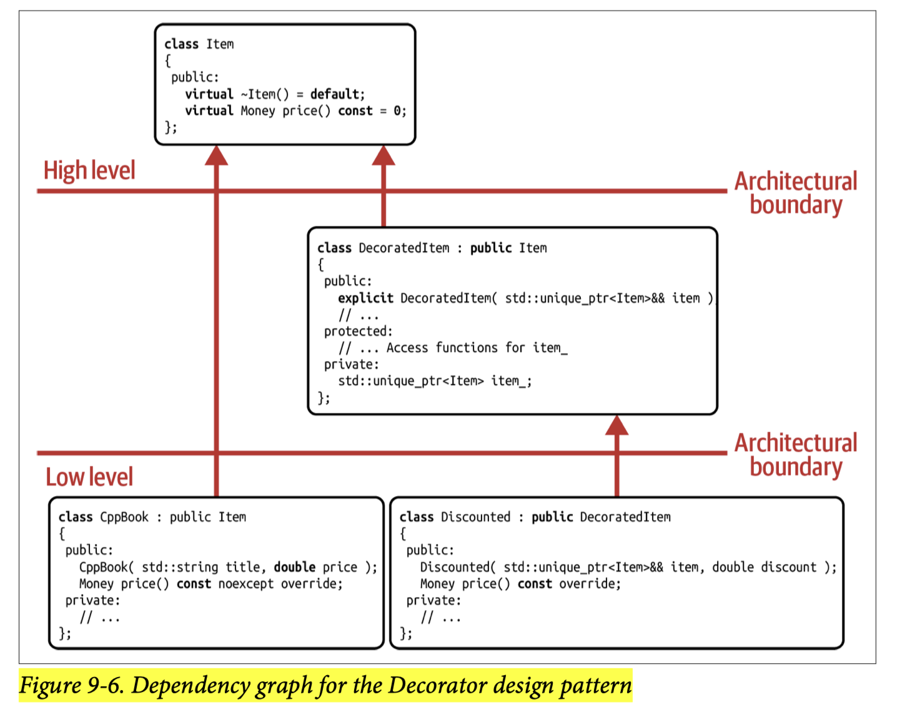
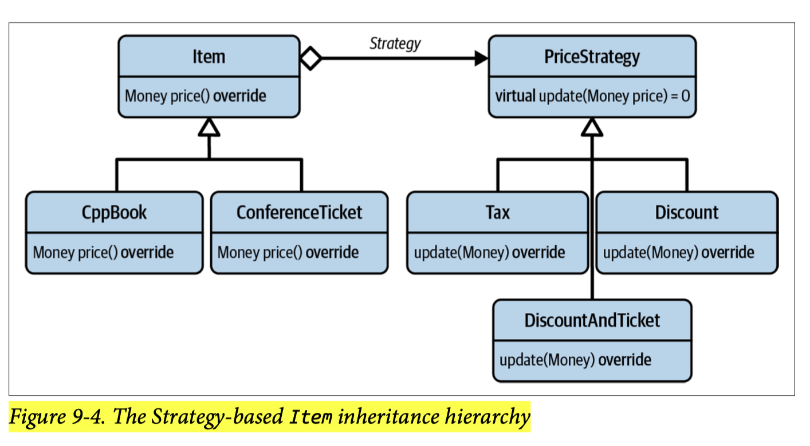
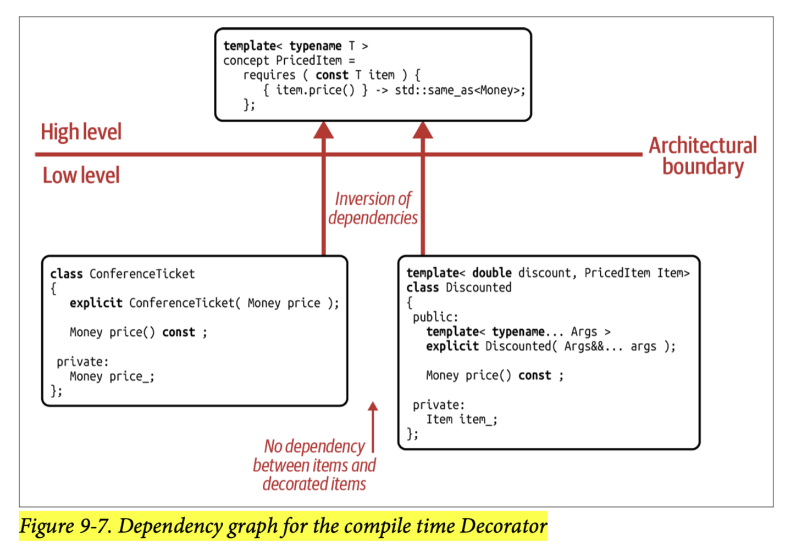

## [Index](../c++_software_design.md)

# Decorator

- __Primary Focus__: the flexible combination of different pieces of functionality through composition
- __Classic Implementation__:

- In the Decorator design pattern, the addition of new “responsibilities” is identified as a variation point and extracted in the form of the `DecoratedItem` class.
    - On the one hand, this class is a separate, __special implementation__ of the `Item` base class and represents an added responsibility for any given item.
    - On the other hand, this class is __an abstraction__ itself and the core abstraction introduced by Decorator Design Pattern
- __Recursive Nature__: `DecoratedItem` acts as a wrapper around item and the wrapped item can also be `DecoratedItem` itself, so the new functionality can be easily added/chained in a recursive manner
- __SRP, OCP and DRY__
- __Comparison with Strategy__:
    
    - Decorator is particularly well suited to combine different implementations, which enables you to augment and extend functionality, while Strategy's focus is replacing it or switching between implementations.
    - Strategy does not enable the easy combination and reuse of different implementations. Attempting to do this would quickly result in an undesirably complex Strategy inheritance hierarchy.
    - For Decorator, there's no need to define any default behavior in the form of a null strategy.
    - If you already have a Strategy Implementation in place, it's also possible to combine these two design patterns by introducing a `DecoratedStrategy` abstraction
- __Shortcomings__:
    - __Performance Cost in runtime polymorphism__: every level in a given hierarchy/chain adds one level of indirection
    - Due to the enormous flexibility like Adapter, we have potential danger of combining Decorators in a nonsensical way
- __STL Example `std::pmr::monotonic_buffer_resource`__: it inherits from `std::pmr::memory_resource` and also contains an upstream allocator data member `std::pmr::memory_resource *`
    - though there is no `std::pmr::decorated_memory_resource` base class, it still represents Decorator Design Pattern and provides a great example of using Decorator to chain allocators

## Value-Based Decorator

- Compile time Decorator
    - 
    - replace base class (runtime abstraction) with concept (compile-time abstraction)


- Runtime Decorator
    -
    - replace base class to an Owning Type Erasure Wrapper
    ```cpp
    // can combine runtime and compile-time decorators
    Item item(
        Discounted<0.19, Taxed>(
            Taxed(0.2, ConferenceTicket{"Core C++", 499.0})
        )
    );
    ```