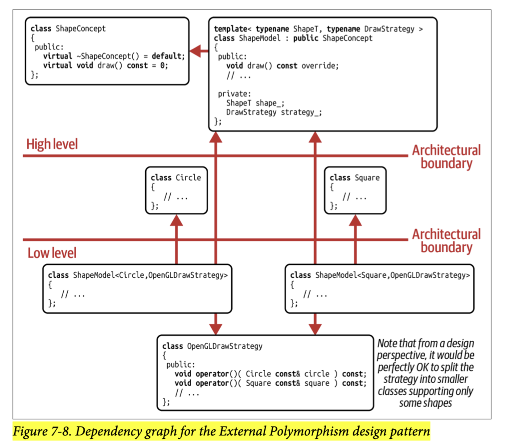

## [Index](../c++_software_design.md)

# External Polymorphism

## Intents
- enable the polymorphic treatment of nonpolymorphic types (types without virtual methods)
- extract the complete polymorphic behavior as a variation point

## Components


- __Concept (Abstraction)__: the set of virutal functions has been moved into the abstract `ShapeConcept` class, which now takes the place of the `Shape` base class and serves as the shape abstraction that represents all the operations and requirements that are expected for shapes
- __Model (implementation)__: the only class inheriting from `ShapeConcept` is the `ShapeModel` class template. This class is instantiated for a specific kind of shape and acts as a wrapper for it
    - __Exemplar for combining runtime and compile-time polymorphism__
    - __Another Abstraction?__: note that we can also use C++20 concept to specify requirement and restrict instantiation of `ShapeModel`, this C++20 concept can also be an abstraction, while it and `ShapeConcpet` might be different in the specifications of requirements, they are conceptually the same. To avoid confusion when maintaining the code, not creating such abstraction is a better choice, the `ShapeConcept` base class is sufficient for the purpose of abstraction.
        - we can also not expose this concept as abstraction and just keep it as implementation details which can provide more friendly error messages in misuse cases
- Within the `ShapeModel` class template, you have the complete flexibility to implement drawing as you see fit, prefer __Strategy__ and __free functions__ for looser coupling:
    - __Strategy__
        - __std::function__
        - __Policy-based Design__: Since `ShapeModel` is already a template, we can use policy-based design without the cost of turning a non-template into a template
    - Forward to __Free Functions__
    - __Implement in class__ by calling some common methods (like `getCenter()`, or using Prototype design pattern, which calls copy ctor) of all shapes

## Client Code
```cpp
#include <Circle.h>
#include <Square.h>
#include <Shape.h>
#include <OpenGLDrawStrategy.h>
#include <memory>
#include <vector>

int main() {
    using Shapes = std::vector<std::unique_ptr<ShapeConcept>>;

    using CircleModel = ShapeModel<Circle, OpenGLDrawStrategy>;
    using SquareModel = ShapeModel<Square, OpenGLDrawStrategy>;

    Shapes shapes{};

    // Creating some shapes, each one
    //  equipped with an OpenGL drawing strategy
    shapes.emplace_back(
        std::make_unique<CircleModel>(
            Circle{2.3}, OpenGLDrawStrategy(/*...red...*/)));
    shapes.emplace_back(
        std::make_unique<SquareModel>(
            Square{2.3}, OpenGLDrawStrategy(/*...green...*/)));
    shapes.emplace_back(
        std::make_unique<CircleModel>(
            Circle{4.1}, OpenGLDrawStrategy(/*...blue...*/)));
        
    for (auto const& shape : shapes) shap->draw();
}
```

## Strengths

- you can __nonintrusively equip any type including even scalar types with polymorphic behavior__
- __SRP__: Due to separating concerns and extracting the polymorphic behavior from the shape types, you remove all dependencies on graphics libraries, serialize libraries, etc.
- __OCP__: The shape type become simpler and nonpolymorphic, you're able to easily add new kinds of shapes.
- __Easier to add operations compared to traditional OOP__: though it is still not as easy as Visitor design pattern to add operations, when we add one virtual operation in `ShapeConcept`, we just need to change one place -- `ShapeModel` class template, while in traditional OOP, we need to find all shapes inheriting from base and add the method
    - we can also follow ISP and divide the `ShapeConcept` base class into `Drawable`, `Serializable`, etc.
        ```cpp
        template <typename ShapeT>
        class ShapeModel : public Drawable, public Serializable {
            // ...
        };
        ```
- __DRY__: reduce the usual inheritance-related boilerplate code and implement it in exactly one place (`ShapeModel`)
- By reducing the number of indirections by exploiting the available class template, you can improve performance.

## Shortcomings

- __Reference Semantics-based__: not a value semantics-based solution and does not help to simplify user code