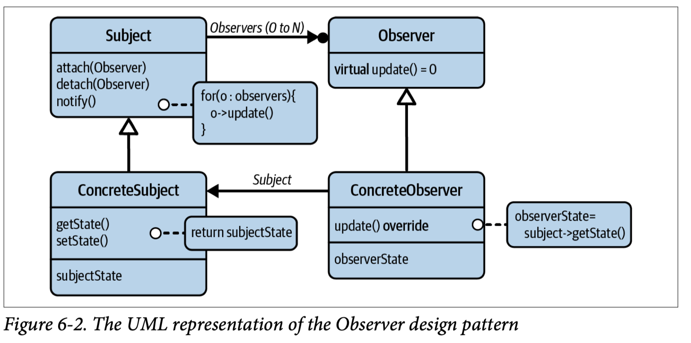
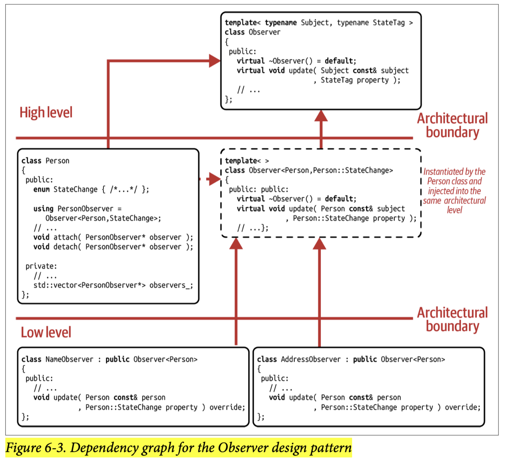

## [Index](../c++_software_design.md)

# Observer

## Analysis

- Define a one(subject)-to-many(observers) dependency between objects so that when one object changes state, all its dependents are notified and updated automatically.
- The need to introduce new observers—the need to extend a one-to-many dependency—is recognized to be the variation point. As Figure 6-2 illustrates, this variation point is realized in the form of the Observer base class.
    
- __SRP and OCP__: the `Observer` base class is another example of the SRP, again, the SRP acts as an enabler for the OCP. By introducing the Observer abstraction, anyone is able to add new kinds of observers (e.g., `ConcreteObserver`) without the need to modify existing code.
- __shortcomings__
    - __no pure value-based implementation__: you need to use pointers to attach and detach Observers, subjects do not take ownership of Observers and do not want to deal with the copy of a stateful Observer
    - handling __thread-safe__ registration and deregistration of observers
    - handling of events like an untrusted observer can freeze a server during a callback if it behaves inappropriately
    - __overuse__ of observers can lead to a complex network of interconnections
        - might introduce an infinite loop of callbacks
        - any sequence of notifications should always run along a directed, acyclig graph (DAG) toward the lower levels of your architecture

## Push Observers

```cpp
class Observer {
public:
    virtual void update1(/*arguments representing the updated state*/) = 0;
    virtual void update2(/*arguments representing the updated state*/) = 0;
};
```

- In this form, the observer is given all necessary information by the subject and therefore is not required to pull any information from the subject on its own.
- __strengths__:
    - This can __reduce the coupling to the subject__ significantly and create the opportunity to reuse the classes deriving from Observer base class for several subject classes.
        - if these two update functions do not belong together, we should also follow ISP to put them in separate pure abstract classes and it will further boost reusability of Observers for several subject classes. Downside is that subject now might needs to distinguish among different kind of observers.
- __shortcomings__:
    - observers are __always given all the information__, this push style works well only if observers do need the information most of the time
    - pushing creates a __dependency on the number and kind of arguments__ that are passed to the observer, any changes to these arguments requires a lot of subsequent changes in the deriving observer classes.

## Pull Observer

```cpp
template <class Subject>
class Observer {
    using subject_property_tag = typename Subject::property_tag;
public:
    virtual void update(Subject const& subject,
                        subject_property_tag property) = 0;
    // the observer can also remember the subject on its own
};
```

- In this form, the classes deriving from the Observer base class are required to pull the new information from the subject on their own.
- to reduce dependency of the `Observer` base class on a speicific `Subject`, we make `Observer` as a template base class
- __strengths__ and __shortcomings__ are the opposite of push observers
- to avoid observers from "searching" for the state change if multiple details have changed, which could be inefficient, we pass a tag to provide information about which property of a subject has changed



- to use value semantics and avoid inheritance hierarchy, we can apply Strategy and use `std::function` for the polymorphic `update()`
    - note that it usually does not work well with push observers, since multiple `update()` requires multiple `std::function` instances

