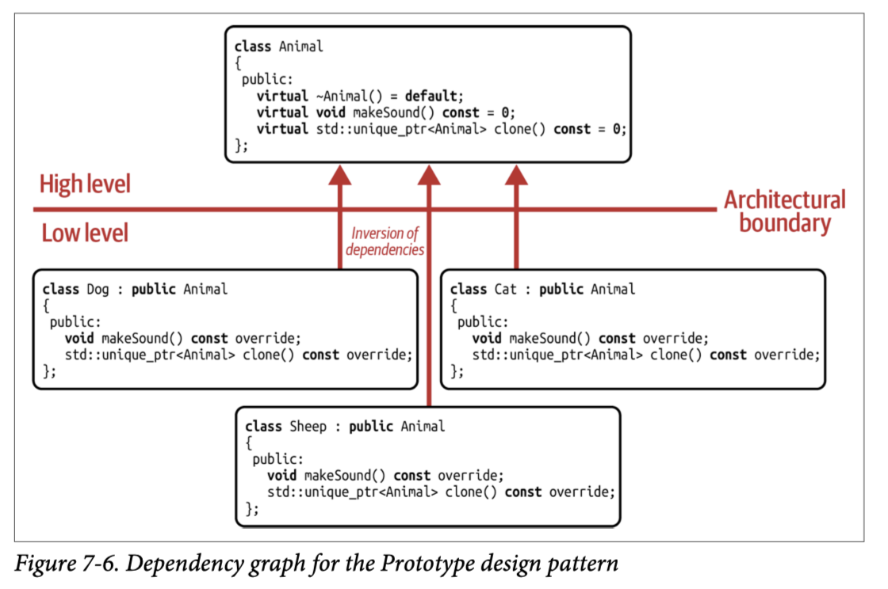

## [Index](../c++_software_design.md)

# Prototype

## Analysis

- Intent: Specify the kind of objects to create using a prototypical instance, and create new objects by copying this prototype.
- It is a creational design pattern and focused on providing an abstract way of creating copies of abstract entities.
- The Prototype design pattern is commonly implemented by a virtual `clone()` function in the base class
    - deriving classes cannot simply implement the function any way they want, but are expected to return an exact copy of themselves (any other result would violate the LSP)
    - This copy is commonly created dynamically by `new` and returned by a pointer-to-base.

- __Comparison with `std::variant`__: note that though we can get a correct copy of the underlying object using `std::variant`, it is not considered Prototype design pattern as `std::variant` only supports a fixed set of types
- The Prototype design pattern really is a classic and very OO-centric design pattern, there is no value semantics way of implementation, any shortcomings of reference semantics are intrinsic properties of Prototype design pattern