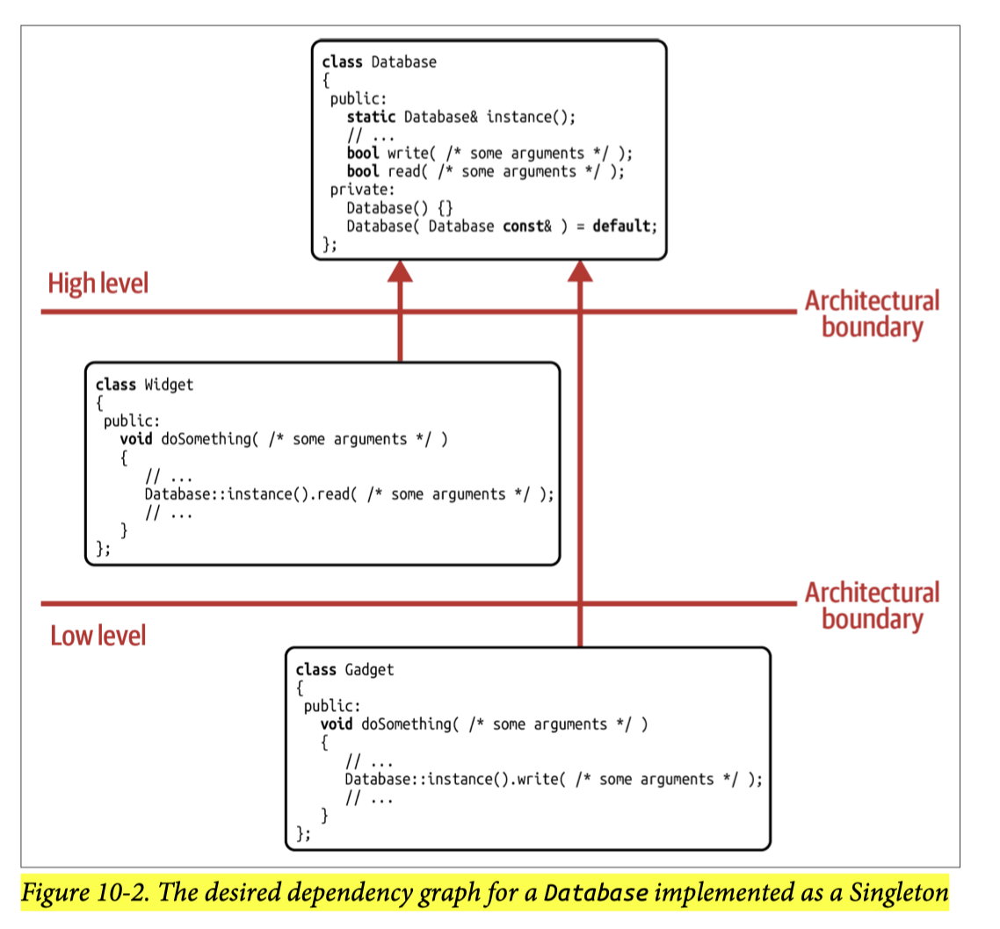
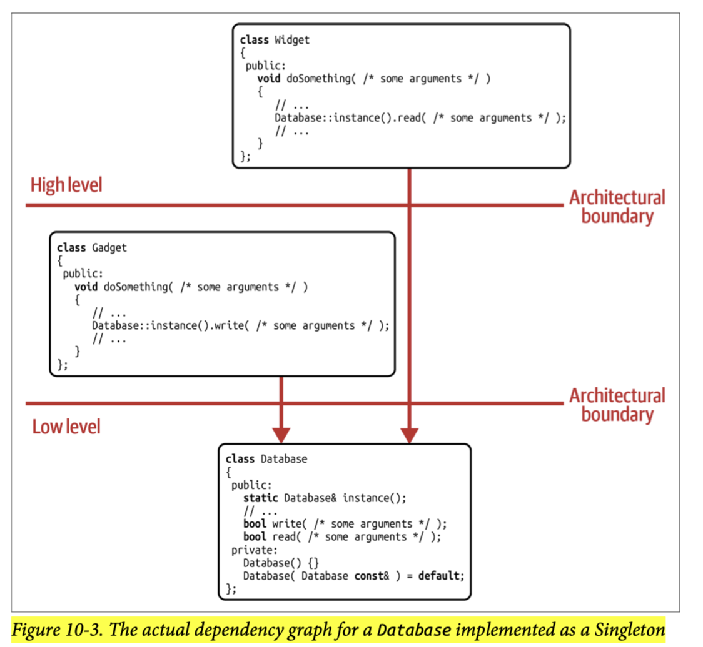
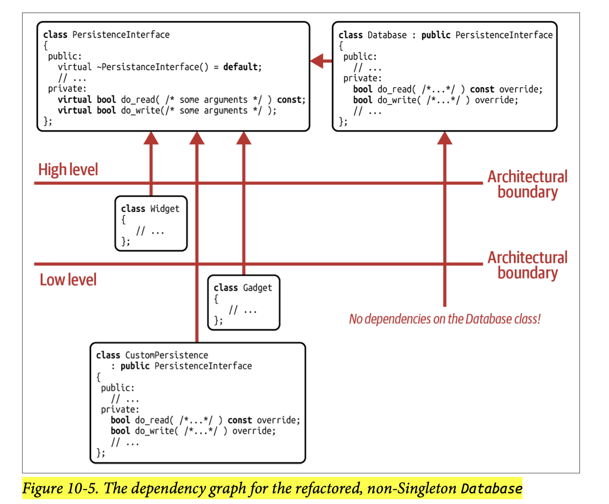

## [Index](../c++_software_design.md)

# Singleton

```cpp
class Database final {
public:
    static Database& instance() {
        static Database db;
        return db;
    }

    // ...

private:
    Database() {/*...*/}
    Database(Database const&) = delete;
    Database(Database&&) = delete;
    Database& operator=(Database const&) = delete;
    Database& operator=(Database&&) = delete;

    // ...
};
```
- Intent: “Ensure a class has only one instance, and provide a global point of access to it.”
- __implementation pattern instead of design pattern__
    - Singleton does not introduce any abstraction and not an abstraction itself: no base class, no template parameters, nothing
    - It isn't concerned with the interaction and interdependencies of entities, and hence it isn't aiming at managing or reducing dependencies. Instead, Sinlgeton is focused on restricting the number of instantiations to exactly once.
- __Representing Global States__: Singletons are mostly used to represent entities in a program that logically and/or physically exist only once and that should be used by many other classes and functions. Common examples are the system-wide database, logger, clock, or configuration.
- __Problem of Global States__
    - Global (mutable) state is very hard to reason about, as read and write access to this state usually happens invisibly within some function, which, based on its interface, does not reveal the fact that it uses the global state.
    - The problem of global state is a problem that we can’t resolve by avoiding Singletons. It’s a general problem, unrelated to any particular pattern.
    - Singletons that provide a __unidirectional data flow__ to or from some global state are acceptable.
        - like config or clock are only readable and logger is only writable

## Design Singletons for Changeability and Testability




- __Violating DIP and bad changeability__: `Database` class is not an abstraction but a concrete implementation, there are strong and unfortunately even invisible dependencies from all over the code to the specific implementation details and design choices of the `Database` class.
- __Bad Testability__: none of these functions provide you with a way to substitute the Database with something else: any kind of stub, mock, or fake. They all treat the `Database` Singleton as their shiny, precious secret.
- __Solution (refer to C++17 polymorphic memory resource)__:
    
    - introduce an abstraction `PersistenceInterface`
    - let the `Database` singleton be an implementation of the abstraction
    - places that access the singleton will depend on the abstraction instead of the singleton
    - applies Strategy to allow user to inject dependencies globally or locally
        - __globally__: customized what will be returned from the access point
            - example code: [singleton.cpp](./singleton.cpp)
        - __locally__: let `PersistenceInterface*` be a data member of the class that uses the singleton or let the functions that use the singleton accepts an additional argument (`PersistenceInterface*`)
            - pros: the class/function becomes a little more “honest” by explicitly stating its dependencies.
            - cons: become unwieldy in large call stacks