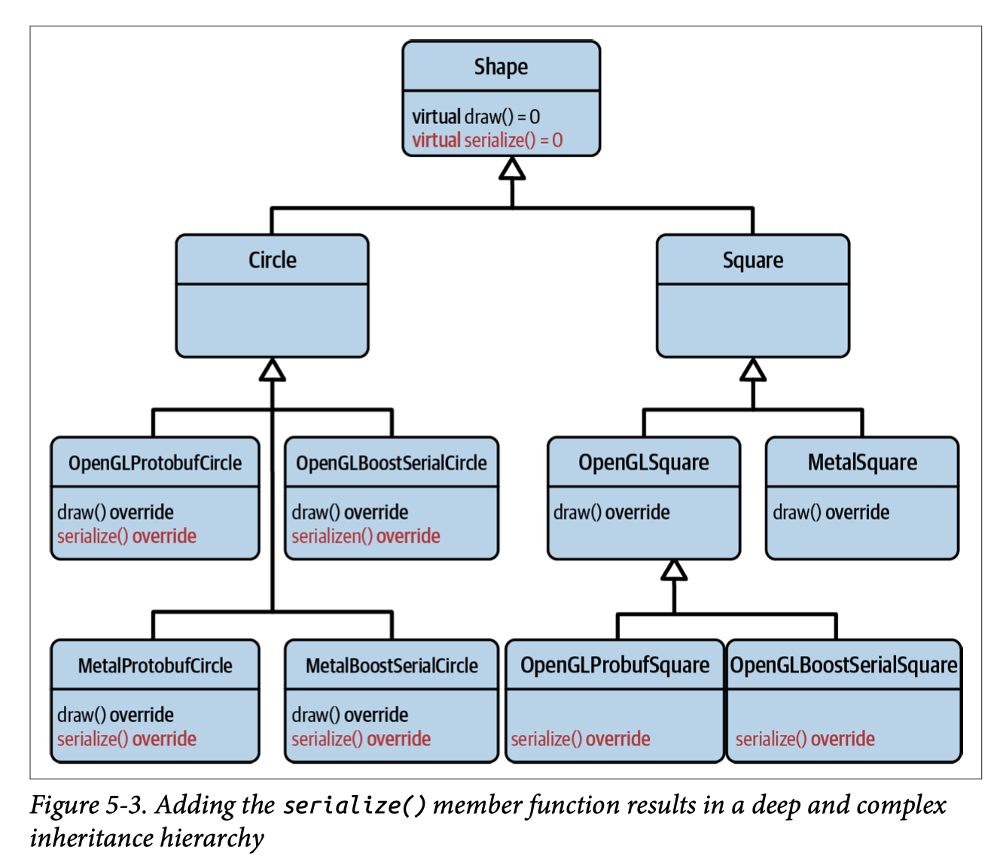
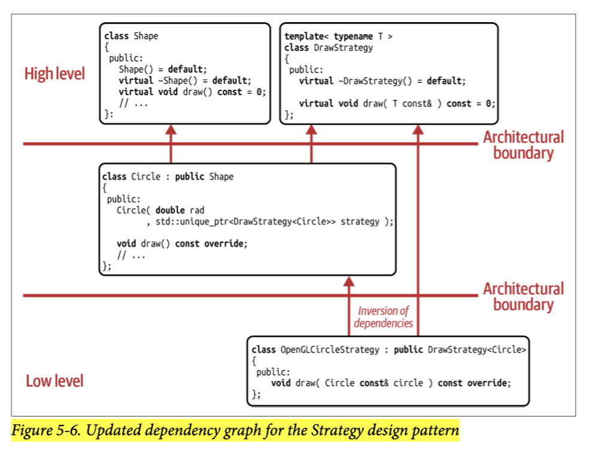
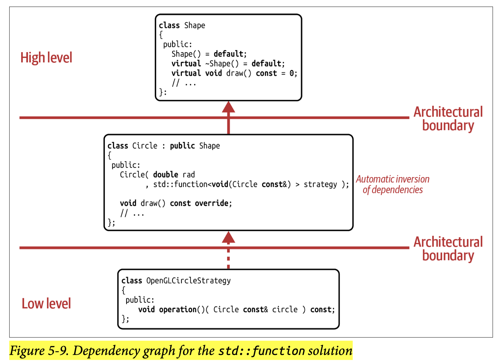

## [Index](../c++_software_design.md)

# The Strategy Design Pattern

## Analysis

- With the Strategy design pattern, we have identified the ___implementation details of a single function___ as a ___variation point___. After introducing an abstraction for these implementation details, we’re still able to easily add new types, but we are not able to easily add new operations. Adding an operation would still require you to intrusively add a virtual member function.
- Visitor and Strategy cannot be applied together for runtime polymorphism.
- __Composition__: by using HAS-A relation, we avoid exponential growth of inheritance hierarchy and allows us to confugure behavior from the outside (dependency injection)
    
- __Shortcomings__:
    - in runtime polymorphism, it incurs performance cost with additional runtime dispatch
    - multiple Strategy objects needed for multiple operations, otherwise (one strategy for multiple operations) will violate SRP

## Classic Implementation



- use template base class for the Strategy abstraction so that `Circle` does not know about other shapes

## Value Semantics using `std::function`



- __pros__: all the strengths of value semantics over reference semantics
- __cons__:
    - potential performance disadvantage if relying on the standard implementation
    - only supports one operation, if need `undo` like in Command design pattern, need another instance

## Strategy in static polymorphism (Policy-Based Design)

```cpp
template <DrawCircleStrategyConcept DrawCircleStrategy>
class Circle : public Shape {
    /*...*/
    DrawCircleStrategy drawer_;
};
```

- __pros__:
    - do not need base class `DrawStrategy<T>` anymore
    - better performance with no pointer indirections and runtime dispatch
- __cons__
    - lose the flexibility to configure at runtime
    - since it becomes template, it is defined in header file, without C++20 modules, this creates physical dependency on implementation of `Circle`

# Command Design Pattern

## Analysis

- Strategy vs Command
    - structurally identical to Strategy and has the same strengths and shortcomings
    - only difference is that the Strategy design pattern specifies ___how___ something should be done, the Command design pattern specifies ___what___ should be done.
    - if there is an `undo()` operation, it means it's focused on ___what___ should be done and has the information to roll back the operation, so it is Command
    - there is a gray area between them
    - example:
        - Strategy: STL container allocator, comparator in `std::sort`
        - Command: thread pool tasks, UnaryFunc in `std::for_each`

