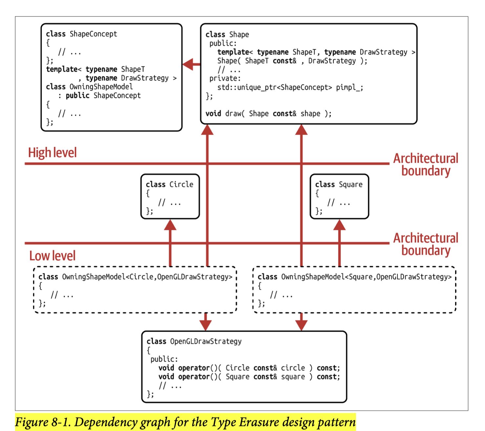

## [Index](../c++_software_design.md)

# Type Erasure

- __code__: [te.hpp](./te.hpp)
- __Compound Design Pattern__
    - __[External Polymorphism](../external_polymorphism/external_polymorphism.md)__: the key ingredient for achieving the decouping effect and the nonintrusive nature of Type Erasure
    - __[Bridge](../bridge/bridge.md)__: key to creating a value semantics-based implementation
    - __[Prototype](../prototype/prototype.md) (optional)__: required to deal with the copy semantics of the resulting values
- __Intent__: “Provide a ___value-based___, ___non-intrusive___ abstraction for an ___extendable set___ of unrelated, potentially ___non-polymorphic___ types with the ___same semantic behavior___.”
    - __Value-based__: The intent of Type Erasure is to create value types that may be copyable, movable, and most importantly, easily reasoned about. However, such a value type is not of the same quality as a __regular__ value type; there are some limitations. In particular, Type Erasure works best for unary operations but has its limits for binary operations.
    - __Nonintrusive__: when a type provides the behavior expected by the abstraction, it is supported by the abstraction automatically without the need to apply any modifications
    - __Extendable, unrelated set of types__: like traditional OOP, you can add types easily and these types should not be connected in any way
    - __Potentially nonpolymorphic__: types should not have to buy into the set by inheritance or provide virtual functionality on their own
    - __Same semantic behavior__: The goal is not to provide an abstraction for all possible types but to provide a semantic abstraction for a set of types that provide the same operations (including same syntax) and adhere to some expected behavior, according to the LSP. If possible, for any type that does not provide the expected functionality, a compile-time error should be created (using C++20 concept for constraints).
- __ISP__: like External Polymorphism, we can easily adhere to the ISP by providing several type-erased abstractions
- __Shortcomings__
    - __implementation complexity__: an option is to use a third-party library
    - __using Type Erasure for binary operations is not straightforward__
        - fine if two objects are equal if some public properties are equal
        - otherwise, we need to delegate to the binary operator of the type itself, which requires comparing their type first (either `dynamic_cast` or uses another polymorphic method `type()` like `std::any`, this is not feasible if policy-based design is used)
        - this is a only shortcoming with respect to regular value type, traditional OOP alsh has this shortcoming
    - __Setup Costs of Wrapping__: If you already have an object and wants to wrap it into an owning type erasure wrapper, a move/copy operation is required
        - Solutions:
            - construct (emplace) the object directly into the wrapper
            - defines a non-owning type erasure wrapper: [te.hpp](./te_ref.hpp)
- __Optimization Potential__
    - SBO: [te_sbo.hpp](./te_sbo.hpp)
    - Manual Dispatch: [te_md.hpp](./te_md.hpp)
