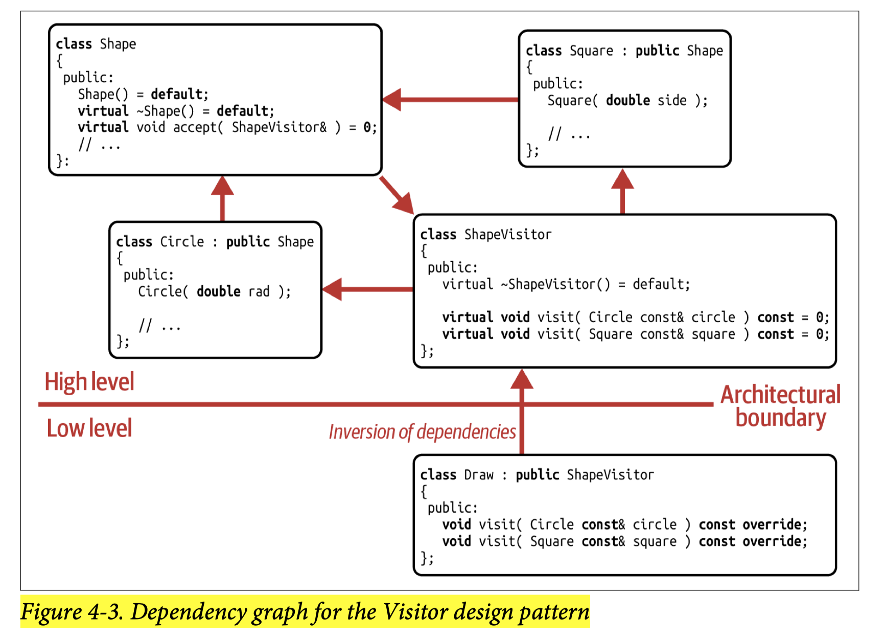
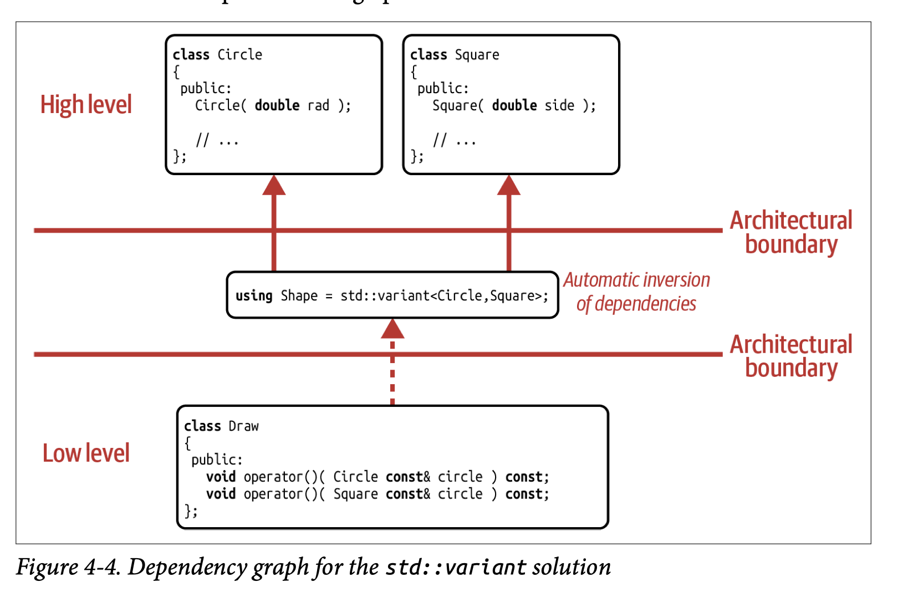
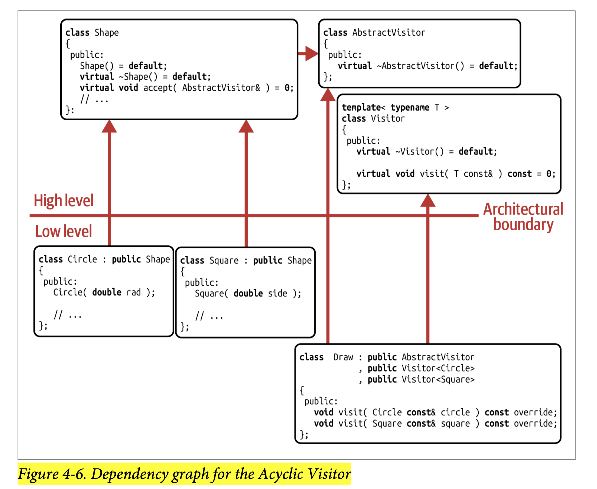

## [Index](../c++_software_design.md)

# The Visitor Design Pattern

- [Extend Type vs Extend Operations in Dynamic Polymorphism](#extend-type-vs-extend-operations-in-dynamic-polymorphism)
- [Analysis](#analysis)
- [Classic Implementation](#classic-implementation)
- [`std::variant` Implementation (Value Semantics)](#stdvariant-implementation-value-semantics)
- [Acyclic Visitor](#acyclic-visitor)

## Extend Type vs Extend Operations in Dynamic Polymorphism

- procedural solution treats operations as an ___open set___ and types as a ___closed set___
    - example: [procedural.cpp](./procedural.cpp)
        - with this solution, we can add operations like __serialize__ easily without modifying/recompiling any existing code
        - However, adding a new type requires modifying `<Shape.h>` and results in recompilation and we need to add another case in `switch` statements in all operations
- object-oriented solution treats operations as a ___closed set___ and types as an ___open set___
    - example: [oop.cpp](./oop.cpp)
- __note__: in static polymorphism, botth aspects can be extended easily with proper design
    - like in STL, you can easily add new operations, i.e., algorithms, but also easily add new types, i.e., containers, that can be copied, sorted, etc.

## Analysis

- With the Visitor design pattern, we have identified ___the general addition of operations___ as the ___variation point___. Therefore, we created an abstraction for operations in general, which in turn allowed everyone to add operations.
- Like procedural solution, Visitor allows you to treat operations as an open set in dynamic polymorphism, but it can transform oop solution from open for adding types to open for adding operations
- __SRP and OCP__: By introducing a Visitor abstraction for operations in general, you follow the SRP: `Shape` does not have to change for every new operation. This avoids frequent modifications of the `Shape` hierarchy and enables the easy addition of new operations. The SRP therefore acts as an enabler for the OCP.
- __Shortcomings__: types become a closed set unless using [acyclic visitor](#acyclic-visitor)

## Classic Implementation

- introduces an abstraction `ShapeVisitor`
- `accept()` is the traditional name in the context of the Visitor design pattern
- [classic_visitor.cpp](./classic_visitor.cpp)
- shortcomings
    - 
    1. __low implementation flexibility__
        - has to write `visit` method for every concrete classes even though their implementations are the same
        - each visitor that represents different operations must have the same return type
    2. __difficult to add new types__: Adding a new shape in the `Shape` hierarchy would require the entire `ShapeVisitor` hierarchy to be updated: you would have to add a new pure virtual function to the `ShapeVisitor` base class, and this virtual function would have to be implemented by all derived classes.
    3. __intrusive__: need to add `accept()` member function into the hierarchy
    4. __performance__: every operation now required two virtual function calls: `accept` and `visit`
    5. __complexity__: experience has proven this design pattern to be rather hard to fully understand and maintain. This is a rather subjective disadvantage, but the complexity of the intricate interplay of the two hierarchies often feels more like a burden than a real solution.

## `std::variant` Implementation (Value Semantics)

- [visitor_variant.cpp](./visitor_variant.cpp)
- strengths
    -
    1. __higher implementation flexibility__
        - can write fewer `visit` methods (in this case `operator()`) in implementations are the same and one type is implicitly convertible to another
        - each visitor that represents different operations can have different return types
        - types need not be in the same hierarchy and not even need to be `class` type anymore
    2. __non-intrusive__: no need to add any additional method (`accept`) in the types that is operating on
    3. __better performance__: only one runtime dispatch
    4. __Much simpler dependencies to understand and maintain__
    4. __all other strengths of value semantics over reference semantics__
- __shortcomings__:
    - still difficult to add new types
    - if `sizeof` types differ a lot, might need to store them behind pointers, then fall back to indirections and allocations that come with reference semantics

## Acyclic Visitor

 

- [acyclic_visitor.cpp](./acyclic_visitor.cpp)
- __strengths__: both adding types and adding operations follows OCP
- __shortcomings__:
    - all __shortcomings__ of classic visitor implementation except that now it is not difficult to add new types
    - much slower (due to `dynamic_cast`)