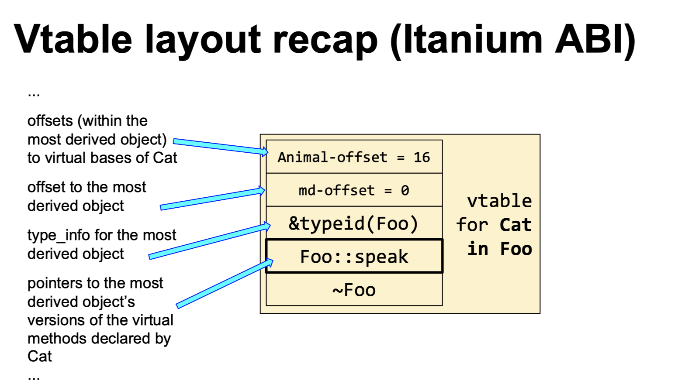
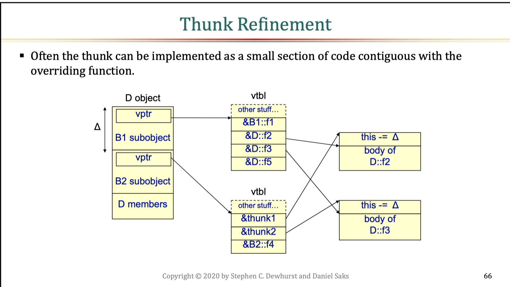
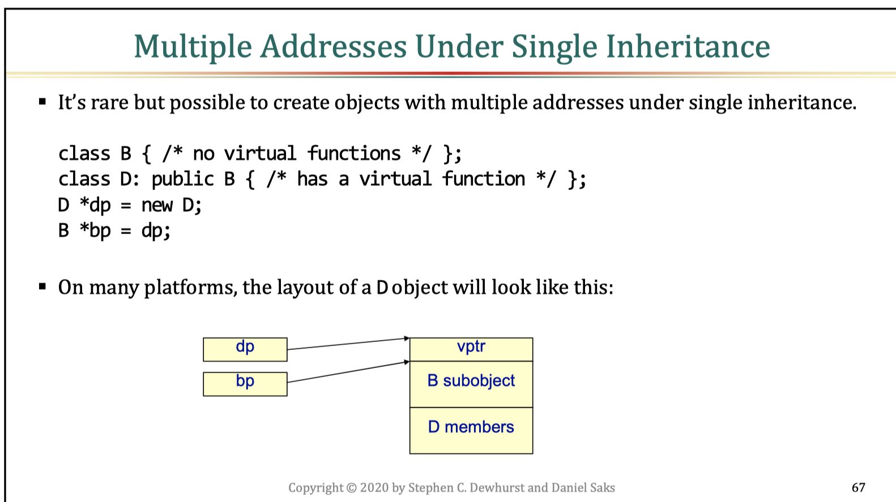

# Class Layout

- [Non-static Data Members](#non)
- [Order of Base Class Subobjects](#order-of-base-class-subobjects)
- [Lexical vs Physical Ordering](#lexical-vs-physical-ordering)
- [vtable](#vtable)
- [Multiple Inheritance](#multiple-inheritance)

## Non-static Data Members

- with the same access label had to be laid out in the same relative order
```cpp
class C {
public:
    int a;
private:
    int b;
public:
    int c;
};

// layout: abc (typical), acb (legal), bac (legal), cba (illegal)
```
- be cautious to use `memcmp` for comparison, considering
    - padding (use type trait `std::has_unique_object_representations` to determine)
    - order

## Order of Base Class Subobjects

- order of base class subobjects in most derived object is unspecified in C++ standard
- _typical_:
    - base class subobject precedes storage for derived class data members
    - in multiple inheritance, multiple base class subobjects are laid out in the order they appear on the base class list
- _However, a compiler may elect to optimize storage use by permuting the base class subobject order_
    - for example, to perform empty base optimization (EBO, which should be replaced by using `[[no_unique_address]]` since C++20) 
    - class that has predictable layout is [standard layout type](../cppcon/type-categories.md#standard-layout-type)

## Lexical vs Physical Ordering

- language constructs that enfore an ordering on members are defined lexically, not physically
- for example:
    - member initializer list initializes in the order of declaration
    - base class subobjects are initialized based on their lexical position on the base class list (depth-first search traversal) and destroyed in reverse order
    - default `operator<=>` compares members in their declared order

## vtable

- if a class has a `virtual` function, every object of that class contains a pointer to a shared virtual function table, which enables dynamic dispatch of member functions
- the vtable is a dumping ground for most type-related information about a class (these stuff are in negative offset from pointer to vtable according to itanium ABI)
    - `std::type_info *`
    - offset to the start of the complete object
        - used in case of multiple inheritance, where different subobjects have different addresses, i.e., different values of `this`
    - offsets to virtual base class subobjects
        - might have multiple

<p align="center">
    
</p>

## Multiple Inheritance

- an object can have more than one valid address
    ```cpp
    struct Base1 { int i; };
    struct Base2 { int j; };
    struct Derive : Base1, Base2 {};
    Derive* d = new Derive{};
    Base1 *b1 = d;     // safe, standard conversion
    Base2 *b2 = d;     // safe, standard conversion, adjust pointer value
    // b2 have different address value from d
    ```
- when comparing pointers, we are comparing __object identity__ instead of __addresses__
    ```cpp
    assert(d == b2);            // true even if d and b2 has different values
    // compiled to: (d ? d + delta : 0) == b2
    assert(d == (void*)b2);     // false because type information is lost

    // we can calculate delta by:
    void* p1 = reinterpret_cast<void *>(1);
    void* p2 = static_cast<Base2*>(static_cast<Derive*>(p));
    int delta = reinterpret_cast<intptr_t>(p2) - reinterpret_cast<intptr_t>(p1);
    ```
    - _delta_ is known at compile time and usually small enough to be represented as immediate data in an instruction
        - this _delta_ also applies when `static_cast<Derive*>(b2)`
        - _delta_ does not apply for `reinterpret_cast`, this is also one reason why `reinterpret_cast` is dangerous
    - check [here](https://godbolt.org/z/c1P6azaac) to see assembly code
- when calling overriden member function through pointer `b2`, need to apply _delta_ to `this` pointer, this delta adjustment is performed by a small snippet of code called __"thunk"__
    
- multiple valid addresses can also occur for single inheritance, delta adjustment rules are the same here (except for `virtual` base class)
    

## Virtual Base Class

- used to avoid duplicate subobjects when a class is inherited more than once in a class hierarchy
- complex and inefficient, should avoid in most designs
    - "complexify" constructors and destructors
    - data members of virtual base classes are not in a fixed offset because virtual base class subobjects are not in a fixed offset, their offsets need to be determined in runtime when acceessed through derived object pointer by looking up the vtable


## References

- [Back to Basics: Class Layout - Stephen Dewhurst - CppCon 2020](https://www.youtube.com/watch?v=SShSV_iV1Ko)
- [CppCon 2017: Arthur O'Dwyer “dynamic_cast From Scratch”](https://www.youtube.com/watch?v=QzJL-8WbpuU)


