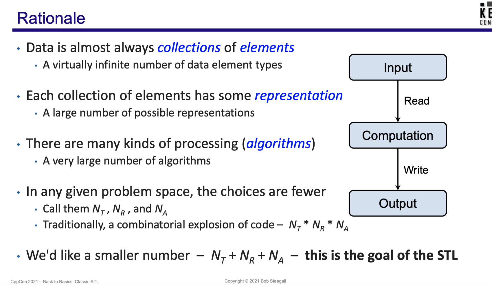
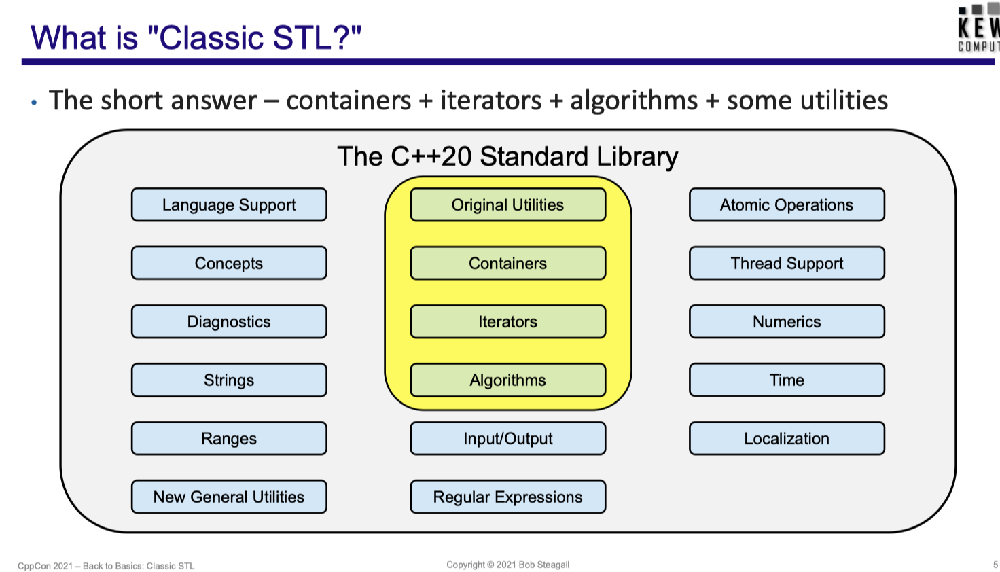
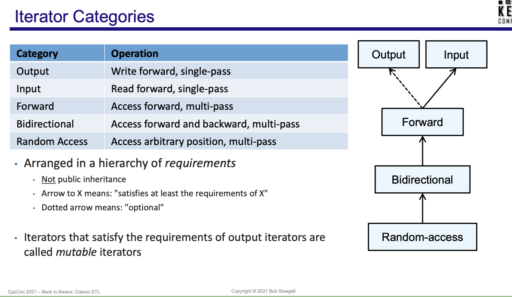

# Reference

- [Back to Basics: Classic STL - Bob Steagall - CppCon 2021](https://www.youtube.com/watch?v=tXUXl_RzkAk&list=WL&index=39&t=16s)

# Rationale

  

# Classic STL

  

- _containers_ store __collections of elements__
- _algorithms_ perform operations upon __collections of elements__
- _containers_ and _algorithms_ are entirely independent
- _iterators_ is the bridge between _containers_ and _algorithms_
    - containers provide data to algorithms through iterators
    - algorithms access data in containers through iterators

# Containers

- containers provide support for
    - adding/removing elements
    - accessing elements via associated iterators
    - a container's iterators understand and ___abstract___ the container's internal structure
- sequence container
    - 
    - ordered collections where an element's position is independent of its value
    - order of elements can be modified
    - `vector`, `deque`, `list`, `array`, `forward_list`
- associative container
    - 
    - a sorted collections where an element's position depends on its value
    - _usually_ implemented using binary search trees (__red black tree__ specificly for STL)
    - `map`, `set`, `multimap`, `multiset`
- unordered associative container
    -
    - unordered collections where an element's position is irrelevant
    - implemnted using hash tables
    - `unordered_map`, `unordered_set`
- container adaptors
    - 
    - wrapper around other STL containers to provide a limited or different set of functionalities
    - `stack`, `queue`, `priority_queue`

# Iterators

- provide access to container elements through well-defined interfaces with strict guarantees

  

