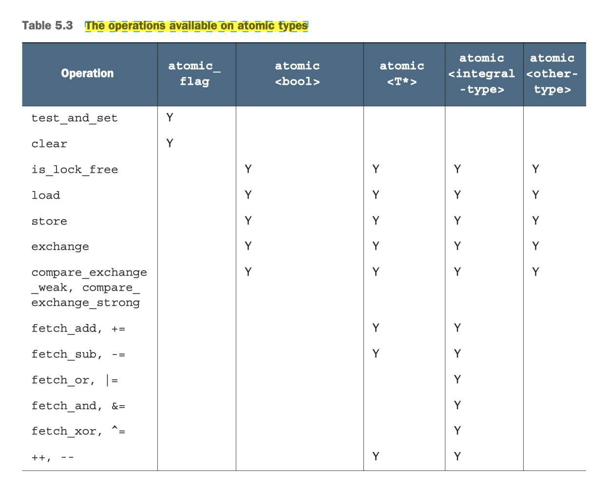

## [Index](../README.md)

# C++ Atomics

- [`std::atomic_flag`](#stdatomic_flag)
- [`std::atomic<>`](#stdatomic)
- [compare-and-exchange operations](#compare-and-exchange-operations)
- for `std::memory_order`, refer to [multithreading-aware memory model note](./memory-model/memory-model.md)

<p align="center">
    
</p>

 since C++20, specializations for floating-point types are added, it supports `fetch_add` and `fetch_sub`

## `std::atomic_flag`

- only atomic type guaranteed to be lock-free
- only atomic type that requires special treatment for initialization
    - must be initialized with `ATOMIC_FLAG_INIT`, which initializes the flag to a _clear_ state
- `std::atomic_flag` does not have a nonmodifying query operation
- __usage example__: implementing a spin-lock mutex
    ```cpp
    class spinlock_mutex {
      std::atomic_flag flag;
    public:
      spinlock_mutex() : flag{ATOMIC_FLAG_INIT} {}
      void lock() { while (flag.test_and_set(std::memory_order_acquire)); }
      void unlock() { flag.clear(std::memory_order_release); }
    };
    ```

## `std::atomic<>`

- all atomic types except `std::atomic_flag` are specializations of the `std::atomic<>` template
- operations might be achieved by using an internal lock, check it by querying `static constexpr` variable `is_always_lock_free`
- unlike `std::atomic_flag`, can be initialized from an object of built-in type
    ```cpp
    constexpr atomic( T desired ) noexcept;
    ```
- operations on atomic types are defined in terms of one object, __copy operations__ involve two objects, requiring a read on an object and a write on another object, so copy operations are `= delete` in atomic types
- `std::atomic<>` do support assignment from, and implicit conversion to the corresponding built-in types as well as direct `load()` and `store()` member function
    - note that assignment operators of `std::atomic<T>` return `T` rather than `std::atomic<T>&`
- named functions returns original value, while compound-assignment operators returns the new value
- the corresponding free functions are designed to be C-compatible, so they use pointers rather than references in all cases
- the primary template requires the template argument (user-defined type) to be: 
    - `std::is_trivially_copyable_v<T>`
    - `std::is_copy_constructible_v<T>`
    - `std::is_move_constructible_v<T>`
    - `std::is_copy_assignable_v<T>`
    - `std::is_move_assignable_v<T>`
- most platforms will be able to use atomic instructions for `std::atomic<T>` if `sizeof(T) <= sizeof(void*)`, some platform also supports _double-word-compare-and-swap_ ___(DWCAS)___ instruction corresponding to the `compare_exchange_xxx` functions. So even `sizeof(T) == sizeof(void*) * 2`, `std::atomic<T>::is_always_lock_free` can still be true.


## Compare-and-exchange operations

```cpp
bool compare_exchange_weak( T& expected, T desired,
                            std::memory_order success,
                            std::memory_order failure ) noexcept;

bool compare_exchange_strong( T& expected, T desired,
                              std::memory_order success,
                              std::memory_order failure ) noexcept;
```
- a kind of read-modify-write operation and cornerstone of programming with atomic types
- effects:
    - if stored value == expected and no spurious failure:
        - stored value = desired
        - return true
    - else:
        - expected = desire
        - return false
- the __spurious failure__ only occurs for `compare_exchange_weak`
    - This is most likely to happen on machines that lack a single compare-and-exchange instruction, if the processor can’t guarantee that the operation has been done atomically—possibly because the thread performing the operation was switched out in the middle of the necessary sequence of instructions and another thread scheduled in its place by the operating system where there are more threads than processors. This is called a __spurious failure__, because the reason for the failure is a function of timing rather than the values of the variables.
    - so it is typically used in a loop
        ```cpp
        extern std::atomic<bool> b;
        bool expected = false;
        while (!b.compare_exchange_weak(expected, true) && !expected);
        ```
    - prefer `compare_exchange_weak` than `compare_exchange_strong` when calculation of the value to be stored is cheap
- the comparison is bitwise comparison as if using `memcmp`, don't use compare-and-exchange operations for types with padding bits or provides comparison with different semantics
- __usage example__: unsupported atomic operations like multiplication or division can be achieved by using compare-exchange operation
    ```cpp
    extern std::atomic<int> i;
    int expected = i.load(std::memory_order_relaxed);
    while (!compare_exchange_weak(expected, expected * 5,
            std::memory_order_seq_cst, std::memory_order_relaxed));
    ```

## References

- [cppreference std::atomic](https://en.cppreference.com/w/cpp/atomic/atomic)
- Williams, A. (2019). C++ Concurrency in Action, Second Edition. Chapter 5: The C++ memory model and operations on atomic types. Manning Publications.