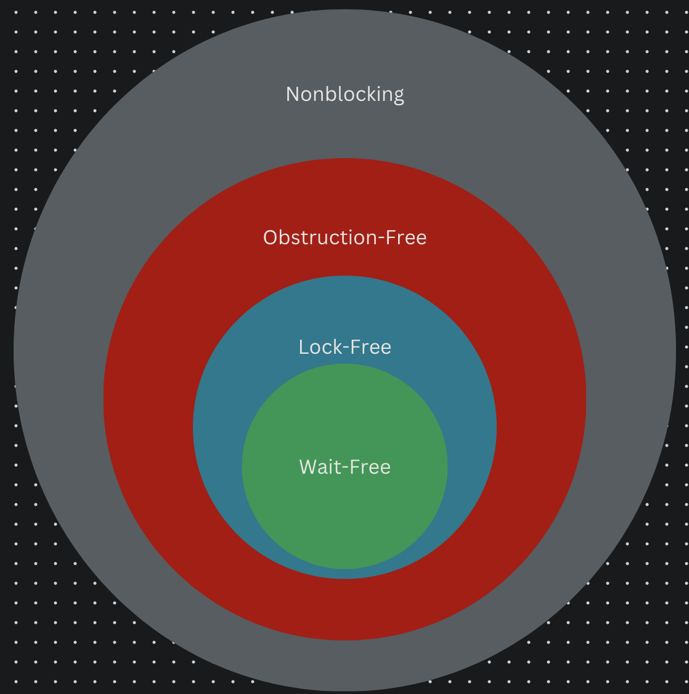

## [Index](./concurrent_data_structure.md)

# Lock-Free Concurrent Data Structures

- [Definition](#definition)
- [Pros and Cons](#pros-and-cons)
- [Guidelines](#guidelines)
- [Case Study](#case-study)
    - [lockfree_stack](#lockfree_stack)

## Definition

    

- __blocking__: algorithms and data structures that calls blocking library functions are called _blocking_ algorithms and data structures
    - __blocking library functions__  will interact with OS kernel to suspend the execution of current thread if needed
        - example: `std::mutex::lock`, `std::condition_variable::wait`
- __nonblocking__:
    - __Deadlock__ can still occur
    - a spin-lock is nonblocking but not so useful, so knowing something is nonblocking is not enough in most circumstances
- __Obstruction-Free__: if all other threads are paused, then any given thread will complete its operation in a bounded number of steps.
    - __Deadlock__ is impossible but __Livelock__ is still possible
    - For the most part, obstruction-free DSA aren't __particularly useful__—it's not often that all other threads are paused, so this is more useful as a characterization of a failed lock-free implementation.
- __Lock-Free__: If multiple threads are doing work, then after a bounded number of steps one of them will complete its operation.
    - __Livelock__ is impossible but __Starvation__ is still possible
    - __system-wide progress__ is guaranteed
    - these threads don't need to perform the same operation, a lock-free queue might allow one thread to push and one to pop but break if two threads try to push new items at the same time.
    - lock-free DSA
        - relies on __atomic operations__ and the associated __memory-ordering guarantees__ in order to ensure that data becomes visible to other threads in the correct order
        - commonly use __CAS (compare-and-swap) operation__
            - The reason for using a CAS operation is that another thread might have modified the data in the meantime, in which case the code will need to redo part of its operation before trying the CAS again.
            - The code can still be lock-free if the CAS would eventually succeed if the other threads were suspended. If it didn’t, you’d have a spin lock, which is nonblocking but not lock-free.
            - Algorithms that can involve an unbounded number of retries because of clashes with other threads are not wait-free. For example, when CAS operation is put in a `while` loop.
- __Wait-Free__: Every thread doing work will complete its operation in a bounded number of steps. 
    - __Starvation__ is impossible
    - __per-thread progress__ is guaranteed

## Pros and Cons

- pros
    - enable __maximum concurrency__
    - __Robustness__: no deadlock and livelock, and since no thread holds a lock, if any thread dies it does not break the execution of other threads
- cons
    - __Much harder to implement__
    - __More atomic operations than lock-based__: associated cache ping-pong may decrease overall performance
    - __Bad scalibility__: with high contention, there will be many failing CAS operations, it's like busy-waiting and can be worse than blocking

## Guidelines

- __benchmark both a lock-based data structure and a lock-free one before committing either way__
    -
- __use a lock-free memory reclamation scheme__
    -
    - One of the biggest difficulties with lock-free code is managing memory. It’s essential to avoid deleting objects when other threads might still have references to them, but you still want to delete the object as soon as possible in order to avoid excessive memory consumption.
    - __several techniques:__
        - __waiting until no threads__ are accessing the data structure and deleting all objects that are pending deletion
            - __cons__: in high-load situations, there may never be quiescent state, the `to_be_deleted` list would grow without bounds
            - to identify whether a particular node is still accessed by some threads, we can use __hazard pointers__ or __reference counting__
        - using __hazard pointers__ to identify that a thread is accessing a particular object
            - They are so called because deleting a node that might still be referenced by other threads is hazardous.
            - __basic idea__:
                - If a thread is going to access an object that another thread might want to delete, it first sets a hazard pointer to reference the object, informing the other thread that deleting the object would indeed be hazardous. Once the object is no longer needed, the hazard pointer is cleared.
                - If a thread wants to delete an object, it must first check the hazard pointers belonging to the other threads in the system. If none of the hazard pointers reference the object, it can safely be deleted. Otherwise, it must be left until later.
        - __Reference counting__ the objects so that they aren't deleted until there are no outstanding references
            - __most ideal__: use a lock-free `atomic<shared_ptr>` implementation if there is one
            - __split reference counts__ (if double-word-compare-and-swap operation is supported by the platform):
                - One possible technique involves the use of not one but two reference counts for each node: an internal count and an external count. The sum of these values is the total number of references to the node.
                - The external count is kept alongside the pointer to the node and the internal count is kept as part of the node.
                - The external is increased every time the pointer is read. When the reader is finished with the node, it decreases the internal count. A simple operation that reads the pointer will leave the external count increased by one and the internal count decreased by one when it’s finished.
                - When the external count/pointer pairing is no longer required (the node is no longer accessible from a location accessible to multiple threads, for example, it is removed from the list), the internal count is increased by the value of the __external count minus two__ and the external counter is discarded. Once the internal count is equal to zero, there are no outstanding references to the node and it can be safely deleted.
                    - __why minus two:__
                        - there is no longer a reference to it from its orginal location (which is accessible to multiple threads)
                        - combine the step that the current thread will decrement the internal count
        - using a __garbage collector__
- __use `std::memory_order_seq_cst` for prototyping__
    -
    - using other memory orderings is an _optimization_, and as such you need to avoid doing it prematurely
    - In general, you can only determine which operations can be relaxed when you can see the full set of code
- __watch out for the ABA problem__
    -
    - The ABA problem is something to be wary of in any compare/exchange–based algorithm. It goes like this:
        1. Thread 1 reads an atomic variable `x`, and finds it has value `A`
        2. Thread 1 performs some operations based on this value, such as dereferencing it if it's a pointer
        3. Thread 1 is suspended by OS
        4. Thread 2 changes value of `x` to `B`
        5. Thread 2 changes the data associated with the value `A` s.t. the value held by thread 1 is no longer valid. This may be as drastic as freeing the pointed-to memory.
        6. Thread 2 then changes `x` back to `A` based on this new data. If this is a pointer, it may be a new object that happens to share the same address as the old one.
        7. Thread 1 resumes and performs a compare/exchange on `x`, comparing against `A`. The compare/exchange succeeds (because the value is indeed `A`), but the data originally read at step 2 is no longer valid, but thread 1 has no way of telling and will corrupt the data structure.
    - __common way to avoid__: includes an ABA counter alongside the variable `x`, everytime the value is replaced, the counter will be incremented
- __identify busy-wait loops and help the other thread__
    -
    - If you end up with a busy-wait loop, you effectively have a blocking operation and might as well use mutexes and locks.
    - By modifying the algorithm so that the waiting thread performs the incomplete steps if it’s scheduled to run before the original thread completes the operation, you can remove the busy-wait and the operation is no longer blocking.

## Case Study

### lockfree_stack

- lockfree_stack with memory leak: [lockfree_stack_memory_leak.cpp](./lockfree_stack_memory_leak.cpp)
- Solutions for memory reclamation:
    - use an atomic count to keep track of the number of threads calling `pop` and delete all pending nodes when it reaches 0
    - __hazard pointers__: [lockfree_stack_hazard_pointer.cpp](./lockfree_stack_hazard_pointer.cpp)
        - the code example is just a naive implementation, as each `pop()` will try to delete nodes with no hazards and for each candidate to be deleted, it requires a linear scan of the hazard pointer array, in the worst case, time complexity is O(n^2), where n is size of hazard pointer array
        - __better reclamation strategies using hazard pointers__:
            - __set a threshold for the size of the reclamation list__
                - You don’t try to reclaim any nodes at all `pop()` unless there are more than n nodes on the list. That way you’re guaranteed to be able to reclaim at least one node.
                - If you wait until there are n+1 nodes on the list, you’re not much better off. Once you get to n nodes, you’ll be trying to reclaim nodes for most calls to `pop()`, so you’re not doing much better.
                - But if you wait until there are 2*n nodes on the list, then at most n of those will still be active, so you’re guaranteed to be able to reclaim at least n nodes, and it will then be at least n calls to `pop()` before you try to reclaim any nodes again.
                - __amortized time complexity O(n)__: you’re checking 2*n nodes every n calls to `pop()` and reclaiming at least n nodes. That’s effectively two nodes checked for every `pop()`, one of which is reclaimed.
            - __create `thread_local` reclamation list__
                - no need for atomic variables for the count or list access
                - if the thread exits before all its nodes have been reclaimed, they can be stored in the gloabl list as before and added to the local list of the next thread doing a reclamation process
    - __reference counting__
        - use lock-free `atomic<shared_ptr>`: [`lockfree_stack_ref_count1.cpp`](./lockfree_stack_ref_count1.cpp)
        - __Split reference counts__: [`lockfree_stack_split_ref_count.cpp`](./lockfree_stack_split_ref_count.cpp)

### lockfree_queue

- single-producer, single-consumer unbounded wait-free queue: [`sqsc_queue_unbounded.cpp`](./spsc_queue_unbounded.cpp)
- multiple-producer, multiple-consumer unbounded lock-free queue with reference counting and helper mechanism: [`mpmc_queue_ref_count.cpp`](./mpmc_queue_ref_count.cpp)