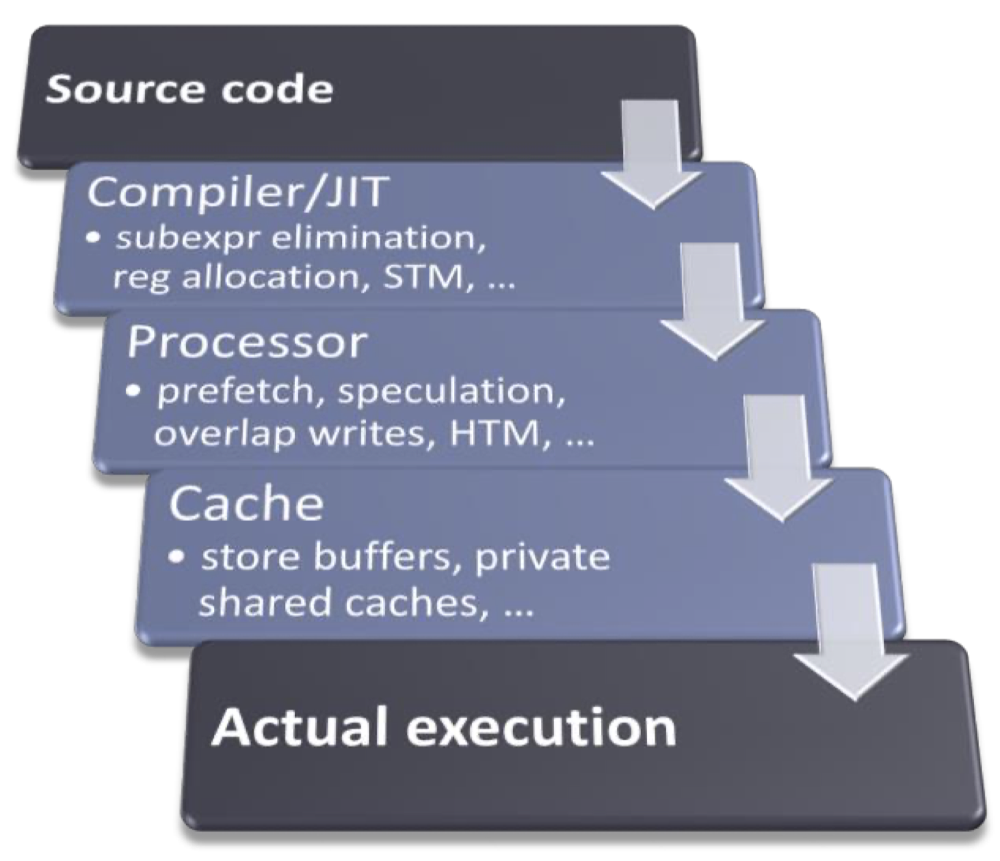
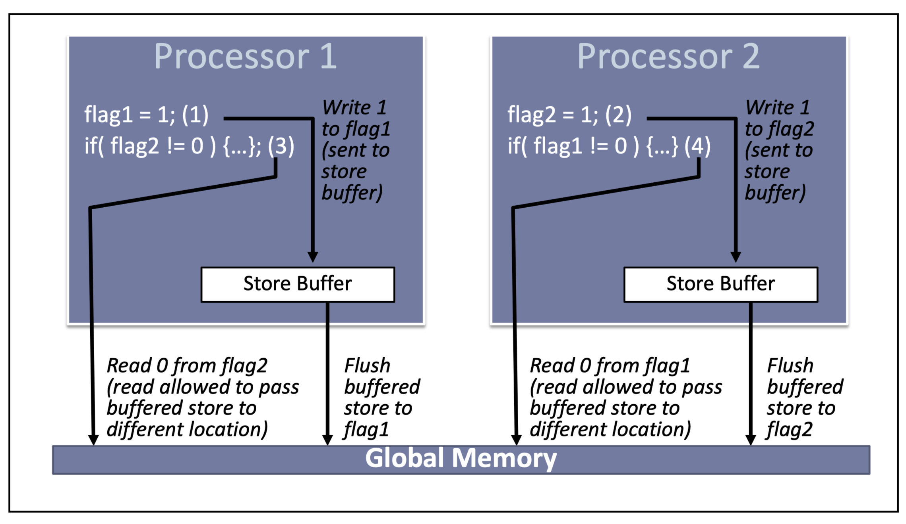
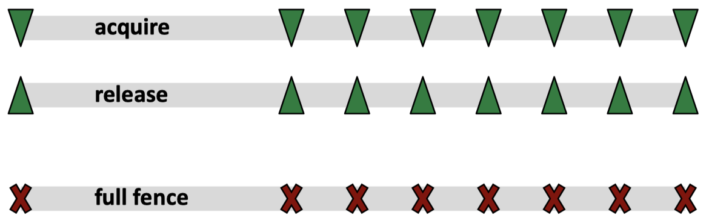

## [Index](../../README.md)

# Multithreading-aware Memory Model

- [Motivation for defining multithreading-aware memory model](#motivation-for-defining-multithreading-aware-memory-model)
- [Definition and Some Key Concepts](#definition-and-some-key-concepts)
- [`std::memory_order`](#stdmemory_order)

# Motivation for defining multithreading-aware memory model

- two reasons: optimizations and concurrency
    - your program will not be executed as you wrote
    - in order to optimize the performance of execution, "the system" (compiler, processor and cache) will "transform" your program
        - __transformations__: reorder, invent, remove instructions
        - 
    - these optimizations are fine in single-threaded context, "the system" will provide an illusion of __sequentially consistency (SC)__
        - __sequentially consistency (SC)__: the processor perform the operations in order exactly as specified by the program
    - but things get messy when concurrency is involved, besides straightforward consequence like __cache incoherence__, there are many other subtle problems that can happen, see the following examples:

## register allocation (by compiler)
- for this general pattern:
    ```
    if (cond) lock x
    ...
    if (cond) use x
    ...
    if (cond) unlock x
    ```
- if we have:
    ```
    if (cond) x_mutex.lock()
    for (...) {
      if (cond) ++x;
      ...
    }
    if (cond) x_mutex.unlock()
    ```
- a kind of transformation for the `for-loop` will be:
    ```
    r1 = x
    for (...) {
        if (cond) ++r1
    }
    x = r1;     // oops: write is not conditional
    ```

## speculation (by processor)
- for the same above pattern, if processor speculates that `cond` is true:
    ```cpp
    if (cond) x = 42;
    // transform to:
    r1 = x;             // read what's there
    x = 42;             // oops: optimistic write is not conditional
    if (!cond) x = r1;  // write back if guessed wrong
    ```

## store buffer (processor/cache)

- even if "the system" do not do any transformations except for using a __store buffer__:
    


# Definition and Some Key Concepts

- __C++ memory model__ defines the semantics of computer memory storage for the purpose of the [C++ abstract machine](../../c++_abstract_machine/c++_abstract_machine.md).
- C++11's default memory model is __Sequentially Consistent for Data Race Free (SC-DRF) programs__
    - this means that if a program is __data race-free__, then the system will provide the illusion that all memory operations are executed in the program order
    - otherwise, it is __undefined behavior__
- __data race__: a program is said to have __data race__ if two or more threads access the same memory location concurrently and:
    - at least one of the thread performs a __write operation__
    - without __synchronization__

## memory access relations defined by C++ memory model

### __synchronize-with__:
- relationship that you can get only between operations on atomic types
    - synchronization primitives (like `mutex`) are all built on top of atomic operations
- an atomic store in thread A ___synchronizes-with___ an atomic load in thread B if:
    - they operate on the same variable M
    - atomic load is an __acquire operation__
    - atomic store is an __release operation__
    - atomic load in thread A reads the value that is written by
        - the atomic store in thread B or
        - any atomic RMW operation in the __release sequence__ headed by the atomic store in thread B
            - __release sequence__ consists of:
                - head: a release operation on M followed by
                - a ___continuous___ sequence of RMW operations made to M by any threads
                    - can be _any_ memory ordering (even `memory_order_relaxed`)
                    - why it can't be pure store? I cannot find answer...
            - an simple example that makes use of __release sequence__:
                - thread A pushes 10 items in queue and set atomic count to 10 with release operation
                - thread B comes to consume one item and performs `fetch_sub(1,std::memory_order_acquire)`
                - thread C also comes to consume one item, but now the count 9, which is not what thread A stores, since `fetch_sub` in thread B is a RMW operation and thus considered part of release sequence, thread C's acquire operation still ___synchronizes-with___ release operation in thread A and is safe to take item out of queue
- to achieve __SC-DRF memory model__, when __release operation__ ___synchronizes-with___ __acquire operation__, both operations act as __memory barrier/fence__
- __memory barrier/fence__ prevents code from being reordered across it in one direction or both directions
    - it requires cooperation with software (compiler) and hardware (processor and cache)
    - memory operations before a __release operation__ cannot be reordered to be after the __release operation__
        - __release__ is considered as publishing data that has been written to other threads
    - memory operations after a __acquire operation__ cannot be reordered to be before the __acquire operation__
        - __acquire__ is considered as acquiring data that is published by other threads
        ```cpp
        // x = 2 cannot be reordered before mut.lock()
        mut.lock();
        x = 2;
        mut.unlock();
        // x = 2 cannot be reordered after mut.unlock()
        ```
        
- memory synchronization __actively works against__ important modern hardware optimizations
    - => want to do as little as possible

### __happens-before__

- A ___happens-before___ B if:
    - same thread: A is ___sequenced-before___ B
    - different threads: A ___synchronizes-with___ B
    - A ___happens-before___ C and C ___happens-before___ B (_Transitivity_)

# `std::memory_order`

- defines how memory operations can be reordered around an __atomic__ operation when ___synchronizes-with___ relation occurs
    - an atomic load/RMW is an acquire operation when tagged `std::memory_order_{acquire,acq_rel,seq_cst}`
    - an atomic store/RMW is a release operation when tagged `std::memory_order_{release,acq_rel,seq_cst}`
- `std::memory_order_relaxed`: does not form a memory barrier
- `std::memory_order_acquire`: memory operations after it cannot be reordered before it
- `std::memory_order_release`: memory operations before it cannot be reordered after it
- `std::memory_order_acq_rel`: form a full fence
- `std::memory_order_seq_cst`: form a full fence and there is a single global ordering between all `std::memory_order_seq_cst` operations
    - "single global ordering" is an ordering of operations that is agreed by all threads, see the following example:
        ```cpp
        #include <thread>
        #include <atomic>
        #include <cassert>
        
        std::atomic<bool> x = {false};
        std::atomic<bool> y = {false};
        std::atomic<int> z = {0};
        
        void write_x()
        {
            x.store(true, std::memory_order_seq_cst);
        }
        
        void write_y()
        {
            y.store(true, std::memory_order_seq_cst);
        }
        
        void read_x_then_y()
        {
            while (!x.load(std::memory_order_seq_cst))
                ;
            if (y.load(std::memory_order_seq_cst)) {
                ++z;
            }
        }
        
        void read_y_then_x()
        {
            while (!y.load(std::memory_order_seq_cst))
                ;
            if (x.load(std::memory_order_seq_cst)) {
                ++z;
            }
        }
        
        int main()
        {
            std::thread a(write_x);
            std::thread b(write_y);
            std::thread c(read_x_then_y);
            std::thread d(read_y_then_x);
            a.join(); b.join(); c.join(); d.join();
            assert(z.load() != 0);  // will never happen
        }
        ```
        - there is no happen-before relation between `write_x` and `write_y`
        - without `std::memory_order_seq_cst`, thread c and thread d might see different views of the ordering of `write_x` and `write_y`, and it is possible that thread c sees `write_y` then `write_x`, thread d sees `write_x` then `write_y`
    - default `std::memory_order` for all atomic operations
    - it is often used when multiple atomic variables are involved
        - for release/acquire pair, only one atomic variable is involved
        - avoid mixing `std::memory_order_seq_cst` with other relaxed atomic operations, otherwise it can produce surprising results
    - most expensive memory ordering, on a multi-processor system this may require extensive and time-consuming communication between processors
- distinct memory orderings can have varying costs on different CPUs
    - x86: strongly-ordered, atomic load and store are acq_rel by default
    - ARM: weakly-ordered, acq_rel and seq_cst come with more costs
- `std::memory_order` can also be used with `std::atomic_thread_fence` to get ___synchronizes-with___ relation between atomic operations tagged `std::memory_order_relaxed`
    - check cppreference for it: https://en.cppreference.com/w/cpp/atomic/atomic_thread_fence

## usage in double-checked locking pattern (DCLP)

```cpp
// singleton initialization
std::atomic<Widget*> Widget::ptrInstance{nullptr};
Widget* Widget::instance() {
    Widget* ptr = ptrInstance.load(std::memory_order_acquire);  // 1
    if (ptr == nullptr) {       // first check
        std::lock_guard<std::mutex> lg{mutW};
        ptr = ptrInstance.load(std::memory_order_relaxed);      // 2
        if (ptr == nullptr) {   // second check
            ptr = new Widget();
            ptrInstance.store(ptr, std::memory_order_release);  // 3
        }
    }

    // using temporary variable ptr to avoid an extra atomic load when return
    return ptr;
}
```
- for atomic load `1`, if it uses `std::memory_order_relaxed`, release operation `3` will not ___synchronizes-with___ it
    - it can see that ptrInstance is not `nullptr` but the memory it points to can still be garbage
    - in this case, it will return a pointer to the `Widget` object that is in a "partially-constructed" state

# References

- [C++ and Beyond 2012: Herb Sutter - atomic Weapons 1 of 2](https://www.youtube.com/watch?v=A8eCGOqgvH4&t=1522s)
- [C++ and Beyond 2012: Herb Sutter - atomic Weapons 2 of 2](https://www.youtube.com/watch?v=KeLBd2EJLOU)
- [CppCon 2017: Fedor Pikus “C++ atomics, from basic to advanced. What do they really do?”](https://www.youtube.com/watch?v=ZQFzMfHIxng)
- [CppCon 2015: Michael Wong “C++11/14/17 atomics and memory model..."](https://www.youtube.com/watch?v=DS2m7T6NKZQ&t=2670s)
- [cppreference std::memory_order](https://en.cppreference.com/w/cpp/atomic/memory_order)
- [cppreference Memory model](https://en.cppreference.com/w/cpp/language/memory_model)
- [C++ standard [atomics.order]](https://eel.is/c++draft/atomics.order#def:coherence-ordered_before)
- Williams, A. (2019). C++ Concurrency in Action, Second Edition. Chapter 5: The C++ memory model and operations on atomic types. Manning Publications.