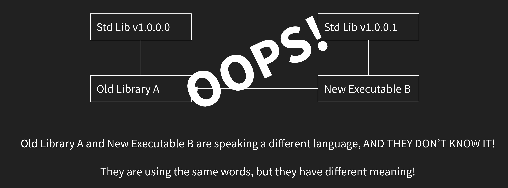

# Application Binary Interface (ABI)

- contrasting __Application Programming Interface (API)__, which:
    - defines the functions and classes interfaces
    - what parameters to pass, what result to expect
    - on the level of source code
- __Application Binary Interface (ABI)__, on the other hand, can be thought as __API__ for binary/machine code
    - [Itanium C++ ABI](https://itanium-cxx-abi.github.io/cxx-abi/abi.html)
    - usually involves how binary codes of user and library communicate

# Examples of ABI

## Function Arguments Passing

- if [trivial type](https://en.cppreference.com/w/cpp/named_req/TrivialType):
    - same as C:
        - arguments are passed in registers
        - or (if too large) push them on stack
- else
    1. space allocated on the stack
    2. caller invokes copy-ctor
    3. address paased as a normal argument
    4. caller invokes dtor

## Data Layout in Class

- base classes in declaration order
- non-static data members in declaration ordeer
- vtable

## Name Mangling

- mangles function names considering namespaces and overloading
- so that each function has a unique identity
```cpp
namespace hello {
    void foo(int);  // mangled as '_ZN5hello3fooEi'
    void foo(long); // mangled as '_ZN5hello3fooEl'
}
```

# ABI Stability

- software compiled with one version of library do not need to be recompiled to use newer version of the library
- common scenario without __ABI stability__: 
    1. _executable B_ is linked with a _binary library A_
    2. both _A_ and _B_ used and compiled against _std lib v1_
    3. _std lib_ updates to v2 with an __ABI break__
    4. recompiled source code of _B_ with the __new version of compiler__ that comes with this __std lib v2__
    5. linking the __new executable B__ to the __old library A__ --> undefined behvior

<p align="center">
    
</p>

## Break ABI

- to avoid breaking ABI, updates are quite limited:
    - add new static data members
    - add new classes
    - add new non-virtual functions
    - a few others...
- any other updates will break ABI:
    - change the return type of a function
    - reorder/add/remove data members
    - reorder/add/remove virtual functions
    - reorder/add/remove function parameters

## Consequences

standard library loses __performance__ or __the ability to change__

<p align="center">
    
</p>

- examples that will break ABI:
    - improve performance of hashmap, `std::regex`, `std::shared_ptr`
    - `scoped_lock` was added to avoid modifying `lock_guard`
        - such "adding names" solution is expensive in terms of education and cognitive overhead
    - changes return type of `push_back` to reference to the pushed element (like `emplace_back`)
        - or just discard `push_back` since `emplace_back` can do all the job
    - ...

## Controlling ABI

- avoid silent ABI break
    - inline namespaces
        - `inline namespace v1` --> `inline namespace v2`
        - undefined behvaior now becomes link error
    - symbol visibility
        - visibility attributes (non-standardized)
        - controlling [linkage](../../README.md#linkage)
        - in [C++20 modules](../../c%2B%2B20/cpp20.md#chapter-16-modules), `export` can be used to mark an entity to be visible

# Reference
- [CppCon 2019: Louis Dionne “The C++ ABI From the Ground Up”](https://www.youtube.com/watch?v=DZ93lP1I7wU)
- [C++ Weekly - Ep 270 - Break ABI to Save C++](https://www.youtube.com/watch?v=By7b19YIv8Q)
- [The Day The Standard Library Died](https://cor3ntin.github.io/posts/abi/)
