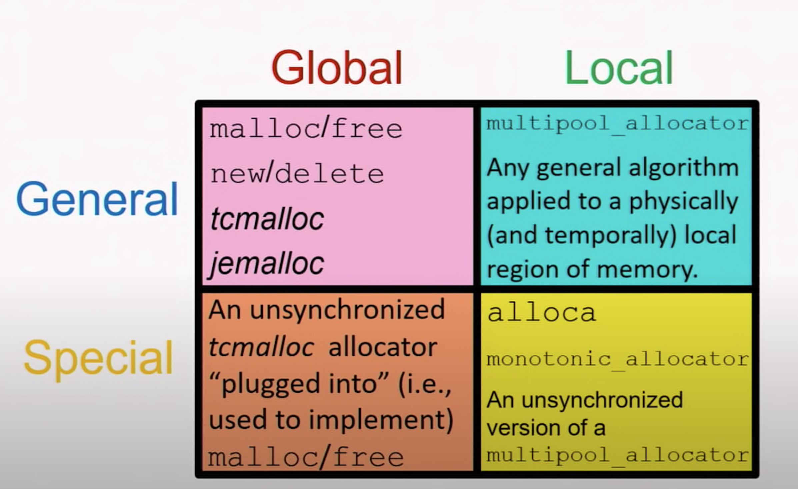

# Memory Allocator

## Why care about memory allocators?

same reasons why we like C++;
- enable us to "fine-tune" at a low level when needed
    - not all memory is alike
        - fast, shared, protected
    - qualitative benefits
        - testing, debugging, measuring
- help to improve runtime performance

## Definition

- A __stateful__ mechanism that organizes a region of computer memory (possibly non-contiguous), dispensing and reclaiming authorized access to suitable subregion on demand.
- a pointer to a region of memory and some logic that controls it
    - the logic lives in the allocator
    - but the memory is just memory, not value, cannot be copied

### Gloabl/Local x Gloabl/Local
- global allocator
    - operates a single ubiquitous region of memory
    - exists throughout the lifetime of a program
    - inherently accessible from all parts of a program
    - `malloc`, `free`, `new`, `delete` are not allocators, they are ways we access gloabl allocators
- local allocator
    - operates a local sub-region of memory
    - may exist for less than the lifetime of a program
    - suupplied for client use via a "reference"
- general-purpuse allocator
    - designed to work reasonably well for all use cases
    - satisfies all requirements for memory allocators
- special-purpose allocator
    - works especially well for some use cases
    - need not satisfy all requirements for allocators
        - unsynchronized
        - does not allow individual deallocations (monotonic)

## Interface
- (stateful) utility functions
    - example
        - `malloc`, `free`
        - `new`, `delete`
    - does not support allocator object
- template parameter (C++03, C++11 model)
    - pros
        - concrete allocator type is available for use by client's compiler
    - cons
        - forces a client to be a template
        - allocator type affects C++ type of the client object
- pointer of a pure abstract base class (C++17 way, polymorphic allocator)
    - pros
        - can be held by a non-template class
        - does not affect type of container
    - cons
        - consumes memory to store pointer
        - virtual function call usually resolves in runtime
            - virtual functions can (sometimes) be bound at compile time!

## Aspects of Software that affect allocation strategy
- Density of allocation operations
    - D = numAllocDeallocOps / numInstr
    - __0.0__: no allocations occur
    - __1.0__: every instruction is either `allocate` or `deallocate`
- Variation of alloacted sizes
    - V = numUniqueAllocSizes / numAllocOps
- Locality of accessed memory
    - I = number of access instructions on subregion over a duration of time
    - M = size of memory in subregion
    - T = number of transitions out of subregion over duration
    - I / (M*T)
        - physical locality: I/M
        - temporal locality: T/M
- Utility
    - U = MaxMemoryInUse / totalMemoryAllocated
    - __0.0__: Memory is repeatedly freed/reallocated
    - __1.0__: All allocations precede deallocations
- Contetion of concurrent threads
    - C = expected num concurrent allocations / number of active threads
    - __0.0__: at most one thread has non-zero __D__
    - __1.0__: __D__ per thread is 1

## Benchmark Take-Away Tips
for large system and long-running system, there absolutely will be performance advantages to use local allocators over gloabl allocators
- __monotonic allocator__ is superior when __U__ is high, but never use it when __U__ is low
- __locality__ is so important that for long-running systems, the speed of alloc/dealloc ops themselves may be __entirely irrelevant__ to overall runtime performance
    - DR (degradation ratio) = access after shuffle / access before shuffle
    - without local allocators, __DR > 10__
    - with local allocators, __DR around 1.5__, order of magnitudes speed-up than without local allocators!

## Question I have
- local allocator also controls a local sub-region of memory, but how do they get this control?
    - do they use some system calls to interact with os directly?
    - or do they use `malloc` or pre-allocated buffer on stack to get a sub-region up-front?