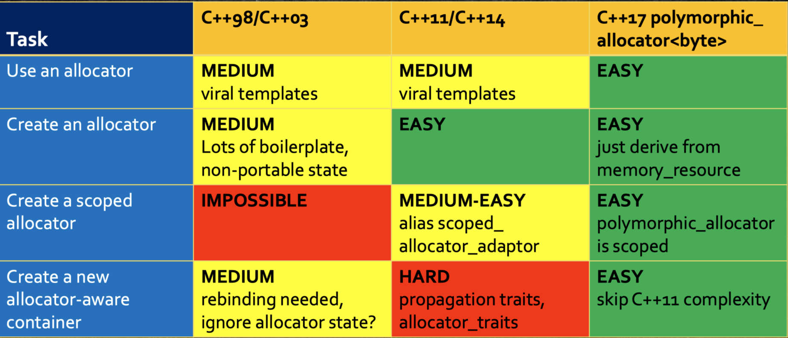

# Content

- [Memory Allocator](#memory-allocator)
    - [Why care about memory allocator?](#why-care-about-memory-allocators)
    - [Definition](#definition)
    - [Interface](#interface)
    - [Aspects of Software that affect allocation strategy](#aspects-of-software-that-affect-allocation-strategy)
    - [Benchmark Take-away Tips](#benchmark-take-away-tips)
- [About `malloc`](#about-malloc)
    - [Purpose](#purpose)
    - [Implementation](#implementation)
    - [`malloc`-related functions](#malloc-related-functions)
- [About Stack Segment](#about-stack-segment)
- [Case Study: TCMalloc](#case-study-tcmalloc)
- [From `std::allocator` to Polymorphic Memory Resource (PMR)](#from-stdallocator-to-polymorphic-memory-resource-pmr)
    - [`std::allocator`](#stdallocator)
    - [C++11 `std::allocator_traits`](#c11-stdallocator_traits)
    - [C++17 Allocator Model: Polymorphic Memory Resource (PMR)](#c17-allocator-model-polymorphic-memory-resource)
- [References](#references)


# Memory Allocator

## Why care about memory allocators?

same reasons why we like C++;
- enable us to "fine-tune" at a low level when needed
    - not all memory is alike
        - fast, shared, protected, persistent
    - qualitative benefits
        - testing, debugging, measuring
- help to improve runtime performance
    - reduce fragmentation
    - reduce diffusion
    - avoid concurrency locks

## Definition

- A __stateful__ mechanism that organizes a region of computer memory (possibly non-contiguous), dispensing and reclaiming authorized access to suitable subregion on demand.
- a pointer to a region of memory and some logic that controls it
    - the logic lives in the allocator
    - but the memory is just memory, not value, cannot be copied

### Gloabl/Local x General/Special
- global allocator
    - operates a single ubiquitous region of memory
    - exists throughout the lifetime of a program
    - inherently accessible from all parts of a program
    - `malloc`, `free`, `new`, `delete` are not allocators, they are ways we access gloabl allocators
- local allocator
    - operates a local sub-region of memory
    - may exist for less than the lifetime of a program
    - suupplied for client use via a "reference"
- general-purpuse allocator
    - designed to work reasonably well for all use cases
    - satisfies all requirements for memory allocators
- special-purpose allocator
    - works especially well for some use cases
    - need not satisfy all requirements for allocators
        - unsynchronized
        - does not allow individual deallocations (monotonic)

<div style="text-align:center"></div>

## Interface
- (stateful) utility functions
    - example
        - `malloc`, `free`
        - `new`, `delete`
    - does not support allocator object
- template parameter (C++03, C++11 model)
    - pros
        - concrete allocator type is available for use by client's compiler
    - cons
        - forces a client to be a template
        - allocator type affects C++ type of the client object
- pointer of a pure abstract base class (C++17 way, polymorphic allocator)
    - pros
        - can be held by a non-template class
        - does not affect type of container
    - cons
        - consumes memory to store pointer
        - virtual function call usually resolves in runtime
            - virtual functions can (sometimes) be bound at compile time!

## Aspects of Software that affect allocation strategy
- Density of allocation operations
    - D = numAllocDeallocOps / numInstr
    - __0.0__: no allocations occur
    - __1.0__: every instruction is either `allocate` or `deallocate`
- Variation of alloacted sizes
    - V = numUniqueAllocSizes / numAllocOps
- Locality of accessed memory
    - I = number of access instructions on subregion over a duration of time
    - M = size of memory in subregion
    - T = number of transitions out of subregion over duration
    - I / (M*T)
        - physical locality: I/M
        - temporal locality: T/M
- Utility
    - U = MaxMemoryInUse / totalMemoryAllocated
    - __0.0__: Memory is repeatedly freed/reallocated
    - __1.0__: All allocations precede deallocations
- Contetion of concurrent threads
    - C = expected num concurrent allocations / number of active threads
    - __0.0__: at most one thread has non-zero __D__
    - __1.0__: __D__ per thread is 1

## Benchmark Take-Away Tips
for large system and long-running system, there absolutely will be performance advantages to use local allocators over gloabl allocators
- __monotonic allocator__ is superior when __U__ is high, but never use it when __U__ is low
- __locality__ is so important that for long-running systems, the speed of alloc/dealloc ops themselves may be __entirely irrelevant__ to overall runtime performance
    - DR (degradation ratio) = access after shuffle / access before shuffle
    - without local allocators, __DR > 10__
    - with local allocators, __DR around 1.5__, order of magnitudes speed-up than without local allocators!

## Question I have
- local allocator also controls a local sub-region of memory, but how do they get this control?
    - do they use some system calls to interact with os directly?
    - or do they use `malloc` or pre-allocated buffer on stack to get a sub-region up-front?
- Ans: second one, local allocator is also called arena allocator, refer to [definition of arena](https://stackoverflow.com/questions/12825148/what-is-the-meaning-of-the-term-arena-in-relation-to-memory)


# About `malloc`

## Purpose

- C Language supports two kinds of memory allocation through variables
    - static or global variables has __static allocation__, their lifetimes are throughout the execution of the process and never get freed
    - local virables has __automatic allocation__, their lifetimes bind to the block where they are declared
        - they are freed at the end of the block
        - a block is a section of program text that contains name bindings local to the block
- __dynamic allocation__ are not supported by variables (there cannot be variables with dynamic allocation)
- `malloc` then is provided by C library to support dynamic allocation

## Implementation

### high-level steps for typical `malloc` implementation:
1. a request for memory with specified size comes in via `malloc`
2. search for a suitable block in free list
    - if not found, need to increase the size of the heap
        - if the request size is small, use `sbrk`
        - else, use `mmap`

### notes
- system calls used:
    - `void* sbrk(intptr_t increment)`
        - extends program break (the boundary of heap segment) by specified `increment`
        - use `sbrk(0)` to see current program break
        - when `sbrk` grows into a new page, kernel will mark the corresponding page table entry as valid
    - `void* mmap`
        - create new memory mapping, might include multiple pages
        - can be located anywhere between stack and heap segments
- `malloc` will create multiple arenas (heaps) when there are multiple threads
    - cannot use `sbrk` to grow arenas seperated from heap segment, use `mmap` instead
- free list is a list of blocks of memory that are available for use
    - there might be multiple free lists to hold different sizes of blocks

## `malloc`-related functions
- `void* malloc(size_t size)`
    - allocate a block of `size` bytes
- `void free(void *addr)`
    - free a block previously allocated by `malloc`
    - metadata about the data block is stored before the data blcok, check if to determine size to free
- `void *realloc(void* addr, size_t size)`
    - make a block previously allocated by `malloc` larger or smaller
    - if larger, possibly copying it to a new location
- `void *calloc(size_t count, size_t eltsize)`
    - allocate a block of `count * eltsize` bytes
    - set its contents to zero
- `void *aligned_alloc(size_t alignment, size_t size)`
    - allocate a block of `size` bytes whose address is a multiple of `alignment`

# About Stack Segment

- to set up initial thread, process requests stack memory from the kernel via `mmap()` system call with `MAP_GROWSDOWN` flag
- memory after the end of the initial mapping is guard area
    - when guard page is first accessed through stack pointer, a page fault occurs
    - page fault handler automatically commits more of the guard area, allowing the stack to grow
- can be thought as `mremap()` is implicitly called when growing stack

# Case Study: TCMalloc

- read [TCMalloc Design Doc](https://github.com/google/tcmalloc/blob/master/docs/design.md)
- basically a series of caches
    - front-end
        - fast allocation and deallocation
        - per-thread cache / per-CPU cache (logical CPU)
        - no synchronization needed
        - for per-CPU cache, use `rseq` to optimize common case instead of using atomics
    - middle-end
        - responsible for refilling the front-end cache
        - protected by a mutex lock
        - each size class has a transfer cache and central free list
    - back-end
        - responsible for refilling the middle-end cache
        - fetching memory from OS when no suitably sized memory available
- design that reflects key assumptions for designing memory allocator
    - assumptions:
        - small objects are allocated more frequently and have a shorter lifespan
        - large objects are allocated less frequently and have a longer lifespan
        - objects with the same sizde are usually allocated, accessed and destroyed together
    - large objects: allocated directly from the back-end
    - small objects: allocating from front-end and have "pages" of objects of the same size
        - fast
        - low per object memory overhead
        - less internal fragmentation
        - less diffusion


# From `std::allocator` to Polymorphic Memory Resource (PMR)

## `std::allocator`
- why we don't like `std::allocator`
    - not originally designed for improving memory allocation
        - initially intended to handle `near` and `far` pointers problems
    - memory allocator should just allocate bytes, but `std::allocator` takes in a type parameter, which makes no sense
        - it also introduces the need to define `rebind` template
    - forcing client container to be template
    - the same container with different allocator type are different types
    - implementation complexity
        - large number of `typedefs`
        - propogation traits
        - `rebind` template

## C++11 `std::allocator_traits`
- C++11 introduces `std::allocator_traits<Alloc>`
    - a utility template provides uniform interface for allocators
    - STL containers now talks to allcator using `allocator_traits`
    - implementation of allocators get easier
        - just need to define `allocate`, `deallocate`, `value_type` and `==/!=` operators
        - when wrapped inside `allocator_traits`, it provides default version for functions, type aliases, `rebind` and propogation traits that are not defined
- we also want the scoped allocator model: container and its members to use the same allocator
    - simple and less memory diffusion
    - can use `scoped_allocator_adaptor` in C++11
        - viral template, difficult to use

## C++17 Allocator Model: Polymorphic Memory Resource

- `std::pmr::memory_resource`: simple base class support `allocate` and `deallocate`
    - get rid of type parameter, just allocating raw bytes
    - override `do_allocate`, `do_deallocate` and `do_is_equal` to create custom memory resource
    - can be chained together
    ```cpp
    class custom_resource : public pmr::memory_resource {
    public:
    explicit custom_resouce(pmr::memory_resource *parent
                            = pmr::get_default_resource());
    ...
    };
    ```
- `std::pmr::polymorphic_allocator<T>`: a thin wrapper of `std::pmr::memory_resource`
    - has a non-`explicit` constructor that takes `memory_resource *`
    - have type template parameter only for the purpose of backwards compatibility
    - `T` by default is `std::byte` (since C++20)
    ```cpp
    std::array<int, 1000> buf;
    std::pmr::monotonic_buffer_resource pool{buf.data(), buf.size()};
    std::pmr::vector<int> vec{&pool};
    // equivalent to
    std::vector<int, std::pmr::polymorphic_allocator<int>> vec1{std::pmr::polymorphic_allocator<int>(&pool)};
    ```
<div style="text-align:center"></div>

### standard memory resources

- gloabl memory resources
    - `new_delete_resource`: using `new` and `delete`
        - returned by `get_default_resource` when `set_defualt_resource` has not been called
    - `null_memory_resource`: throw on allocation
        - used as a fallback allocator of an allocator who should not propogate
- classes who need to instantiate
    - `monotonic_buffer_resource`: super-fase, non-thread-safe, allocation into a buffer with do-nothing deallocation
    - `(un)synchronized_pool_resource`: (non)-thread-safe pools of similar-sized memory blocks

### polymorphic allcator aware container

- __copy construction__: use default polymorphic allocator by default
- __move construction__: use other's allocator by default
- __copy/move assignment__: never propogate allocator
    - move assignment delegate to copy assignment if allocator not equal
- for contructing members, use `construct` instead of placement new to make members use same allocator (scoped allocator model)
- refer to [slist.h by Pablo Halpern](https://github.com/phalpern/CppCon2017Code/blob/master/slist.h)
```cpp
class S {
    using allocator_type = std::pmr::polymorphic_allocator<>;

    explicit S(allcator_type a = {});
    S(const S& other, allcator_type a = {});    // do not copy allocator
    S(S&& other);
    S(S&& other, allocator_type a);
};
```

# References

- [CppCon 2015: Andrei Alexandrescu “std::allocator...”](https://www.youtube.com/watch?v=LIb3L4vKZ7U)
- [CppCon 2017: Pablo Halpern “Allocators: The Good Parts”](https://www.youtube.com/watch?v=v3dz-AKOVL8)
- [CppCon 2017: John Lakos “Local ('Arena') Memory Allocators (part 1 of 2)”](https://www.youtube.com/watch?v=nZNd5FjSquk)
- [CppCon 2017: John Lakos “Local ('Arena') Memory Allocators (part 2 of 2)”](https://www.youtube.com/watch?v=CFzuFNSpycI)
- [What Programmers Should Know About Memory Allocation - S. Al Bahra, H. Sowa, P. Khuong - CppCon 2019](https://www.youtube.com/watch?v=gYfd25Bdmws)
- [Getting Allocators out of Our Way - Alisdair Meredith & Pablo Halpern - CppCon 2019](https://www.youtube.com/watch?v=RLezJuqNcEQ)