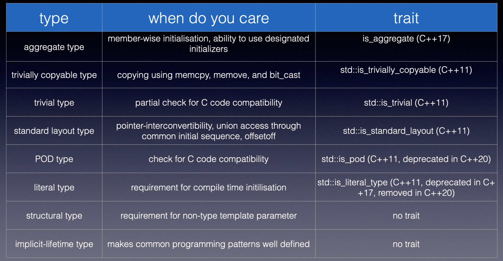

__All following types definition are in C++20__
- [Aggregate](#aggregates)
- [Standard Layout Type](#standard-layout-type)
- [Trivially Copyable Type](#trivially-copyable-type)
- [POD Type](#pod-type)
- [Literal Type](#literal-type)

# Scalar Type

Simple type without any internal structure (compared to aggregates, these two types cover all types in C)
- arithmetic types
- enumeration types
- pointer types
- pointer-to-member types
- `std::nullptr_t`
- cv-qualified versions of these types

# Aggregates

- array (_homogeneous collection of data_)
- class (_heterogeneous collection of data_) with
    - no user-__declared__ or inherited constructor
    - all non-static data members must be public
    - no private or protected base classes
    - no vtable
        - no virtual functions
        - no virtual base classes

# Standard Layout Type

Types with predicatable and consistent layout

## definition

- scalar types
- standard-layout class types
    - has the same access control for all non-static data members
        - prevent compiler from reordering data members
    - no vtable
    - only one class in the hierarchy can have non-static data members
    - all base classes and non-static data members are standard layout type
    - has no base classes that requires a distinct address
        - two objects that are not bit-fields may have the same address if one of the two followings is true:
            - one is a subobject of the other
            - one is a subobject of zero size and they are of __different types__
                - `[[no_unique_address]]` in C++20
- arrays of such types
- cv-qualified versions of such types

## implications

- the following addresses are the same
    - standard layout class object
    - first non-static data member
    - object of its base class
- `offsetof` is well-defined for standard layout class types

# Trivially Copyable Type

## trivial special member function

- not user-__provided__
    - for ctor, class has no default member initializers for non-static data members
- class does not have vtable
    - except destructor, which only requires non-`virtual` dtor
- corresponding special member function of base classes and non-static data members is trivial

## definition

- at least one non-deleted copy operation
- all copy operations are trivial
- has a trivial non-deleted destructor
- to be `trivial` type, need a non-`deleted` trivial default ctor
    - note we might already have trivial ctors (copy/move), but that is not enough for trivially copyable type to be `trivial`

# POD Type

- properties relevant to object layout - standard layout type
- properties relevant to object construction, copying and destruction - trivial types
- original term no longer needed - deprecated, then removed in C++20

# Literal Type

Types that can be contructed, manipulated and returned from `constexpr` functions

- scalar type
- reference type
- literal class
- an array of literal type

## literal class

- has a `constexpr` destructor
- all of its non-static data members and base classes are of literal types
- is one of
    - closure type
    - aggregate type
    - has one `constexpr` ctor that is not a copy or move ctor

# Structural Type

- [scalar type](#scalar-type)
- lvalue reference
- [literal class](#literal-class) that all base classes and non-static data members are:
    - public and non-mutable
        - allows member-wise comparison for equivalence check
    - structural types or array of structural types

# References

- [A Tour of C++ Recognised User Type Categories - Nina Ranns - CppCon 2022](https://www.youtube.com/watch?v=pdoUnvTwnr4)
- cppreference