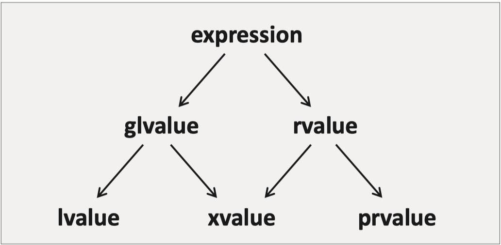

# From [Back to Basics: Understanding Value Categories - Ben Saks - CppCon 2019](https://www.youtube.com/watch?v=XS2JddPq7GQ)

- Value Categories are not language features, they are used for compiler to understand and interpret expressions in C++.
- Used to categorize expressions, not values
- each C++ expression is characterized by two independent propeties
    - type
    - value category

# Evolution of Value Category

## Before C++11: lvaue vs rvalue

### lvalue
- an expression that refers to a memory location
    - compiler might optimize the __lvalue__ away from being stored in memory, but as programmer we should always assume __lvalue__ has a memory location
- its address is accessible by programmer, i.e., can apply unary operation `&` to take its address
    ```cpp
    auto i = &("abc");  // compiled, "abc" stores in data section
    ```

### rvalue
- non-lvalue, address not accessible by programmer, programmer should assume rvalue do not have memory storage and do not try to get their address
    - do not have memory storage if can be encoded into assembly instruction as immediate operand
        ```cpp
        int i = 5;  // mov i, #5
        ```
    - placed in the data section of address space
        ```cpp
        double j = 3.1415;  // literal 3.1415 stores in data section
        auto k = &(3.1415); // ERROR
        ```
    - placed on stack for class type returned from function
        ```cpp
        struct S {
            double i = 3.1415;
            int j = 2;
        };
        S foo() { return S{}; }

        j = foo().i;    // returned object stored on stack
        auto ptr = &(foo());    // ERROR
        ```

### a third value category?

- we can use reference-to-const (`const T&`) to bind to __rvalue__, through this, __reference-to-const__ parameter has the same outward behavior as __pass-by-value__ parameter
    ```cpp
    void foo(const int& i) { ... }
    void bar(int i) { ... }
    // can bind to rvalue
    foo(1);
    bar(1);

    int j = 3;
    // j will not change after function calls
    foo(j);
    bar(j);
    ```
- in order to bind `const T&` to __rvalue__, a temporary object is created in memory (on stack), then the reference can bind to the temporary object
    - reference is functionally the same as pointer in C++, it also refers to a memory location
- there is no need to introduce a new value category, we can regard the above process as conversion from __rvalue__ to __lvalue__
    - there is no way for a C++ expression to fall in between these two categories

## Since C++11

### Introduction of rvalue reference and move semantics

- C++11 introduces __rvalue references__, which can only bind to __rvalue__
- its main purpose is to allow move sematics
    - which enables programmer to define move ctor and move assignment operator to __move__ from instead of __copy__ from an rvalue
    - it allows compiler to replace expensive copy operation (eg. deep copy) with less expensive move (eg. shallow copy)
- but it makes little sense to copy/move from traditional __rvalue__, which is typically used for initialization
- it will, however, be beneficial if we can move from an __lvalue__ instead of copy from an __lvalue__ (eg. replacing deep copy with shallow copy)
- then the problem is how to tell the compiler that we want it to interpret an __lvalue__ as __rvalue__ and call the move operation as needed instead of copy operation
- to enable casting an __lvalue__ to __rvalue__, C++11 defines another property of __rvalue reference__ that is distinct from __lvalue reference__:
    ```
    an rvalue reference that is returned from a function is an rvalue.
    ```


### Introduction of xvalue

- C++11 defines a new special __rvalue__ here: an __unnamed rvalue reference__, it is an expression in a state between __rvalue__ and __lvalue__:
    - property of __rvalue__
        - its address still cannot be taken by programmer using `&` operator, which makes it still __rvalue__
        - can only bind to __const lvalue reference__ and __rvalue reference__
    - property of __lvalue__
        - since it is a __reference__, it represents a location in memory
- then when compiler deals with expression that is __rvalue__, it needs to know if the __rvalue__ is in this in-between state, if it is, then compiler does not need to generate code to create a new temporary object when binding this __rvalue__ to a reference
- so now __rvalue__ category is divided into __xvalue__ and __prvalue__:
    - __xvalue (expiring value)__: __unnamed rvalue reference__, refer to a special memory location where resources can be reused
        - __expiring__ means it is near the end of its lifetime and it is safe to take its resources
        - so `std::move` can be used to tell compiler that an __lvalue__ has become a temporary object and it is safe to "steal" its resources
    - __prvalue__: traditional __rvalue__
        - non-string literals
        - objects returned from function by value
        - ...
- since __xvalue__ can also bind to a reference without conversion (creating temporary object), it together with __lvalue__ are called __glvalue (generalized lvalue)__



## Since C++17

### mandatory copy elision

- without mandatory copy elision:
    - a temporary object of type `S` might be created in memory
    - then `s` is copy/move constructed using the temporary object
    - as a result, copy/move constructor need to be defined
    ```cpp
    class S { ... };
    S foo() { return S{}; }

    S s = foo();
    ```
- with mandatory copy elision:
    - prvalue is guaranteed to be passed around as an unmaterialized object until:
        - when passed to a reference
            - __temporary materialization__: creates a temporary object in memory according to the prvalue
                - converted to __xvalue__
            - bind the reference to the temporary object
        - used to initialize an object
            - if type matches the object type, constructed in place
            - if type matches the argument of the object's ctor, call the corresponding ctor
    - benefits:
        - performance is guaranteed
        - can declare copy/move constructor as `deleted` if needed

### prvalue are no longer moved from

- for __prvalue__ to be a temporary object that has a memory location, it must go through __temporary materialization__ to convert to __xvalue__
- in contrast with the C++11 scheme, prvalues are no longer moved from, what is being moved from is __xvalue__