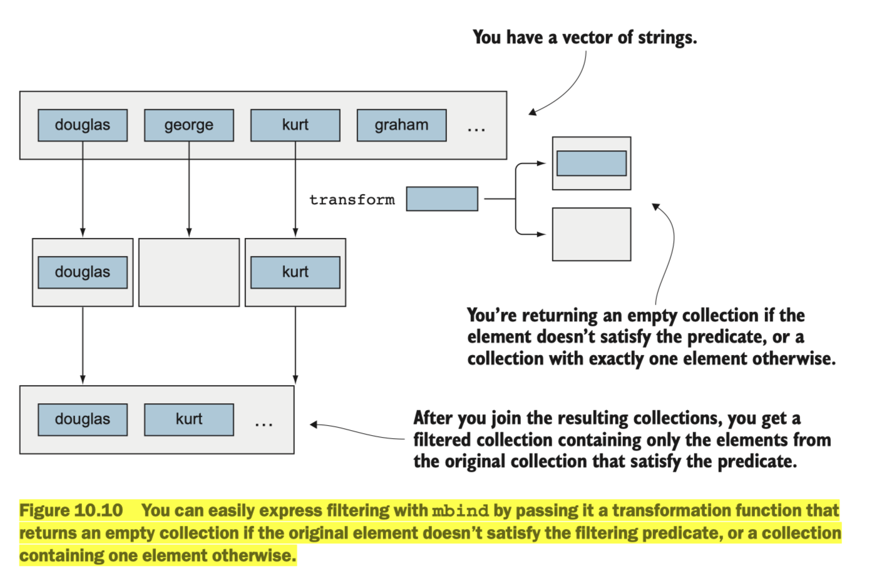
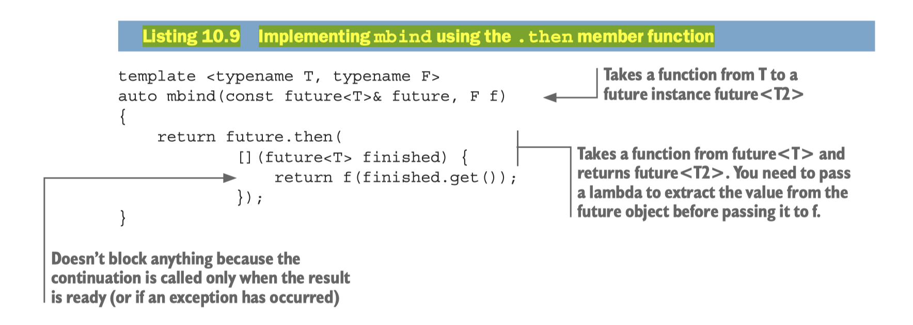

## [Index](../README.md)

# Monads

## Definition

- Monad is a class template that defines two operations
    ```
    construct:  T -> M<T>
    bind:       (M<T1>, T1 -> M<T2>) -> M<T2>
    ```
- Monad is a functor with two additional operations: `construct` (create monadic values from normal values) and `join` (faltten out nested monadic values)
    ```
    join: M<M<T>> -> M<T>
    ```
    - a class template `F` is a functor if it has a `transform`/`map` function defined on it:
        ```
        transform: (F<T1>, T1 -> T2) -> F<T2>
        ```

## Insights

- __From Functor to Monad__: implement `bind` using `transform` and `join`
    ```
    bind(a: M<T1>, f: T1 -> M<T2>) => join(transform(a, f))
    ```
- __Monad is a Functor__: implment `transform` with `bind` and `construct`
    ```
    transform(a: F<T1>, f: T1 -> T2) => bind(a, compose(f, construct))
    ```
- __Only One Free Type Parameter__: for a class template to be functor, there can only be one free type parameter, for template like `expected<T,E>`, it is only functor when `T` or `E` is considered as fixed
- __Semantics of Monad does not define Unwrap__: Monad is some kind of container that knows how to operate on its values, though there is a wrap operation `T -> M<T>` defined, there is no simple unwrap operation like `unwrap: M<T> -> T`. You can only tell monad what to do with the internal values by using the monadic bind operation to bind to a function.
    - From [Wiki](https://en.wikipedia.org/wiki/Monad_(functional_programming)): 
        > "For a monad m, a value of type m a represents having access to a value of type a within the context of the monad." —C. A. McCann

        > More exactly, a monad can be used where unrestricted access to a value is inappropriate for reasons specific to the scenario. In the case of the Maybe monad, it is because the value may not exist. In the case of the IO monad, it is because the value may not be known yet, such as when the monad represents user input that will only be provided after a prompt is displayed. In all cases the scenarios in which access makes sense are captured by the bind operation defined for the monad; for the Maybe monad a value is bound only if it exists, and for the IO monad a value is bound only after the previous operations in the sequence have been performed.
- __Monadic Functions Composition__: monadic functions `T1 -> M<T2>` have good composability:
    ```
    mcompose(f1: T1 -> M<T2>, f2: T2 -> M<T3>) -> (T1 -> M<T3>) {
        return a: T1 => bind(f1(a), f2)
    }
    ```

## Benefits

- __High-level Construct__: Monads can be used to turn complicated sequences of functions into succinct pipelines that abstract away __control flow__, and __side-effects__.
- __Reduce Boilerplate code__ for common operations
- both of above enhance readability and make code less error-prone

## Examples

### `std::vector`

- functor transform/map: 1 to 1, input vector size == output vector size
- monad bind: 1 to any number, output vector size can be anything
    - `vector<vector<T>> ---join---> vector<T>`
    - can do filter which cannot be done by function transform/map
        - just proof of concept, don't actually implement filter like this:
    

### `std::optional` and `std::expected`

- `transform`: functor's transform/map operation
- `and_then`: monadic bind operation
    ```
    and_then(this: optional<T1>, f: T1 -> optional<T2>) {
        if (this) {
            return f(this.value());
        } else {
            return {};
        }
    }
    ```

```cpp
std::optional<std::string> current_user_html() {
    return current_login.and_then(user_full_name).and_then(to_html);
    // reduce boilerplate of using if-else branch to check optional for each returned value
}
```

### `std::experimental::future`



- `then` not accepted in standard yet: cannot be specified by programmer whether continuation executes on receiver side or producer side

## Reference

- [Functional Programming in C++, by Ivan Cukic. Chapter 10 Monads](https://www.manning.com/books/functional-programming-in-c-plus-plus)
- [Monads in Modern C++ - Georgi Koyrushki & Alistair Fisher - CppCon 2023](https://www.youtube.com/watch?v=kZ8rbhGgtv4)
- https://en.wikipedia.org/wiki/Monad_(functional_programming)